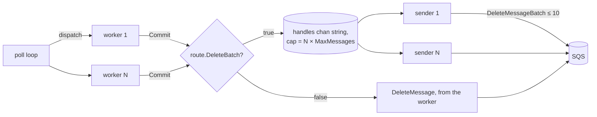

# Design Document

## Overview

This design adds an opt-in **batched delete path** to the consumer. A route enables it with
`router.WithDeleteBatch()`. On such a route, every Commit hands the message's receipt handle
to a per-route **Delete_Batcher** instead of calling `DeleteMessage` from the worker. The
Delete_Batcher runs `WorkerPoolSize` **Sender** goroutines. Each Sender blocks until a receipt
handle arrives, then drains whatever else is already queued (up to 10) without waiting, and
sends one `DeleteMessageBatch` request. No timer is involved: a batch grows only while earlier
requests are in flight, so the extra wait a delete can see is bounded by one request already
in progress.

Routes without the option keep today's Synchronous_Delete path unchanged:
`dispatcher.deleteMessage` issues one `DeleteMessage` per Commit from the worker.

Packages that change:

- `router`: new option and getter.
- `consumer`: new optional client interface, new `deleteBatcher`, wiring in `dispatcher` and
  `Consumer.Run`.
- `errors`: new sentinel `ErrDeleteBatchUnsupported`.
- `fake`: `SQSClient` gains `DeleteMessageBatch`.
- `benchmarks` (separate module): in-memory client and new benchmarks.
- Docs: `README.md`, `consumer/doc.go`, `router/doc.go`.

Packages that do not change: `broker`, `producer`, `middleware`, `typed`, `client`, `conn`,
`idgen`, `logger`. The broker passes the SQS client through to `consumer.New` unchanged, so
the capability check in `Consumer.Run` covers broker-managed routes as well.

### Research summary and key design decisions

External behavior, confirmed against current documentation:

- **SDK API.** aws-sdk-go-v2 `service/sqs` v1.48.1 (the version in `go.mod`) exposes
  `func (c *Client) DeleteMessageBatch(ctx context.Context, params *DeleteMessageBatchInput,
  optFns ...func(*Options)) (*DeleteMessageBatchOutput, error)`. It is not deprecated. Entries
  are `types.DeleteMessageBatchRequestEntry{Id, ReceiptHandle}`; the output carries
  `Successful []types.DeleteMessageBatchResultEntry` and `Failed []types.BatchResultErrorEntry`
  with `Id`, `Code`, `SenderFault`, and `Message`.
- **Limits.** A batch request accepts at most 10 entries (`TooManyEntriesInBatchRequest`). An
  empty request is rejected (`EmptyBatchRequest`). Entry `Id`s must be unique within the
  request (`BatchEntryIdsNotDistinct`), at most 80 characters, and contain only alphanumeric
  characters, hyphens, and underscores (`InvalidBatchEntryId`).
- **Partial success.** The API can return HTTP 200 with some entries in `Failed`, so per-entry
  results must always be inspected.
- **IAM.** Batch actions cannot be granted separately: the `sqs:DeleteMessage` permission also
  authorizes `DeleteMessageBatch` (SQS Developer Guide, "Amazon SQS batch actions"). No new IAM
  permission is required.
- **Billing and quotas.** A batch request is billed as one request regardless of entry count.
  FIFO queues outside high-throughput mode allow 300 API calls per second per action per
  partition, which is 3,000 messages per second with batches of 10 (SQS message quotas). Standard
  queues have nearly unlimited per-action throughput.
- **SDK retries.** The SDK's standard retryer already retries throttling and transient 5xx
  errors at the request level, so the Delete_Batcher adds no retry loop of its own.

Key decisions:

1. **Opportunistic drain instead of linger.** The upstream proposal (JustCodes/loafer-go PR
   #12) waits up to a linger duration (default 50ms) and also flushes when every message of a
   receive cycle has completed. On FIFO queues, SQS does not deliver the next message of a
   `MessageGroupId` until the in-flight one is deleted, so a linger adds directly to per-group
   latency; the receive-cycle flush makes one group's delete wait on another group's slowest
   handler. Opportunistic draining has neither effect and needs no timer, clamp, or in-flight
   counter. The cost is that batches only fill under load, which is also where the savings
   matter: at roughly $0.40 per million standard requests, the best-case saving is about $36 per
   100M messages per month.
2. **Optional interface instead of extending `SQSClient`.** Adding `DeleteMessageBatch` to
   `consumer.SQSClient` would break every user-defined implementation, which would require a
   major version. A separate `BatchDeleteClient` interface, checked with a type assertion in
   `Consumer.Run`, keeps v1 compatible. The check fails fast with `ErrDeleteBatchUnsupported`
   instead of silently falling back, so a misconfiguration is visible at startup.
3. **Senders = `WorkerPoolSize`.** Today at most `WorkerPoolSize` deletes run in parallel (one
   per worker). Matching that count means delete throughput never falls below the current
   ceiling. Fewer Senders would produce larger batches at medium load but would cap throughput
   at about `senders × 10 / RTT`. The average batch size is roughly `λ × RTT / senders`, where
   λ is the delete rate per second and RTT is the request latency. A configurable Sender count
   is left as a possible additive option later.
4. **Blocking enqueue for backpressure.** When the queue is full, the committing worker blocks
   until a Sender takes an entry. This keeps the in-memory backlog bounded and mirrors today's
   behavior, where a worker blocks on its own `DeleteMessage`. A fallback to a single
   `DeleteMessage` was rejected because it adds a second code path without a throughput benefit.
5. **Receipt handles, not message pointers, on the channel.** The Sender needs only the
   receipt handle. Sending a `string` copy avoids sharing `*message` across goroutines after
   the worker has moved on.
6. **Detached context per request.** Sender goroutines receive
   `context.WithoutCancel(runCtx)` as a parameter (the context is not stored in a struct). Each
   request is bounded by `context.WithTimeout(ctx, deleteRequestTimeout)`, so deletes committed
   during shutdown are still sent, and no request can hang shutdown.

## Architecture



### Where the new branch slots in

All four Commit sites already call `dispatcher.deleteMessage(ctx, msg)`:

- `dispatcher.process` on handler success (Visibility_Retry_Model).
- `dispatcher.processScheduled` after a successful retry schedule, after a successful DLQ
  publish, and on handler success (Scheduled_Retry_Model).

Only the body of `deleteMessage` changes:

```go
func (d *dispatcher) deleteMessage(ctx context.Context, msg *message) {
    if d.batcher != nil {
        d.batcher.enqueue(msg.Identifier())
        return
    }
    // existing synchronous DeleteMessage, unchanged
}
```

Paths that never call `deleteMessage` (handler error, backoff, observe-only DLQ, Held_Message,
failed schedule or DLQ publish) are untouched, so the set of committed messages is identical on
both paths. Metric emission in `processScheduled` stays after the `deleteMessage` call, with
the same semantics as today: it records the outcome, not the delete result.

### Sender loop

```go
func (b *deleteBatcher) run(ctx context.Context) {
    defer b.wg.Done()
    batch := make([]string, 0, maxDeleteBatch)
    for first := range b.handles {
        batch = append(batch[:0], first)
    drain:
        for len(batch) < maxDeleteBatch {
            select {
            case h, ok := <-b.handles:
                if !ok {
                    break drain
                }
                batch = append(batch, h)
            default:
                break drain
            }
        }
        b.send(ctx, batch)
    }
}
```

The `select` has no `ctx.Done()` case by design: the loop exits when the channel is closed,
which happens only after every producer has stopped. That ownership rule is what guarantees
pending deletes are never dropped during a graceful shutdown.

### Shutdown sequence

```mermaid
sequenceDiagram
    participant Run as Consumer.Run
    participant D as dispatcher.stop
    participant W as workers
    participant B as deleteBatcher
    Run->>Run: ctx canceled, poll returns
    Run->>D: deferred stop()
    D->>W: close worker channels
    W-->>B: enqueue remaining commits
    D->>D: wg.Wait() (workers + visibility goroutines)
    D->>B: close()
    B->>B: close(handles); senders drain and send the rest
    B-->>D: senders' wg.Wait() returns
    D-->>Run: return nil
```

### Invariants

- The `handles` channel is closed exactly once, by `deleteBatcher.close`, and only after
  `dispatcher.wg.Wait()` has returned. No send can happen after the close.
- Every receipt handle received by a Sender is included in exactly one `DeleteMessageBatch`
  request.
- No request carries more than 10 or fewer than 1 entries.
- On a Standard_Route, `d.batcher` is nil and no Sender goroutine exists.

## Components and Interfaces

### `router.WithDeleteBatch` and `Route.DeleteBatch`

File: `router/options.go`, `router/router.go`.

```go
// WithDeleteBatch enables batched deletes for the route. Committed messages are
// removed through DeleteMessageBatch requests formed opportunistically: deletes
// that queue up while earlier requests are in flight are sent together, and no
// delay is ever added to wait for a fuller batch. The SQS client must implement
// consumer.BatchDeleteClient; *sqs.Client does.
func WithDeleteBatch() Option

// DeleteBatch reports whether batched deletes are enabled for the route.
func (r *Route) DeleteBatch() bool
```

`Route` gains an unexported `deleteBatch bool` field (placed by `fieldalignment`). The option
never returns an error and combines with every retry model and run mode.

### `consumer.BatchDeleteClient`

File: `consumer/client.go`.

```go
// BatchDeleteClient is implemented by SQS clients that support DeleteMessageBatch.
// It is required only by routes configured with router.WithDeleteBatch; a
// concrete *sqs.Client satisfies it.
type BatchDeleteClient interface {
    // DeleteMessageBatch deletes up to ten messages from the specified queue.
    DeleteMessageBatch(
        ctx context.Context,
        params *sqs.DeleteMessageBatchInput,
        optFns ...func(*sqs.Options),
    ) (*sqs.DeleteMessageBatchOutput, error)
}
```

Compile-time assertion added to the existing block: `_ BatchDeleteClient = (*sqs.Client)(nil)`.

### `deleteBatcher`

File: `consumer/delete_batcher.go` (new, unexported).

```go
const (
    // maxDeleteBatch is the largest number of entries AWS SQS accepts in one
    // DeleteMessageBatch request.
    maxDeleteBatch = 10

    // deleteRequestTimeout bounds every DeleteMessageBatch request, so a stalled
    // request can never block shutdown indefinitely.
    deleteRequestTimeout = 5 * time.Second
)

type deleteBatcher struct {
    client   BatchDeleteClient
    log      *slog.Logger
    handles  chan string
    queueURL string
    wg       sync.WaitGroup
}

func newDeleteBatcher(client BatchDeleteClient, queueURL string, capacity int, log *slog.Logger) *deleteBatcher
func (b *deleteBatcher) start(ctx context.Context, senders int) // launches senders; ctx must already be detached
func (b *deleteBatcher) enqueue(handle string)                  // blocking send
func (b *deleteBatcher) close()                                 // close(handles); wg.Wait()
func (b *deleteBatcher) run(ctx context.Context)                // sender loop (above)
func (b *deleteBatcher) send(ctx context.Context, batch []string)
```

`send` builds entries with `Id: strconv.Itoa(i)` (decimal index: unique, alphanumeric, at most
two characters), calls `DeleteMessageBatch` with `context.WithTimeout(ctx,
deleteRequestTimeout)`, and reports failures as described under Error Handling. A nil logger is
replaced with `logger.NewNoOp()`, as in `newDispatcher`. Sender goroutines are tracked with the
batcher's own `wg` using `Add` before `go`, matching the style of `dispatcher.start`; they are
not in `dispatcher.wg`, because `dispatcher.stop` must wait for workers before closing the
channel.

### `dispatcher` and `Consumer.Run` wiring

File: `consumer/dispatch.go`, `consumer/consumer.go`.

- `dispatcher` gains `batcher *deleteBatcher` (nil on a Standard_Route).
- `dispatcher.stop` becomes: close worker channels → `d.wg.Wait()` → `if d.batcher != nil {
  d.batcher.close() }`.
- `Consumer.Run`, before `resolveQueueURL` and after the existing scheduler-client check:

  ```go
  var batchClient BatchDeleteClient
  if c.route.DeleteBatch() {
      bc, ok := c.client.(BatchDeleteClient)
      if !ok {
          return errors.ErrDeleteBatchUnsupported
      }
      batchClient = bc
  }
  ```

- After `newDispatcher` and before `d.start(ctx)`, when `batchClient != nil`:

  ```go
  d.batcher = newDeleteBatcher(batchClient, queueURL, workers*maxMessages, c.log)
  d.batcher.start(context.WithoutCancel(ctx), workers)
  ```

  `workers` and `maxMessages` are the values `newDispatcher` already normalizes (both at least
  1), read from `d.workerPoolSize` and `d.bufferSize`.

### `errors.ErrDeleteBatchUnsupported`

File: `errors/errors.go`, added to the existing `var` block:

```go
// ErrDeleteBatchUnsupported indicates that a route enabled batched deletes but
// the SQS client does not implement DeleteMessageBatch.
ErrDeleteBatchUnsupported = New("sqs client does not support DeleteMessageBatch")
```

### `fake.SQSClient`

File: `fake/sqs_client.go`.

- New field `DeleteMessageBatchFunc func(ctx context.Context, params *sqs.DeleteMessageBatchInput, optFns ...func(*sqs.Options)) (*sqs.DeleteMessageBatchOutput, error)`.
- New method `DeleteMessageBatch`: records the input under `mu`, delegates to the func when
  set, otherwise returns an output listing every entry `Id` in `Successful` and a nil error.
- New method `DeleteMessageBatchCalls() []*sqs.DeleteMessageBatchInput` returning a copy.
- New compile-time assertion `var _ consumer.BatchDeleteClient = (*SQSClient)(nil)`.

### Benchmark client and benchmarks

Files: `benchmarks/fakeclient.go`, `benchmarks/bench_test.go`.

- `benchClient` gains `deleteLatency time.Duration`, plus atomic counters `deleteCalls` (both
  APIs) and `batchCalls`, `batchEntries` (batch API only).
- `DeleteMessage` and the new `DeleteMessageBatch` sleep `deleteLatency` when non-zero,
  increment the counters, and add the number of removed messages to `delivered`, closing `done`
  when `delivered` reaches `total`. `DeleteMessageBatch` reports every entry as successful.
- A new helper `benchAWSXDelete(b, groups, latency, batch)` reuses the flow of `benchAWSX` with
  the latency set on the client and `router.WithDeleteBatch()` added when `batch` is true. It
  reports `msg/s`, `delete-calls/msg` (= `deleteCalls / b.N`), and, for batch runs,
  `entries/batch` (= `batchEntries / batchCalls`).
- New benchmark functions (existing functions untouched):
  `BenchmarkDeleteStandardSync`, `BenchmarkDeleteStandardBatch`, `BenchmarkDeleteFIFOSync`,
  `BenchmarkDeleteFIFOBatch`, each with sub-benchmarks `latency=0` and `latency=2ms`
  (constant `simulatedDeleteRTT = 2 * time.Millisecond`).

## Data Models

| Item | Value | Notes |
| --- | --- | --- |
| `Route.deleteBatch` | `false` by default | Set only by `WithDeleteBatch()` |
| Sender count | `WorkerPoolSize` (≥ 1) | Never below today's delete parallelism |
| `handles` capacity | `WorkerPoolSize × MaxMessages` | Default route: 5 × 10 = 50 |
| `maxDeleteBatch` | 10 | AWS limit, inclusive |
| Entry `Id` | `strconv.Itoa(i)`, `i ∈ [0, 9]` | Unique and valid per AWS rules |
| `deleteRequestTimeout` | 5s | Per request; also the shutdown bound per request |

## Error Handling

No new error is returned at runtime; delete failures are logged and swallowed, as today.

| Failure | Detection | Handling | Message disposition |
| --- | --- | --- | --- |
| Client lacks `DeleteMessageBatch` | Type assertion in `Run` | Return `errors.ErrDeleteBatchUnsupported` before `resolveQueueURL`; no goroutine started | Nothing consumed |
| Request error (network, throttling after SDK retries, timeout, `QueueDoesNotExist`, …) | `err != nil` | One Error log per entry: `"failed to delete message"`, `queue_url`, `receipt_handle`, `error` | Reappears after visibility timeout |
| Per-entry failure | entry in `out.Failed` | One Error log: `"failed to delete message"`, `queue_url`, `receipt_handle`, `code`, `sender_fault`, `error` (entry `Message`) | Reappears after visibility timeout |
| Failed entry with unknown `Id` | `Id` not a valid index in the sent batch | Log Error with the raw `id` and `code`, without a receipt handle; no panic | Unknown |
| `nil` output with `nil` error | `out == nil` | Treated as no reported failures; no panic | Assumed deleted |

`nil` pointers in `Failed` entries (`Id`, `Code`, `Message`) are read through `aws.ToString`,
so a malformed response cannot cause a nil dereference.

## Correctness Properties

*A property is a characteristic or behavior that should hold true across all valid
executions of a system — essentially, a formal statement about what the system should
do. Properties serve as the bridge between human-readable specifications and
machine-verifiable correctness guarantees.*

### Property 1: Every committed handle is sent exactly once

*For any* sequence of receipt handles enqueued concurrently by any number of producers, and any
number of Senders ≥ 1, after `close` returns the multiset of `ReceiptHandle`s across all
`DeleteMessageBatch` requests equals the multiset of enqueued handles.

**Validates: Requirements 4.1, 4.7, 7.2**

### Property 2: Every request is well-formed

*For any* enqueue sequence and Sender count, every `DeleteMessageBatch` request has between 1
and 10 entries inclusive, entry `Id`s that are pairwise distinct and match `^[A-Za-z0-9_-]{1,80}$`,
`QueueUrl` equal to the route queue URL, and each entry `ReceiptHandle` equal to an enqueued
handle.

**Validates: Requirements 4.5, 4.6, 4.8**

### Property 3: Standard routes keep the synchronous path

*For any* batch of messages and handler outcomes on a Standard_Route, the consumer makes zero
`DeleteMessageBatch` calls and exactly one `DeleteMessage` call per committed message, and works
with a client that implements only `consumer.SQSClient`.

**Validates: Requirements 2.2, 2.3, 2.4**

### Property 4: The committed set is identical on both paths

*For any* batch of messages with generated handler outcomes (success, error, backoff), retry
model, and run mode, the set of receipt handles removed on a Delete_Batch_Route equals the set
removed by `DeleteMessage` on an otherwise identical Standard_Route, and a Delete_Batch_Route
makes zero `DeleteMessage` calls. In particular, errored, backed-off, and held messages are
never removed under the Visibility_Retry_Model.

**Validates: Requirements 4.1, 4.2, 8.1, 8.2, 8.3, 8.4**

### Property 5: Failures are logged once per entry and never panic

*For any* batch and any generated response, consisting of a request error, a nil output, or an
output whose `Failed` entries reference any subset of sent `Id`s plus arbitrary unknown `Id`s
with nil or non-nil fields, `send` does not panic, logs exactly one Error record with message
"failed to delete message" per failed entry (all entries on a request error), includes the
receipt handle and queue URL for every known entry, and logs nothing for successful entries.

**Validates: Requirements 6.1, 6.2, 6.3, 6.4, 6.5, 6.7, 6.8**

### Property 6: Shutdown flushes everything and leaks nothing

*For any* set of handles enqueued before and after the run context is canceled (while workers
are still finishing), when `Consumer.Run` returns every handle has been sent, every request was
made with a context that was not canceled at call time, and no Sender goroutine remains.

**Validates: Requirements 7.1, 7.2, 7.3, 7.5**

### Property 7: Unsupported clients fail fast

*For any* Delete_Batch_Route and any client that implements `consumer.SQSClient` but not
`consumer.BatchDeleteClient`, `Consumer.Run` returns an error matching
`errors.ErrDeleteBatchUnsupported` and the client records zero `GetQueueUrl` and zero
`ReceiveMessage` calls.

**Validates: Requirements 3.4, 3.5, 3.6**

### Property 8: Metrics are emitted under the same conditions

*For any* batch with generated handler outcomes under either retry model, the counts of
success, retry, dead-letter, and observe-only DLQ metrics on a Delete_Batch_Route equal those
on an otherwise identical Standard_Route.

**Validates: Requirements 9.1, 9.2**

## Testing Strategy

### Property-based tests

Property tests use `pgregory.net/rapid`, run a minimum of 100 iterations, live in
`_test` packages, and each is tagged with a comment referencing its design property:
`// Feature: opportunistic-delete-batch, Property {n}: {property text}`.

Because `deleteBatcher` is unexported, the batcher-level properties (1, 2, 5) live in an
internal test file `consumer/delete_batcher_test.go` (`package consumer`), following the
existing pattern of `dispatch_test.go` and `visibility_test.go`. Properties 3, 4, 6, 7, 8 go
through `consumer.New` + `Run` with `fake.SQSClient`.

- **Property 1** — generate 0–200 handles, 1–8 producers, 1–8 Senders; a recording
  `DeleteMessageBatchFunc` with random small latency; compare multisets after `close`.
- **Property 2** — same generators, plus queue URLs; assert per-request shape and the `Id`
  regex; include boundary sizes 1, 9, 10, 11, 20.
- **Property 3** — generate messages and outcomes on a Standard_Route with a client type that
  embeds only `consumer.SQSClient` methods; assert call counts.
- **Property 4** — run the same generated batch twice (batch and standard) with a deterministic
  handler keyed by message body; compare removed handle sets across Visibility and Scheduled
  models and Parallel/PerGroupID modes.
- **Property 5** — call `send` directly with generated responses; capture logs with
  `fake.LogHandler`; count records and check attributes.
- **Property 6** — cancel the run context while generated handlers are still sleeping; record
  `ctx.Err()` inside `DeleteMessageBatchFunc`; verify with `goleak.VerifyNone`.
- **Property 7** — generate route options (retry model, run mode) with `WithDeleteBatch()` and a
  `consumer.SQSClient`-only client.
- **Property 8** — reuse the Property 4 harness with a counting `MetricsRecorder` fake.

### Example and integration tests (PBT not appropriate)

- `router`: `WithDeleteBatch()` sets `DeleteBatch()`; default is false; combines with
  `WithScheduledRetry`, `WithDLQ`, and `PerGroupID` without error (1.1–1.5).
- `consumer`: `*sqs.Client` compile-time assertion (3.2); `ErrDeleteBatchUnsupported` matched
  with `errors.Is` (3.3, 3.4).
- Backpressure (5.2, 5.3, 5.4): a `DeleteMessageBatchFunc` blocked on a channel; enqueue
  `capacity` handles without blocking, then verify the next enqueue blocks until the func is
  released.
- Sender count (5.1): a blocked `DeleteMessageBatchFunc` counts concurrent calls and observes
  exactly `WorkerPoolSize` in flight.
- No timer (4.9): with one Sender and one enqueued handle, the request is observed without
  advancing any clock and before a second handle is enqueued.
- Flush timeout (7.4): a `DeleteMessageBatchFunc` that observes `ctx.Deadline()` and asserts it
  is set and at most `deleteRequestTimeout` away.
- `fake.SQSClient` (10.1–10.5): default success output lists all `Id`s; func override;
  `DeleteMessageBatchCalls` returns a copy; concurrent calls under `-race`.
- LocalStack integration (`-tags=integration`, `consumer/consumer_integration_test.go`):
  `TestIntegrationDeleteBatchRemovesMessages` sends 25 messages to a standard queue and a FIFO
  queue, runs a Delete_Batch_Route, and asserts the queues drain and
  `ApproximateNumberOfMessages` plus `ApproximateNumberOfMessagesNotVisible` reach 0.
- Chaos: `make test-chaos` (`GOMAXPROCS=1 -race -count=30 -shuffle=on`) covers the new tests.

### Unit tests

- `errors`: the new sentinel is distinct from existing ones and matchable through `Wrap`.
- Backward compatibility (2.1, 2.5): no existing exported signature changes, verified by the
  existing compile-time assertions and test suites passing unchanged.
- Benchmarks (11.1–11.7) and documentation (12.1–12.7) are verified by review and by running
  the benchmark command; they are not unit-tested.
