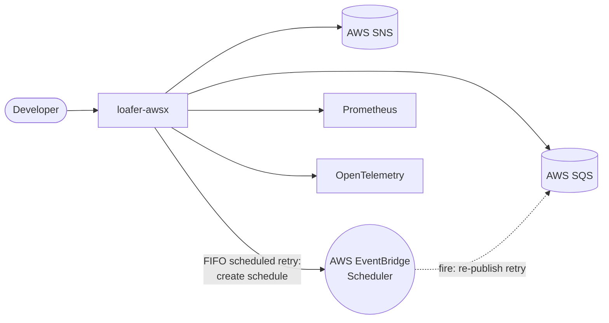
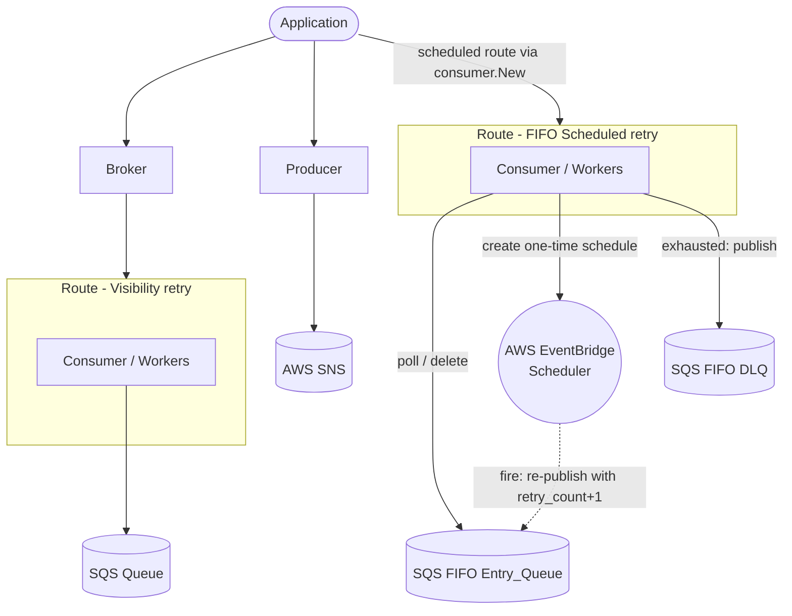

# Design Document

## Overview

This feature adds first-class AWS service client constructors to `loafer-awsx` so
that consuming applications no longer import the AWS SDK for Go v2 service packages
(`sqs`, `sns`, `scheduler`) directly. It introduces a new `client` package that turns
an `aws.Config` (produced by the existing `conn` package) into ready-to-use SQS, SNS,
and EventBridge Scheduler clients.

Each constructor validates connectivity **during construction**: before returning, it
issues a lightweight, read-only request (the "Ping") to confirm the client can reach its
AWS service with valid credentials. The validation applies a dedicated timeout
(default 3s) and retry budget (default 2 retries) that are independent of the request
retry policy carried by the `aws.Config`. Both values are overridable through functional
options, and the validation can be disabled entirely with an opt-out option for
environments where the read-only permission is not granted or where offline construction
is required. The Ping is an internal detail of construction, not a method on the returned
client.

Because the constructors return the library's own minimal interface types
(`consumer.SQSClient`, `producer.SNSClient`, `consumer.SchedulerClient`) rather than the
concrete SDK types, the concrete SDK service types remain an internal implementation
detail. The library becomes a complete wrapper over AWS SDK for Go v2, and a future SDK
version bump stays transparent to consumers.

### Goals

- Provide `client.NewSQS`, `client.NewSNS`, and `client.NewScheduler` constructors that
  accept a `context.Context` and an `aws.Config` and return clients usable by the broker,
  consumer, and producer without importing the SDK service packages.
- Validate connectivity at construction time with a dedicated, independent timeout and
  retry budget, defaulting to 3s and 2 retries and overridable via options.
- Allow the connectivity validation to be disabled via an opt-out option.
- Keep the `conn` package API unchanged.
- Keep the broker, consumer, and producer wiring unchanged.

### Non-goals

- Exposing a caller-invokable `Ping` method; connectivity validation happens inside the
  constructor.
- Replacing or changing the `conn.New` configuration API.
- Wrapping every AWS SDK operation; the returned interface types expose only the
  operations the existing components already require.
- Adding a convenience constructor that internally calls `conn.New` (keeps `client`
  decoupled from `conn`; see Alternatives).

## Architecture

The new `client` package sits between the `conn` package (which produces `aws.Config`)
and the existing `broker` / `consumer` / `producer` components (which accept minimal
client interfaces). It depends on `consumer` and `producer` only for their interface
types and on the AWS SDK service packages to build the concrete clients. No existing
package imports `client`, so there is no import cycle.

```
                +------------------+
                |   conn package   |
                |  conn.New(...)   |
                +---------+--------+
                          | aws.Config
                          v
                +-------------------------------+
                |         client package        |
                |                               |
                |  NewSQS(ctx, cfg, opts) ----+ |--> validate (Ping) --> consumer.SQSClient
                |  NewSNS(ctx, cfg, opts) ----+ |--> validate (Ping) --> producer.SNSClient
                |  NewScheduler(ctx,cfg,opts)-+ |--> validate (Ping) --> consumer.SchedulerClient
                |                               |
                |  builds a concrete            |
                |  *sqs.Client / *sns.Client /  |
                |  *scheduler.Client internally |
                +---------------+---------------+
                                |  returns interface type (SDK type hidden)
        passed to               |  (unchanged wiring)
        +-----------------------+-------------------+------------------------+
        v                                           v                        v
  broker.New(sqsClient)                producer.New(snsClient)   consumer.WithSchedulerClient(sched)
```

### Connectivity validation flow (inside New)

```
NewSQS(ctx, cfg, opts...)
   │
   ├─ o := buildOptions(opts...)         // may fail with ErrInvalidOption -> return nil, err
   ├─ api := sqs.NewFromConfig(cfg)
   ├─ if o.connectivityCheck == false: return api, nil     // opt-out, no I/O (R6.4)
   │
   └─ validate(ctx, o.pingConfig, do):
          budgetCtx = WithTimeout(WithoutCancel(ctx), timeout)   // R4.4 total budget
          for attempt 0..retryLimit:
              if ctx.Err() != nil: return Wrap(ErrPingFailed, ctx.Err())   // R4.5 stop scheduling
              err = do(budgetCtx)   // read-only op, SDK retries disabled     // R5.3 independent budget
              if err == nil: return api, nil                                 // R4.2 success -> return client
              lastErr = err
          return nil, Wrap(ErrPingFailed, lastErr)                           // R4.3 failure -> no client
```

## Package and file layout

A new package `client` (module path `github.com/silviolleite/loafer-awsx/client`):

```
client/
  doc.go          // package documentation
  client.go       // constructors NewSQS/NewSNS/NewScheduler and internal seams
  ping.go         // validate runner and per-service read-only request closures
  options.go      // Option type, options struct, defaults, WithPingTimeout,
                  // WithPingRetryLimit, WithoutConnectivityCheck
  export_test.go  // exposes internal constructor seams to the external client_test package
  client_test.go
  ping_test.go
  options_test.go
```

## Components and Interfaces

### Return types

The constructors return the library's existing minimal interface types. The concrete
`*sqs.Client` / `*sns.Client` / `*scheduler.Client` already satisfy them (asserted in
`consumer` and `producer`), so returning the concrete client typed as the interface hides
the SDK type from the caller while keeping the value usable by the broker, consumer, and
producer.

Returning an interface from a constructor is a deliberate exception to the usual "return
concrete types" guidance: the interface is the mechanism that hides the SDK service
package from caller code, which is the core goal of this feature.

### Internal service interfaces

Each constructor validates through a narrow internal interface that is the union of the
public interface it returns and the read-only operation used by the Ping. The concrete
SDK clients satisfy these directly; tests supply fakes (see Testing Strategy).

```go
// sqsAPI is the internal surface the SQS constructor depends on: the operations the
// consumer/broker require plus the read-only ListQueues call used for validation.
type sqsAPI interface {
    consumer.SQSClient
    ListQueues(ctx context.Context, params *sqs.ListQueuesInput, optFns ...func(*sqs.Options)) (*sqs.ListQueuesOutput, error)
}

type snsAPI interface {
    producer.SNSClient
    ListTopics(ctx context.Context, params *sns.ListTopicsInput, optFns ...func(*sns.Options)) (*sns.ListTopicsOutput, error)
}

type schedulerAPI interface {
    consumer.SchedulerClient
    ListSchedules(ctx context.Context, params *scheduler.ListSchedulesInput, optFns ...func(*scheduler.Options)) (*scheduler.ListSchedulesOutput, error)
}
```

### Constructors

```go
// NewSQS builds an SQS client from cfg, validates connectivity unless disabled, and
// returns a client usable by the broker and consumer. It returns an error wrapping
// ErrInvalidOption for an invalid option, or ErrPingFailed when validation fails, and
// never returns both a nil client and a nil error.
func NewSQS(ctx context.Context, cfg aws.Config, opts ...Option) (consumer.SQSClient, error)

func NewSNS(ctx context.Context, cfg aws.Config, opts ...Option) (producer.SNSClient, error)

func NewScheduler(ctx context.Context, cfg aws.Config, opts ...Option) (consumer.SchedulerClient, error)
```

Each exported constructor is a thin shell over an unexported seam that accepts the
internal interface, so tests can inject fakes:

```go
func NewSQS(ctx context.Context, cfg aws.Config, opts ...Option) (consumer.SQSClient, error) {
    return newSQS(ctx, sqs.NewFromConfig(cfg), opts...)
}

// newSQS applies options, optionally validates connectivity, and returns the client.
func newSQS(ctx context.Context, api sqsAPI, opts ...Option) (consumer.SQSClient, error) {
    o, err := buildOptions(opts...)
    if err != nil {
        return nil, err                              // already wrapped with ErrInvalidOption
    }
    if o.connectivityCheck {
        do := func(ctx context.Context) error {
            _, err := api.ListQueues(ctx, &sqs.ListQueuesInput{MaxResults: aws.Int32(1)},
                func(o *sqs.Options) { o.Retryer = aws.NopRetryer{} })
            return err
        }
        if err := validate(ctx, o.pingConfig(), do); err != nil {
            return nil, err                          // wrapped with ErrPingFailed
        }
    }
    return api, nil                                  // sqsAPI embeds consumer.SQSClient
}
```

`newSNS` and `newScheduler` follow the same shape with `ListTopics` and `ListSchedules`.

### Options

The three constructors share one `Option` type; the configurable inputs are the ping
timeout, the ping retry budget, and whether the connectivity check runs.

```go
// Option configures a client constructor. Options are applied in order and may return
// an error to abort construction.
type Option func(*options) error

type options struct {
    pingTimeout       time.Duration
    pingRetryLimit    uint
    connectivityCheck bool
}

const (
    defaultPingTimeout    = 3 * time.Second // R5.1
    defaultPingRetryLimit = uint(2)         // R5.2
)

func newOptions() *options {
    return &options{
        pingTimeout:       defaultPingTimeout,
        pingRetryLimit:    defaultPingRetryLimit,
        connectivityCheck: true, // validation is on by default
    }
}

// buildOptions applies opts and wraps any option error with ErrInvalidOption.
func buildOptions(opts ...Option) (*options, error) {
    o := newOptions()
    for _, opt := range opts {
        if opt == nil {
            continue
        }
        if err := opt(o); err != nil {
            return nil, errors.Wrap(errors.ErrInvalidOption, err)
        }
    }
    return o, nil
}

// WithPingTimeout overrides the total time budget for connectivity validation,
// including retries. The duration must be positive; a non-positive value fails
// construction with ErrInvalidOption.
func WithPingTimeout(d time.Duration) Option {
    return func(o *options) error {
        if d <= 0 {
            return fmt.Errorf("ping timeout must be positive, got %s", d)
        }
        o.pingTimeout = d
        return nil
    }
}

// WithPingRetryLimit overrides the maximum number of retries the connectivity
// validation performs beyond the initial attempt.
func WithPingRetryLimit(n uint) Option {
    return func(o *options) error {
        o.pingRetryLimit = n
        return nil
    }
}

// WithoutConnectivityCheck disables the connectivity validation performed during
// construction. Use it when the credentials lack the read-only permission the Ping
// requires, or to construct a client offline.
func WithoutConnectivityCheck() Option {
    return func(o *options) error {
        o.connectivityCheck = false
        return nil
    }
}
```

### Validation runner

The retry-and-timeout logic is shared by all three services. Each constructor passes a
closure performing its own read-only request.

```go
type pingConfig struct {
    timeout    time.Duration
    retryLimit uint
}

// validate executes do until it succeeds or the retry budget is exhausted, bounding the
// total duration by cfg.timeout. It stops scheduling new attempts when ctx is canceled
// but lets an in-flight request finish, because do runs on a context detached from ctx
// cancellation yet still bounded by the timeout.
func validate(ctx context.Context, cfg pingConfig, do func(context.Context) error) error {
    // R4.4: child context bounded by the ping timeout; detached from ctx cancellation so
    // an in-flight request can complete (R4.5), while the timeout still bounds the whole
    // validation (the timeout budget includes retries).
    budgetCtx, cancel := context.WithTimeout(context.WithoutCancel(ctx), cfg.timeout)
    defer cancel()

    var lastErr error
    for attempt := uint(0); attempt <= cfg.retryLimit; attempt++ {
        if err := ctx.Err(); err != nil {                // R4.5 stop scheduling further attempts
            return errors.Wrap(errors.ErrPingFailed, err)
        }
        if err := do(budgetCtx); err == nil {            // R4.2 success
            return nil
        } else {
            lastErr = err
        }
    }
    return errors.Wrap(errors.ErrPingFailed, lastErr)    // R4.3 failure after budget exhausted
}
```

Each read-only request disables the SDK's own retryer for that request via
`aws.NopRetryer{}`, so the retry budget in `validate` is the single authoritative retry
count and is independent of the `aws.Config` request retry count (R5.3).

Read-only operation choices (all confirmed present in the pinned SDK versions and all
non-mutating):

| Service   | Ping operation | Why                                                        |
|-----------|----------------|------------------------------------------------------------|
| SQS       | `ListQueues` (`MaxResults=1`) | Read-only, needs no pre-existing queue; validates region + credentials. |
| SNS       | `ListTopics`   | Read-only; input takes only a pagination token, single request. |
| Scheduler | `ListSchedules` (`MaxResults=1`) | Read-only; validates connectivity to EventBridge Scheduler. |

Callers whose credentials do not grant these read-only permissions can disable the check
with `WithoutConnectivityCheck()`.

## Data Models

No persistent data models are introduced. The only new value types are the internal
`options` and `pingConfig` structs described above.

## Error Handling

- Invalid option value → `buildOptions` returns `errors.Wrap(errors.ErrInvalidOption, err)`
  and the constructor returns a nil client (R1.4, R2.4, R3.4, R6.2).
- Validation failure after the retry budget is exhausted → constructor returns
  `errors.Wrap(errors.ErrPingFailed, lastErr)` and a nil client (R4.3). Callers can match
  both `errors.Is(err, errors.ErrPingFailed)` and the underlying cause.
- Context canceled before validation completes → `errors.Wrap(errors.ErrPingFailed, ctx.Err())`,
  so `errors.Is(err, context.Canceled)` (or `context.DeadlineExceeded`) holds (R4.5).
- Connectivity check disabled → constructor returns the client with no I/O and no error
  (R6.4).
- No panics anywhere in the package; all error paths return wrapped errors.

### New sentinel error

Add to `errors/errors.go`, following the existing convention, and add it to the sentinel
table in `errors/errors_test.go`:

```go
// ErrPingFailed indicates that a client connectivity validation (Ping) did not
// succeed within its timeout and retry budget during construction.
ErrPingFailed = New("connectivity ping failed")
```

`ErrInvalidOption` already exists and is reused for option validation.

## Backward compatibility

- The `conn` package API is unchanged (R7.4). Constructors consume the `aws.Config` it
  produces.
- The `broker`, `consumer`, and `producer` packages are unchanged. The constructors
  return `consumer.SQSClient`, `producer.SNSClient`, and `consumer.SchedulerClient`, which
  those components already accept (R7.1, R7.2, R7.3).
- Existing code that constructs clients with `sqs.NewFromConfig` etc. keeps working; the
  new constructors are additive.

## Integration points

- `broker.New(sqsClient, routes, ...)` accepts the `consumer.SQSClient` returned by `NewSQS`.
- `producer.New(snsClient, ...)` accepts the `producer.SNSClient` returned by `NewSNS`.
- `consumer.WithSchedulerClient(sched)` accepts the `consumer.SchedulerClient` returned by
  `NewScheduler`; `consumer.New(sqs, route, ...)` accepts the client from `NewSQS`.
- Examples (e.g. `examples/fifo-scheduled-retry/main.go`) can drop the `sqs`/`scheduler`
  SDK imports and call `client.NewSQS(ctx, cfg)` / `client.NewScheduler(ctx, cfg)`; a
  construction error now also signals a connectivity problem.

## IAM permissions per client

Each constructor's connectivity validation (Ping) issues an additional read-only request
beyond the operations the client uses at runtime, so the caller's credentials need the
Ping permission too — unless the check is disabled with `WithoutConnectivityCheck()`. The
tables below list the complete set of permissions each client requires.

### SQS client (`client.NewSQS`, used by broker and consumer)

| Action | Required by | Notes |
| --- | --- | --- |
| `sqs:ReceiveMessage` | Runtime (consumer poll) | On the Entry_Queue. |
| `sqs:DeleteMessage` | Runtime | On the Entry_Queue. |
| `sqs:ChangeMessageVisibility` | Runtime | Visibility extension during processing. |
| `sqs:GetQueueUrl` | Runtime | Resolve the queue URL from its name. |
| `sqs:SendMessage` | Runtime (Scheduled Retry only) | On the DLQ, to publish exhausted messages. |
| `sqs:ListQueues` | Construction (Ping) | Account-level; omit only if the check is disabled. |

### SNS client (`client.NewSNS`, used by producer)

| Action | Required by | Notes |
| --- | --- | --- |
| `sns:Publish` | Runtime | Covers both `Publish` and `PublishBatch`, on the target topic(s). |
| `sns:ListTopics` | Construction (Ping) | Account-level; omit only if the check is disabled. |

### EventBridge Scheduler client (`client.NewScheduler`, used by consumer Scheduled Retry)

| Action | Required by | Notes |
| --- | --- | --- |
| `scheduler:CreateSchedule` | Runtime | Create the one-time retry schedule. |
| `iam:PassRole` | Runtime | On the execution role passed via `WithSchedulerIdentity`. |
| `scheduler:ListSchedules` | Construction (Ping) | Omit only if the check is disabled. |

The **execution role** assumed by EventBridge Scheduler (the second argument to
`WithSchedulerIdentity`) is separate from the caller's credentials and needs
`sqs:SendMessage` on the Entry_Queue plus a trust policy allowing
`scheduler.amazonaws.com` to assume it.

> Because the Ping uses account-level `List*` permissions that scoped credentials may not
> grant, callers with least-privilege policies can either add the `List*` action or
> construct with `WithoutConnectivityCheck()`.

## Documentation updates

The `README.md` is currently dominated by a large "Configuration Reference" that
enumerates every package's functional options in tables — content that duplicates the
API documentation already published on pkg.go.dev. This feature slims the README and adds
the new material:

- **Trim the Configuration Reference.** Replace the exhaustive per-package option tables
  (`conn`, `router`, `consumer`, `broker`, `producer`, `typed`, `middleware`, `logger`,
  `idgen`, `errors`) with a short prose overview. The existing Go Reference badge at the
  top of the README already points to the full, always-current option and function
  listings, so no new link is added.
- **Document the new `client` package.** Add a short section and a row in the package
  responsibilities table describing `client.NewSQS` / `client.NewSNS` /
  `client.NewScheduler`, the connectivity validation, and the Ping options
  (`WithPingTimeout`, `WithPingRetryLimit`, `WithoutConnectivityCheck`). Detailed
  signatures remain available through the Go Reference badge.
- **Add an IAM permissions section** reproducing the per-client tables above, so operators
  can provision least-privilege policies for the SQS, SNS, and Scheduler clients including
  the Ping permissions.
- **Update the Context and Container diagrams** to include AWS EventBridge Scheduler on the
  FIFO Scheduled Retry path.

### Updated Context Diagram



### Updated Container Diagram



## Testing Strategy

Test package is `client_test` (external), per the steering rules, targeting ≥95% coverage.

- Injection seam: an `export_test.go` file in the `client` package exposes the unexported
  `newSQS` / `newSNS` / `newScheduler` seams to the external `client_test` package. The
  seams accept the internal `sqsAPI` / `snsAPI` / `schedulerAPI` interfaces, so tests pass
  fakes without constructing a real `aws.Config` or reaching the network. This is the
  standard library `export_test.go` idiom.
- Fakes: test doubles implementing `sqsAPI`, `snsAPI`, and `schedulerAPI` with function
  fields for each operation (mirroring the existing `fake` package style), programmable to
  return a queued sequence of errors then success, and recording the number of calls.
- Constructor tests (table-driven): verify option application order, that an invalid
  option yields a nil client and an error matching `errors.ErrInvalidOption`, that a valid
  config with a healthy fake yields a non-nil client, the "never neither" invariant, and
  that `WithoutConnectivityCheck()` returns the client without invoking the read-only op.
- Validation tests (table-driven + property-based with `pgregory.net/rapid`):
  - Success on first attempt and after N transient failures within budget (R4.2).
  - Failure wraps `ErrPingFailed` after the budget is exhausted; assert the read-only op
    call count equals `min(k+1, retryLimit+1)` to prove the budget is respected
    independently of the config retryer (R4.3, R5.3).
  - Default budget: with no options, exactly 3 attempts occur on persistent failure
    (R5.1, R5.2).
  - Overrides: `WithPingRetryLimit(n)` changes the attempt count; `WithPingTimeout(d>0)`
    is applied; `WithPingTimeout(d<=0)` fails construction with `ErrInvalidOption`
    (R6.1, R6.2, R6.3). Rapid generates timeouts and retry limits.
  - Cancellation: a context canceled before/between attempts stops further attempts and
    returns an error matching `context.Canceled` wrapped by `ErrPingFailed`; an in-flight
    request started before cancellation still runs to completion (R4.5).
- Determinism: the validation loop performs no sleep between attempts, so tests need no
  real clock and no real network; all timing is exercised through fakes.
- `goleak` is run in `TestMain` to assert no goroutine leaks.
- The read-only op choices and the "returns interface type" contract are guarded by the
  existing compile-time assertions in `consumer`/`producer` plus the constructor return
  types.

## Alternatives considered

- Expose a caller-invokable `Ping` method on a wrapper type (previous design): rejected in
  favor of validating inside `New`. Validating at construction is fail-fast, removes the
  wrapper struct and method-forwarding boilerplate, and lets the constructors return the
  library's interface types directly.
- Return concrete `*sqs.Client` etc.: rejected. The caller's variable would then reference
  the SDK package type, defeating the goal of removing the SDK import.
- Mandatory validation with no opt-out: rejected. Some callers have credentials scoped to
  specific resources and lack the account-level read-only permission the Ping needs, and
  some need offline construction; `WithoutConnectivityCheck()` covers those cases while
  keeping validation on by default.
- Add a convenience constructor taking `conn` options and calling `conn.New` internally:
  rejected to keep `client` decoupled from `conn` and avoid duplicating the config API.
- Implement validation retries via the SDK per-request retryer (`MaxAttempts`): rejected
  because it couples the budget to SDK retry semantics and makes context-cancellation
  behavior (R4.5) harder to control. A manual loop with the SDK retryer disabled
  (`aws.NopRetryer{}`) makes the budget authoritative and independent (R5.3).

## Correctness Properties

These invariants hold for any inputs and are the basis for the property-based tests
(`pgregory.net/rapid`). Each is deterministic because validation performs no sleeps and
uses fakes rather than real network calls.

### Property 1: Constructor totality

For any option slice, a constructor returns exactly one of a non-nil client or a non-nil
error, never both and never neither (∀ opts: (client ≠ nil) XOR (err ≠ nil)).

**Validates: Requirements 1.5, 2.5, 3.5**

### Property 2: Option-error propagation

If any applied option returns an error, the constructor returns a nil client and an error
matching `errors.ErrInvalidOption`.

**Validates: Requirements 1.4, 2.4, 3.4**

### Property 3: Retry-budget bound

For a construction whose underlying read-only request fails `k` times then would succeed,
the number of attempts equals `min(k+1, retryLimit+1)`; on persistent failure it is
exactly `retryLimit+1`, regardless of the retry count configured on the `aws.Config`.

**Validates: Requirements 5.3**

### Property 4: Success detection

If the underlying request succeeds on attempt `i ≤ retryLimit+1`, the constructor returns
the client and performs no further attempts.

**Validates: Requirements 4.2**

### Property 5: Failure wrapping

When the budget is exhausted without success, the constructor returns a nil client and an
error for which `errors.Is(err, errors.ErrPingFailed)` is true and which unwraps to the
last underlying cause.

**Validates: Requirements 4.3**

### Property 6: Timeout positivity

`WithPingTimeout(d)` succeeds iff `d > 0`; otherwise construction fails with
`errors.ErrInvalidOption` and no client is returned.

**Validates: Requirements 6.2**

### Property 7: Cancellation safety

If the context is already canceled, the constructor schedules no new attempts and returns
a nil client and an error matching both `errors.ErrPingFailed` and the context error; an
attempt already in flight is not aborted by cancellation.

**Validates: Requirements 4.5**

### Property 8: Default configuration

With no options, the ping timeout is 3s and the retry limit is 2 (so 3 total attempts on
persistent failure).

**Validates: Requirements 5.1, 5.2**

### Property 9: Opt-out skips validation

When `WithoutConnectivityCheck()` is supplied, the constructor returns a non-nil client
without issuing any read-only request.

**Validates: Requirements 6.4**

## Requirements traceability

| Requirement | Design element |
|-------------|----------------|
| R1.1–R1.3, R1.5 | `NewSQS` returns `consumer.SQSClient`; `buildOptions` application loop; never-neither invariant |
| R1.4 | `buildOptions` wraps option error with `ErrInvalidOption`, constructor returns nil client |
| R2.1–R2.5 | `NewSNS` returns `producer.SNSClient`; same option/error handling |
| R3.1–R3.5 | `NewScheduler` returns `consumer.SchedulerClient`; same handling |
| R4.1 | Per-service read-only ops (`ListQueues`/`ListTopics`/`ListSchedules`) issued during construction |
| R4.2 | `validate` returns nil (constructor returns client) on first success within budget |
| R4.3 | `validate` returns `Wrap(ErrPingFailed, lastErr)`; constructor returns nil client |
| R4.4 | `budgetCtx = WithTimeout(WithoutCancel(ctx), timeout)` |
| R4.5 | `ctx.Err()` check between attempts stops scheduling; detached `budgetCtx` lets in-flight finish |
| R5.1, R5.2 | `defaultPingTimeout = 3s`, `defaultPingRetryLimit = 2` seeded by `newOptions` |
| R5.3 | `aws.NopRetryer{}` per request + manual loop makes the budget independent of config retryer |
| R6.1, R6.3 | `WithPingTimeout` / `WithPingRetryLimit` overrides |
| R6.2 | `WithPingTimeout(d<=0)` → error wrapped with `ErrInvalidOption`, nil client |
| R6.4 | `WithoutConnectivityCheck()` sets `connectivityCheck=false`; constructor skips validation |
| R7.1–R7.3 | Constructors return the interface types the components already accept |
| R7.4 | `conn` package untouched; constructors consume its `aws.Config` |
