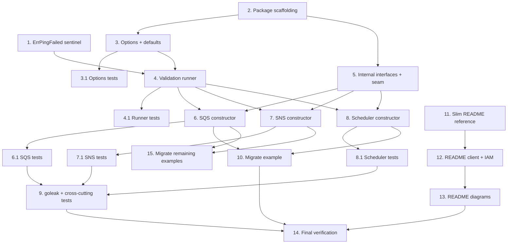

# Implementation Plan

## Overview

This plan implements the new `client` package that constructs SQS, SNS, and EventBridge
Scheduler clients from an `aws.Config` and validates connectivity ("Ping") during
construction, plus the supporting error sentinel, the example migration, and the README
documentation updates (slim the Configuration Reference toward the Go Reference, add the
IAM permissions matrix, and update the architecture diagrams for EventBridge Scheduler).

Tasks are ordered so foundational pieces (error, options, validation runner) land before
the constructors, tests accompany each unit, and documentation follows the working code.

## Tasks

- [x] 1. Add the ErrPingFailed sentinel error
  - Add `ErrPingFailed = New("connectivity ping failed")` to `errors/errors.go` following the existing sentinel convention and docstring style.
  - Add `ErrPingFailed` to the sentinel table and the sentinel list assertions in `errors/errors_test.go`.
  - _Requirements: 4.3, 4.5_

- [x] 2. Create the client package scaffolding and documentation
  - Create `client/doc.go` describing the package: constructors that build SQS/SNS/Scheduler clients from an `aws.Config` and validate connectivity during construction.
  - Create `client/client.go` with the package declaration and the required imports (`context`, `aws`, `sqs`, `sns`, `scheduler`, `consumer`, `producer`, `errors`).
  - _Requirements: 1.2, 2.2, 3.2, 7.4_

- [x] 3. Implement the options type, defaults, and functional options
  - In `client/options.go`, define `Option func(*options) error`, the `options` struct (`pingTimeout`, `pingRetryLimit`, `connectivityCheck`), and `newOptions()` seeding `3s` / `2` / `true`.
  - Implement `buildOptions(opts ...Option) (*options, error)` that skips nil options and wraps any option error with `errors.ErrInvalidOption`.
  - Implement `WithPingTimeout(d time.Duration)` (reject `d <= 0`), `WithPingRetryLimit(n uint)`, `WithoutConnectivityCheck()`, and a `pingConfig()` helper on `options`.
  - _Requirements: 5.1, 5.2, 6.1, 6.2, 6.3, 6.4_

- [x] 3.1 Write property-based and table-driven tests for options
  - In `client_test`, test option application order, that a nil option is skipped, that `WithPingTimeout(d<=0)` yields an error matching `errors.ErrInvalidOption`, and that defaults are `3s` / `2` / check enabled.
  - Use `pgregory.net/rapid` to generate timeouts and retry limits; assert positive timeouts accepted and non-positive rejected.
  - _Requirements: 5.1, 5.2, 6.1, 6.2, 6.3, 6.4_

- [x] 4. Implement the connectivity validation runner
  - In `client/ping.go`, define `pingConfig{timeout, retryLimit}` and `validate(ctx, cfg, do func(context.Context) error) error`.
  - Derive `budgetCtx = context.WithTimeout(context.WithoutCancel(ctx), cfg.timeout)`; loop `attempt` from `0..retryLimit`, checking `ctx.Err()` before each attempt and returning `errors.Wrap(errors.ErrPingFailed, ctx.Err())` on cancellation; return nil on first success; return `errors.Wrap(errors.ErrPingFailed, lastErr)` when the budget is exhausted.
  - _Requirements: 4.2, 4.3, 4.4, 4.5, 5.3_

- [x] 4.1 Write property-based tests for the validation runner
  - In `client_test`, drive `validate` through the exported test seam with a fake `do` that fails `k` times then succeeds; assert the call count equals `min(k+1, retryLimit+1)` and the success/failure outcomes (Properties 3, 4, 5).
  - Test that an already-canceled context produces no attempts and an error matching both `errors.ErrPingFailed` and `context.Canceled`, and that an in-flight request is not aborted by cancellation (Property 7).
  - Use `rapid` to generate `k` and `retryLimit`; keep tests deterministic (no sleeps).
  - _Requirements: 4.2, 4.3, 4.5, 5.3_

- [x] 5. Define internal service interfaces and the injection seam
  - In `client/client.go`, define `sqsAPI`, `snsAPI`, and `schedulerAPI` as the public interface plus the read-only op (`ListQueues` / `ListTopics` / `ListSchedules`).
  - Create `client/export_test.go` exposing the unexported `newSQS` / `newSNS` / `newScheduler` seams to the external `client_test` package.
  - _Requirements: 4.1, 7.1, 7.2, 7.3_

- [x] 6. Implement the SQS constructor
  - Implement `NewSQS(ctx, cfg, opts...) (consumer.SQSClient, error)` delegating to `newSQS(ctx, sqs.NewFromConfig(cfg), opts...)`.
  - Implement `newSQS(ctx, api sqsAPI, opts...)`: build options; if `connectivityCheck`, run `validate` with a `do` calling `ListQueues(MaxResults=1)` with `aws.NopRetryer{}`; return the api as `consumer.SQSClient` or the wrapped error.
  - Document the exported symbols in English.
  - _Requirements: 1.1, 1.2, 1.3, 1.4, 1.5, 4.1, 5.3, 6.4, 7.1_

- [x] 6.1 Write tests for the SQS constructor
  - In `client_test`, use a fake `sqsAPI` to assert: healthy Ping returns a non-nil client; failing Ping returns nil client and an error matching `errors.ErrPingFailed`; an invalid option returns nil client and `errors.ErrInvalidOption`; `WithoutConnectivityCheck()` returns a client without calling `ListQueues`; the never-neither invariant holds.
  - _Requirements: 1.1, 1.3, 1.4, 1.5, 4.3, 6.4_

- [x] 7. Implement the SNS constructor
  - Implement `NewSNS(ctx, cfg, opts...) (producer.SNSClient, error)` and `newSNS(ctx, api snsAPI, opts...)` mirroring the SQS constructor with a `do` calling `ListTopics` and `aws.NopRetryer{}`.
  - _Requirements: 2.1, 2.2, 2.3, 2.4, 2.5, 4.1, 5.3, 6.4, 7.2_

- [x] 7.1 Write tests for the SNS constructor
  - In `client_test`, mirror the SQS constructor tests using a fake `snsAPI` (healthy/failing Ping, invalid option, opt-out skips `ListTopics`, never-neither).
  - _Requirements: 2.1, 2.3, 2.4, 2.5, 4.3, 6.4_

- [x] 8. Implement the Scheduler constructor
  - Implement `NewScheduler(ctx, cfg, opts...) (consumer.SchedulerClient, error)` and `newScheduler(ctx, api schedulerAPI, opts...)` with a `do` calling `ListSchedules(MaxResults=1)` and `aws.NopRetryer{}`.
  - _Requirements: 3.1, 3.2, 3.3, 3.4, 3.5, 4.1, 5.3, 6.4, 7.3_

- [x] 8.1 Write tests for the Scheduler constructor
  - In `client_test`, mirror the SQS/SNS constructor tests using a fake `schedulerAPI` (healthy/failing Ping, invalid option, opt-out skips `ListSchedules`, never-neither).
  - _Requirements: 3.1, 3.3, 3.4, 3.5, 4.3, 6.4_

- [x] 9. Add goleak and cross-cutting property tests
  - Add `TestMain` in `client_test` running `goleak.VerifyTestMain` to assert no goroutine leaks.
  - Add a property test covering all three constructors returning their respective interface types (Property 9) and the retry-budget independence from the `aws.Config` retryer (Property 3).
  - _Requirements: 5.3, 7.1, 7.2, 7.3_

- [x] 10. Update the fifo-scheduled-retry example to use the constructors
  - In `examples/fifo-scheduled-retry/main.go`, replace `sqs.NewFromConfig(cfg)` / `scheduler.NewFromConfig(cfg)` with `client.NewSQS(ctx, cfg)` / `client.NewScheduler(ctx, cfg)`, removing the `sqs` and `scheduler` SDK imports; handle construction errors (now also connectivity errors).
  - Verify the example still compiles.
  - _Requirements: 1.2, 3.2, 7.1, 7.3_

- [x] 11. Slim the README Configuration Reference
  - In `README.md`, replace the exhaustive per-package option tables under "Configuration Reference" (`conn`, `router`, `consumer`, `broker`, `producer`, `typed`, `middleware`, `logger`, `idgen`, `errors`) with a concise prose overview. The existing Go Reference badge at the top of the README already covers full, always-current signatures, so no new link is needed.
  - Keep essential conceptual notes (run modes, DLQ observe-only semantics, middleware ordering) but drop the detailed signature tables.
  - _Requirements: 7.4_

- [x] 12. Document the client package and IAM permissions in the README
  - Add a short "Client constructors" section describing `client.NewSQS` / `client.NewSNS` / `client.NewScheduler`, connectivity validation, and the Ping options; the existing Go Reference badge covers full signatures.
  - Add a `client` row to the package responsibilities table.
  - Add an "IAM permissions" section with the per-client permission tables (SQS, SNS, Scheduler) including the Ping `List*` actions and the execution-role requirements, and note `WithoutConnectivityCheck()` for least-privilege setups.
  - _Requirements: 1.1, 2.1, 3.1, 4.1, 6.4_

- [x] 13. Update the README architecture diagrams for EventBridge Scheduler
  - Replace the Context Diagram and Container Diagram with the updated versions that include AWS EventBridge Scheduler on the FIFO Scheduled Retry path (create schedule, fire/re-publish, DLQ), per the design's Documentation updates section.
  - Update the intro "AWS SDK" line to mention EventBridge Scheduler alongside SQS + SNS.
  - _Requirements: 3.1, 7.3_

- [x] 14. Final verification
  - Run `gofmt`, `go vet`, the linter (`.golangci.yml`), and `go test ./...` for the module; fix any issues.
  - Confirm the fifo-scheduled-retry example builds and the README renders (diagrams and links valid).
  - _Requirements: 1.5, 2.5, 3.5, 7.1, 7.2, 7.3, 7.4_

- [x] 15. Migrate the remaining examples to the client constructors
  - Replace `sqs.NewFromConfig(cfg)` with `client.NewSQS(ctx, cfg)` in `examples/basic/main.go`, `examples/fifo/main.go`, `examples/typed/main.go`, and `examples/middleware/main.go`, removing the `sqs` SDK import from each and handling the construction error (now also a connectivity error).
  - Replace `sns.NewFromConfig(cfg)` with `client.NewSNS(ctx, cfg)` in `examples/producer/main.go`, removing the `sns` SDK import and handling the construction error.
  - Update the affected "create the SQS/SNS client" comments to note the client constructors validate connectivity during construction; mention `client.WithoutConnectivityCheck()` for local runs where the Ping `List*` permission or endpoint is unavailable.
  - Leave `examples/localscheduler/main.go` on the direct SDK clients: it calls Scheduler operations (e.g. `ListSchedules`/`GetSchedule`/`DeleteSchedule`) and SQS operations outside the minimal `consumer.SchedulerClient` / `consumer.SQSClient` interfaces the constructors return, so it cannot use the wrappers; add a brief code comment explaining why.
  - Verify every example builds (`go build ./examples/...`) and run `gofmt`, `go vet`, and the linter.
  - _Requirements: 1.2, 2.2, 7.1, 7.2_

## Task Dependency Graph



```json
{
  "waves": [
    { "wave": 1, "tasks": ["1", "2", "11"] },
    { "wave": 2, "tasks": ["3", "5", "12"] },
    { "wave": 3, "tasks": ["3.1", "4", "13"] },
    { "wave": 4, "tasks": ["4.1", "6", "7", "8"] },
    { "wave": 5, "tasks": ["6.1", "7.1", "8.1", "10"] },
    { "wave": 6, "tasks": ["9"] },
    { "wave": 7, "tasks": ["14"] },
    { "wave": 8, "tasks": ["15"] }
  ]
}
```

## Notes

- All new test files use the external `client_test` package per the steering rules, target ≥95% coverage, contain no comments, and prefer `pgregory.net/rapid` for data generation.
- The validation runner performs no sleeps, so property tests stay deterministic and need no real clock or network.
- The IAM matrix and updated diagrams are specified in the design's "IAM permissions per client" and "Documentation updates" sections; the README tasks reproduce them rather than inventing new content.
- Tasks 11–13 are documentation-only and independent of the code tasks, but all converge at task 14 (final verification).
- Task 15 migrates the remaining examples to the client constructors; it depends only on the SQS/SNS constructors (tasks 6 and 7) and was added after the initial plan, so it follows the first round of final verification.
