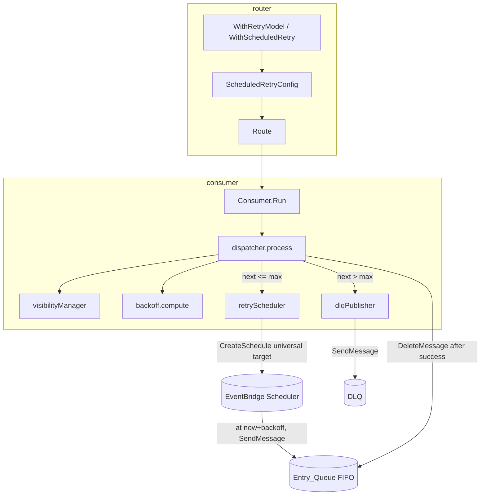

# Design Document

## Overview

This design adds a second, per-route retry model — the **Scheduled Retry model** (the
"fat consumer") — to the FIFO consumption path of `loafer-awsx`, alongside the existing
**Visibility Retry model** which stays the default and is preserved unchanged.

Under the Visibility model (today's behavior), a failing FIFO message is left in the
queue and its visibility timeout is extended until it succeeds or AWS SQS redrives it
natively. This blocks the message group until the message is resolved.

Under the Scheduled Retry model, the consumer owns the whole retry lifecycle so a failing
message never blocks its `MessageGroupId`:

1. The consumer reads a `retry_count` message attribute (default `0`).
2. When the handler fails (returns an error *or* requests backoff), the consumer computes
   the next retry count (`current + 1`) and a backoff delay.
3. If the next count is at or below `Max_Retry_Count`, the consumer asks the
   **Retry_Scheduler** to create a one-time AWS EventBridge Scheduler schedule that
   re-publishes the message to the Entry_Queue after the backoff, then deletes the
   original message so the group unblocks immediately.
4. If the next count exceeds `Max_Retry_Count`, the **DLQ_Publisher** sends the message to
   the configured DLQ, then the consumer deletes the original.
5. On success the message is simply deleted. The library performs no success-side
   publishing: deciding whether success means publishing to a topic, calling an API, or
   doing nothing is the handler's responsibility.

The retry model is selected per route. Enabling the Scheduled model on one route must not
change the behavior of routes using the Visibility model, and no EventBridge Scheduler or
DLQ client is constructed or required unless a route selects the Scheduled model.

### Research summary and key design decisions

Two AWS behaviors materially shape this design and were confirmed against current AWS
documentation:

- **Scheduler target must be the universal target, not the templated SQS target.**
  EventBridge Scheduler's *templated* SQS target (`sqs:sendMessage`) only accepts a
  `MessageBody` plus a `MessageGroupId` (via `SqsParameters`) and, for FIFO queues,
  *requires content-based deduplication*. It cannot carry message attributes or an explicit
  `MessageDeduplicationId`. Because Requirement 3.2 requires carrying user attributes and the
  incremented `retry_count`, and Requirement 3.4 requires an explicit distinct
  `MessageDeduplicationId`, this design uses the **universal target**
  (`arn:aws:scheduler:::aws-sdk:sqs:sendMessage`). With the universal target the schedule's
  `Target.Input` is the full JSON of an SQS `SendMessage` request, so it can include
  `QueueUrl`, `MessageBody`, `MessageGroupId`, `MessageDeduplicationId`, and
  `MessageAttributes`. This is also why Requirement 3.10 mandates explicit-dedup queues.
  (See [Using universal targets in EventBridge Scheduler](https://docs.aws.amazon.com/scheduler/latest/UserGuide/managing-targets-universal.html)
  and [Adding context attributes in EventBridge Scheduler](https://docs.aws.amazon.com/scheduler/latest/UserGuide/managing-schedule-context-attributes.html).
  Content was rephrased for compliance with licensing restrictions.)

- **Scheduler precision vs. the ±1s tolerance in Requirement 9.2.** A one-time schedule uses
  an `at(yyyy-mm-ddThh:mm:ss)` expression whose granularity is one second, but EventBridge
  Scheduler only *guarantees* invocation on a best-effort basis and real dispatch can lag by
  up to roughly a minute. This design resolves the tension by scoping the ±1s tolerance to
  the value the Retry_Scheduler *computes and configures* — the `at()` timestamp — which is
  `now + Backoff_Delay` rounded to whole seconds. That computed value is deterministic and
  property-testable. The *actual* firing latency added by the service is an operational
  reality documented here and in the exported doc comments, not a guarantee the library
  makes. This keeps Requirement 9.2 verifiable without over-promising delivery precision.

- **`ActionAfterCompletion = DELETE` provides self-cleanup.** Setting
  `ActionAfterCompletion` to `DELETE` and `FlexibleTimeWindow.Mode` to `OFF` makes each
  one-time schedule delete itself after its single invocation, satisfying Requirement 9.1
  without the library tracking or reaping schedule resources.
  (See [CreateSchedule API](https://docs.aws.amazon.com/scheduler/latest/APIReference/API_CreateSchedule.html).)

- **`retry_count` is a native SQS message attribute, not an SNS-envelope attribute.** In the
  existing model messages arrive via SNS→SQS and their user attributes live inside the SNS
  envelope in the body. A scheduled retry re-publishes *directly* to SQS, so `retry_count`
  is carried as a native SQS `MessageAttribute` on the re-published message and read from the
  native attributes on the next receive. The original body (including any SNS-envelope user
  attributes) is preserved verbatim as the re-published `MessageBody`.

## Architecture

The Scheduled Retry model is implemented inside the existing `consumer` package by adding
outcome branches to `dispatcher.process`, plus two collaborators — `retryScheduler` and
`dlqPublisher` — and a pure `backoff` helper. Route configuration lives in the `router`
package behind new options. No new packages are introduced.



### Retry-model selection and construction

- `router.RetryModel` is an enum: `VisibilityRetryModel` (zero value / default) and
  `ScheduledRetryModel`.
- `router.WithRetryModel(m)` validates the value and rejects anything else at route
  construction (Req 1.1, 1.4). `router.WithScheduledRetry(opts...)` is sugar that sets the
  model to Scheduled *and* attaches a validated `ScheduledRetryConfig`.
- All Scheduled-model configuration is validated in the route option, so an invalid or
  incomplete configuration returns an error from `router.New` (wrapped with
  `errors.ErrInvalidOption`). Because `consumer.New` receives an already-built `*router.Route`,
  a route that failed to build is never handed to a consumer, so consumption never starts for
  a misconfigured route (Req 1.5, 4.6, 4.7, 5.6, 5.7, 9.4, 11.3).
- `Consumer.Run` inspects `route.RetryModel()`. For the Visibility model the existing code
  path runs untouched and no Scheduler/DLQ client is constructed (Req 10.2, 10.3). For the
  Scheduled model the consumer wires the collaborators from clients supplied through new
  consumer options.

### Where the new branches slot into `dispatcher.process`

`process` keeps its current shape for the Visibility model. For the Scheduled model it
delegates to a new `processScheduled` after the handler returns:

```
process(ctx, msg):
    start visibility goroutine        # extends visibility while handler runs
    err = handler(ctx, msg)

    if retryModel == Visibility:      # unchanged existing behavior
        if msg.BackedOff(): return    # visibility manager applies backoff visibility
        msg.Dispatch()
        if err != nil: observeDLQ / log / leave
        else: deleteMessage
        return

    # Scheduled model
    processScheduled(ctx, msg, err)

processScheduled(ctx, msg, err):
    msg.Dispatch()                    # stop visibility goroutine; no backoff-driven extension
    if err != nil OR msg.BackedOff(): # backoff is treated as failure (Req 3.9)
        current = parseRetryCount(msg) # default 0, log if malformed (Req 2.1-2.4)
        next    = current + 1          # (Req 2.5)
        if next <= maxRetryCount:
            ok = retryScheduler.schedule(ctx, msg, next)   # (Req 3.1-3.4, 9.x)
            if ok: deleteMessage(ctx, msg); metric(retry)  # (Req 3.5, 8.2)
            else:  retainAndLog(...)                        # (Req 3.7, 6.1, 6.3)
        else:
            ok = dlqPublisher.publish(ctx, msg, next)       # (Req 5.1, 5.2)
            if ok: deleteMessage(ctx, msg); metric(deadLetter) # (Req 5.3, 8.3)
            else:  retainAndLog(...)                         # (Req 5.4, 6.2, 6.3)
        return
    # success: library performs no success-side publishing (Req 7.2)
    deleteMessage(ctx, msg); metric(success)  # (Req 7.1, 8.1)
```

Under the Scheduled model the visibility goroutine must **not** react to a backoff signal by
extending visibility (Req 3.9). `visibilityManager` gains a scheduled-aware mode: when the
dispatcher runs a Scheduled-model route, the manager's loop selects only on the ticker,
`dispatchSignal`, and `ctx.Done()` — never on `backoffSignal`. `processScheduled` calls
`msg.Dispatch()` immediately after the handler returns to stop the goroutine, so no
backoff-driven `ChangeMessageVisibility` is ever issued. The buffered (cap 1) backoff channel
means `msg.Backoff` never blocks even though nothing consumes the signal. Goroutine lifetimes
are unchanged: the visibility goroutine is still tracked by the dispatcher wait group and
always returns.

### Message-preservation invariant

`deleteMessage` is called **only** after one of: a schedule was created, a DLQ publish
succeeded, or the handler succeeded (Req 6.4). Every failure branch (`schedule` fails,
`publish` fails) skips deletion, logs the orchestration failure with the message identifier,
and surfaces an error, leaving the message to reappear after its visibility timeout and
keeping the group blocked until then (Req 3.7, 5.4, 6.1, 6.2, 6.3, 6.5, 9.5). If deletion
itself fails after a successful schedule/publish, the message is left for redelivery,
yielding at-least-once delivery (Req 7.5, 11.2).

## Components and Interfaces

### New client interfaces (with fakes)

One new interface is added so the consumer can be tested with a fake and remains decoupled
from the concrete AWS client. It mirrors the `aws-sdk-go-v2` method signature so the concrete
client satisfies it directly.

```go
// SchedulerClient is the minimal EventBridge Scheduler surface the consumer uses.
// *scheduler.Client satisfies it directly.
type SchedulerClient interface {
    CreateSchedule(ctx context.Context, params *scheduler.CreateScheduleInput,
        optFns ...func(*scheduler.Options)) (*scheduler.CreateScheduleOutput, error)
}
```

`consumer.SQSClient` is extended with `SendMessage` (additive; `*sqs.Client` still satisfies
it) so the DLQ publisher can send to the DLQ:

```go
type SQSClient interface {
    // ... existing methods ...
    SendMessage(ctx context.Context, params *sqs.SendMessageInput,
        optFns ...func(*sqs.Options)) (*sqs.SendMessageOutput, error)
}
```

New fakes are added under `fake/`: `fake.SchedulerClient` (recording `CreateSchedule`
calls) following the existing `fake.SQSClient` pattern. `fake.SQSClient` gains a
`SendMessageFunc` + recorded `SendMessage` calls.

### `retryScheduler`

Owns a `SchedulerClient` plus the resolved scheduler identity (target Entry_Queue ARN,
execution role ARN, target queue URL, dedup ID generator). Responsibilities:

- Build the re-publish payload: `MessageBody` = original raw body; `MessageAttributes` =
  the original native user attributes with `retry_count` set to the next count, capped at the
  SQS limit of ten attributes; `MessageGroupId` = original group id; `MessageDeduplicationId`
  = a freshly generated ID distinct from the original (reusing `idgen.NewRandom`), satisfying
  Req 3.2, 3.3, 3.4.
- Serialize that payload as the universal-target `Input` JSON and call `CreateSchedule` with
  `ScheduleExpression = at(now+backoff)`, `FlexibleTimeWindow.Mode = OFF`,
  `ActionAfterCompletion = DELETE`, `Target.Arn` = universal SQS SendMessage ARN,
  `Target.RoleArn` = execution role (Req 3.1, 9.1, 9.2).
- Return an error wrapping `errors.ErrRetryScheduleCreate` on failure so the caller retains
  the message (Req 3.7, 9.5).

Schedule names must be unique per invocation; the scheduler uses the fresh dedup ID (a UUID)
as the schedule name to avoid `ConflictException`.

### `dlqPublisher`

Owns a `SQSClient` and the resolved DLQ destination (queue URL; group id + dedup id
generators when the DLQ is FIFO). It sends the original body plus all user attributes and the
final `retry_count` via `SendMessage` (Req 5.1, 5.2). A FIFO DLQ requires a `MessageGroupId`
(reusing the original group id) and a `MessageDeduplicationId` (freshly generated). On failure
it returns an error wrapping `errors.ErrDLQPublish` so the caller retains the message
(Req 5.4, 6.2).

### Successful outcome

On a successful handler outcome the dispatcher deletes the message and emits the success
metric (Req 7.1, 8.1). The library performs no success-side publishing: whether success means
publishing to a topic, calling an API, or doing nothing is decided inside the handler
(Req 7.2). There is no `successPublisher` component and no SNS client in this design.

### Metrics hooks

Following the existing `DLQMetric` pattern in `consumer/options.go`, three optional counters
are added and wired through consumer options, each labeled by route name and no-op when nil:

```go
type SuccessMetric   func(routeName string)
type RetryMetric     func(routeName string)
type DeadLetterMetric func(routeName string)

func WithSuccessMetric(inc SuccessMetric) Option
func WithRetryMetric(inc RetryMetric) Option
func WithDeadLetterMetric(inc DeadLetterMetric) Option
```

Each metric is emitted exactly once per matching outcome when enabled and never when disabled
(Req 8.1–8.4). Emission is wrapped in a recover-guarded helper so a panicking metric hook is
logged and the message outcome still completes without retention or reprocessing (Req 8.5).

### Router configuration surface

```go
// RetryModel selects the per-route retry behavior.
type RetryModel int
const (
    VisibilityRetryModel RetryModel = iota // default
    ScheduledRetryModel
)

func WithRetryModel(m RetryModel) Option        // Req 1.1, 1.4
func WithScheduledRetry(opts ...ScheduledRetryOption) Option // sets model + config

// ScheduledRetryOption configures the ScheduledRetryConfig.
func WithSchedulerIdentity(targetQueueARN, executionRoleARN string) ScheduledRetryOption // Req 9.3
func WithScheduledDLQ(dlqQueueURL string) ScheduledRetryOption                            // Req 5.5
func WithMaxRetryCount(n int) ScheduledRetryOption                                        // Req 5.5, 5.7
func WithBackoff(base, max time.Duration) ScheduledRetryOption                            // Req 4.1
```

Validation performed at construction (all return configuration errors identifying the
offending value, and none start the Scheduled model on failure):

- Scheduler identity: both target Entry_Queue reference and execution role reference required;
  a missing item is named in the error (Req 9.4).
- DLQ destination required (Req 5.6).
- `Max_Retry_Count` within `[0, 2147483647]` (Req 5.7).
- `base` and `max` backoff within `[1ms, 86_400_000ms]`; `max >= base` (Req 4.6, 4.7);
  base defaults to `1000ms` when unset (Req 4.5).
- Mutual exclusivity: configuring both the Scheduled-model DLQ and the existing observe-only
  `WithDLQ` is a configuration error (Req 11.3).

## Data Models

```go
// ScheduledRetryConfig is the validated per-route configuration for the Scheduled
// Retry model. It is nil for routes using the Visibility model.
type ScheduledRetryConfig struct {
    TargetQueueARN   string        // EventBridge Scheduler target (Entry_Queue) ARN
    ExecutionRoleARN string        // role the scheduler assumes to send the message
    DLQQueueURL      string        // DLQ destination for exhausted messages
    MaxRetryCount    int           // inclusive threshold before DLQ routing
    BaseBackoff      time.Duration // first-retry delay; default 1s
    MaxBackoff       time.Duration // upper clamp; <= 24h
}
```

- `Route` gains `retryModel RetryModel` and `scheduledRetry *ScheduledRetryConfig`, with
  getters `RetryModel()` and `ScheduledRetry()`.
- The `retry_count` message attribute is a native SQS `MessageAttribute` named
  `retry_count`, typed `Number`/`String`, holding a base-10 non-negative integer.
- `message` is extended to expose native SQS user message attributes (distinct from the
  existing SNS-envelope `Attributes()` and SQS `SystemAttributes()`):

```go
// UserMessageAttribute returns a native SQS user message attribute by key.
func (m *message) UserMessageAttribute(key string) string
// UserMessageAttributes returns a fresh copy of all native SQS user message attributes.
func (m *message) UserMessageAttributes() map[string]string
```

### Backoff computation

A pure function computes the delay so it can be property-tested in isolation:

```go
// computeBackoff returns the delay for the given retry attempt (attempt 1 is the
// first retry). It grows exponentially as base * 2^(attempt-1), is clamped to
// [1ms, max], is monotonically non-decreasing in attempt, and never overflows.
func computeBackoff(attempt int, base, max time.Duration) time.Duration
```

Curve: `base * 2^(attempt-1)`, clamped up to at least `1ms` and down to `max`. Overflow is
avoided by returning `max` whenever the shift would exceed `max` (checked before shifting
rather than after). The default curve is deterministic (no jitter) so tests are repeatable;
optional jitter is intentionally out of scope for the default to preserve testability.

### Schedule invocation time

```go
// scheduleAt returns the one-time schedule fire time as now + backoff, truncated
// to whole seconds to match the at() expression granularity.
func scheduleAt(now time.Time, backoff time.Duration) time.Time
```

The `at()` expression is formatted from `scheduleAt`, so the configured invocation time equals
`now + backoff` within ±1s (the truncation error), satisfying Req 9.2 at the configuration
layer.

## Error Handling

New sentinel errors are added to the `errors` package, matchable with `errors.Is` and
wrappable via the existing `errors.Wrap`:

- `ErrRetryScheduleCreate` — the EventBridge Scheduler `CreateSchedule` call failed; the
  original message is retained (Req 3.7, 9.5).
- `ErrDLQPublish` — the DLQ `SendMessage` failed; the original message is retained (Req 5.4,
  6.2).
- `ErrScheduledRetryConfig` — a Scheduled-model route configuration is invalid or incomplete;
  returned from the route option and wrapped with `errors.ErrInvalidOption` by `router.New`
  (Req 1.4, 4.6, 4.7, 5.6, 5.7, 9.4, 11.3).
- `ErrNoSchedulerClient` — a Scheduled-model route was given to a consumer without the
  scheduler client it needs.

Handling rules:

- Orchestration failures (schedule/DLQ) never delete the message and always log at Error level
  with the message identifier, group id, and failure cause, then surface the wrapped error
  (Req 6.3).
- Delete failures after a successful schedule/publish/handler are logged and swallowed, leaving
  the message for at-least-once redelivery (Req 7.5, 11.2), matching the existing
  `deleteMessage` behavior.
- Metric emission failures (panics) are recovered, logged, and non-fatal (Req 8.5).
- Malformed `retry_count` attributes are logged and treated as `0` (Req 2.3, 2.4).

The library never panics; all AWS calls take `context.Context` and honor cancellation, and no
goroutine is added beyond the existing per-message visibility goroutine.

## Correctness Properties

*A property is a characteristic or behavior that should hold true across all valid executions
of a system — essentially, a formal statement about what the system should do. Properties
serve as the bridge between human-readable specifications and machine-verifiable correctness
guarantees.*

### Property 1: Backoff is bounded, monotonic, and seeded by base

*For any* configured `base` and `max` with `1ms <= base <= max <= 24h` and *for any* two
attempts `i <= j` (attempts start at 1), `computeBackoff(i) <= computeBackoff(j)`,
`1ms <= computeBackoff(i) <= max`, and `computeBackoff(1)` equals `base` clamped to
`[1ms, max]`.

**Validates: Requirements 4.2, 4.3, 4.4, 4.5**

### Property 2: Retry-count parsing defaults to zero

*For any* attribute value, parsing the `retry_count` attribute yields the encoded value when
it is a non-negative base-10 integer, and yields `0` when the attribute is absent or does not
parse as a non-negative integer.

**Validates: Requirements 2.1, 2.2, 2.3**

### Property 3: Retry count increments by one on failure

*For any* current retry count `n >= 0`, the next retry count computed on a handler failure is
`n + 1`.

**Validates: Requirements 2.5**

### Property 4: Retry-versus-DLQ decision follows the threshold

*For any* next retry count and `Max_Retry_Count`, the consumer takes the schedule path when
the next count is at or below `Max_Retry_Count` and the DLQ path when it exceeds it, and never
both.

**Validates: Requirements 3.1, 3.8, 5.1**

### Property 5: Re-published retry preserves body and FIFO identity

*For any* FIFO message and next retry count, the scheduled re-publish payload preserves the
original body, preserves the original `Message_Group_Id`, sets the `retry_count` attribute to
the next count, includes the original user attributes without exceeding ten message
attributes, and assigns a `Message_Deduplication_Id` distinct from the original.

**Validates: Requirements 2.6, 3.2, 3.3, 3.4**

### Property 6: Schedule invocation time equals now plus backoff

*For any* `now` and backoff delay, the configured `at()` invocation timestamp equals
`now + backoff` within a tolerance of ±1 second.

**Validates: Requirements 9.2**

### Property 7: A message is deleted only after successful orchestration

*For any* message outcome under the Scheduled model, the original message is deleted if and
only if the handler succeeded, or a retry schedule was created, or a DLQ publish succeeded;
whenever schedule creation or DLQ publish fails, the original message is not deleted and an
error is surfaced and logged.

**Validates: Requirements 3.5, 3.7, 5.3, 5.4, 6.1, 6.2, 6.4, 9.5, 11.2**

### Property 8: Backoff requests are treated as failures

*For any* handler that requests backoff under the Scheduled model, the consumer applies the
schedule-or-DLQ decision and never extends the message visibility timeout.

**Validates: Requirements 3.9**

### Property 9: Success deletes without publishing

*For any* successful handler under the Scheduled model, the message is deleted from the
Entry_Queue and the consumer performs no success-side publish to any destination.

**Validates: Requirements 7.1, 7.2**

### Property 10: Exactly one metric per outcome when enabled

*For any* single message outcome under the Scheduled model, when metrics are enabled exactly
one metric matching the outcome (success, retry, or dead-letter) is emitted labeled with the
route name, and when metrics are disabled no metric is emitted.

**Validates: Requirements 8.1, 8.2, 8.3, 8.4**

## Testing Strategy

The feature mixes pure logic (well-suited to property-based testing) with AWS integration and
configuration wiring (better served by example and integration tests). Both approaches are
used.

### Property-based tests

Property tests use `pgregory.net/rapid` (already used across the repo, e.g. `idgen`), run a
minimum of 100 iterations, live in `_test` packages, and each is tagged with a comment
referencing its design property in the form:
`// Feature: fifo-scheduled-retry, Property {n}: {property text}`.

- **Property 1** — generate `base`/`max` in range and attempt pairs; assert monotonicity,
  bounds, and the base seed. Include boundary generators (1ms, 24h, base == max).
- **Property 2** — generate arbitrary strings plus valid non-negative integers and the
  absent case; assert the parsed value and zero-default. Malformed inputs also assert a log
  entry is recorded via the fake log handler.
- **Property 3** — generate `n >= 0`; assert `next == n+1`.
- **Property 4** — generate next count and `Max_Retry_Count`; assert exactly one path is
  selected, using a fake scheduler and fake DLQ to observe which was called.
- **Property 5** — generate FIFO messages (body, group id, user attributes up to and beyond
  ten) and next counts; decode the universal-target `Input` JSON and assert body, group id,
  `retry_count`, attribute cap, and dedup-id distinctness.
- **Property 6** — generate `now` and backoff; parse the `at()` expression and assert the ±1s
  tolerance.
- **Property 7** — model-based test: generate handler outcome (success / error / backoff) and
  fake scheduler/DLQ success/failure; assert `DeleteMessage` is called iff orchestration
  succeeded, and an error is surfaced/logged otherwise.
- **Property 8** — generate handlers that call `Backoff`; assert no `ChangeMessageVisibility`
  call is issued and the schedule/DLQ decision is applied.
- **Property 9** — generate success outcomes; assert the message is deleted and that no SNS
  or other success-side publish call is issued (the consumer holds no publisher client).
- **Property 10** — generate each outcome with metrics enabled/disabled; assert exactly-once
  or zero counter increments using fake counters.

### Example and integration tests (PBT not appropriate)

- **Router configuration validation** (Req 1.4, 1.5, 4.6, 4.7, 5.6, 5.7, 9.4, 11.3): table
  driven example tests asserting each invalid/missing/conflicting configuration returns the
  expected error and does not build the route.
- **Scheduler request shape** (Req 9.1): example test asserting `CreateScheduleInput` has
  `ActionAfterCompletion = DELETE`, `FlexibleTimeWindow.Mode = OFF`, the universal-target ARN,
  and the execution role — deterministic wiring, so 1–2 examples suffice.
- **Backward compatibility** (Req 10.1–10.4): example tests asserting a Visibility-model route
  builds with no scheduler/DLQ configuration, extends visibility on backoff, and never
  constructs a scheduler/DLQ client or moves messages itself. This includes an assertion
  that the existing `consumer`/`dispatch`/`visibility` tests continue to pass unchanged.
- **End-to-end integration** (optional, mirrors existing `*_integration_test.go` with
  LocalStack via `docker-compose.integration.yml`): a Scheduled-model route that fails a
  handler creates a schedule and deletes the original; an exhausted message lands in the DLQ.
  These use 1–3 representative cases, not property iteration, because they exercise external
  service wiring rather than input-varying logic.

### Unit tests

Focused example tests cover the malformed-attribute logging path, the success-topic-disabled
path, delete-failure logging, and metric-panic recovery — specific behaviors and error
conditions that complement the universal property tests without duplicating them.
