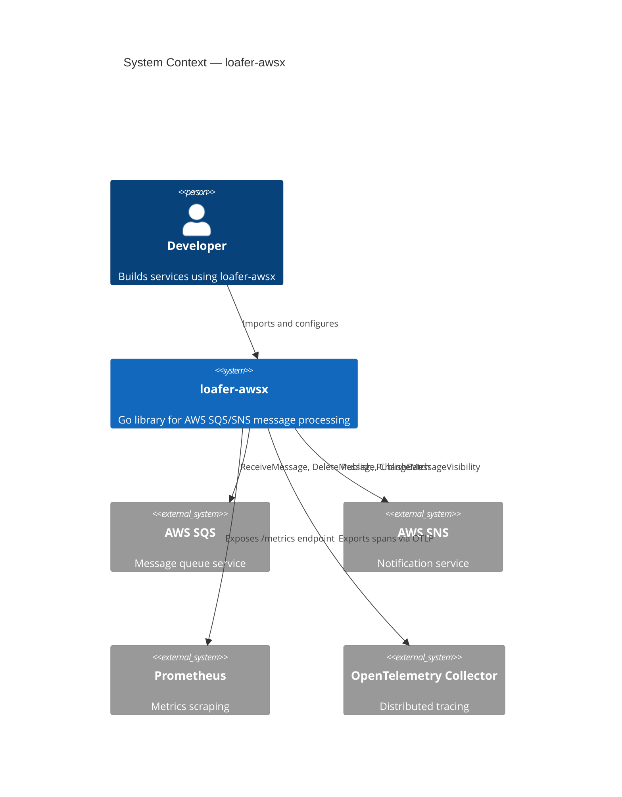
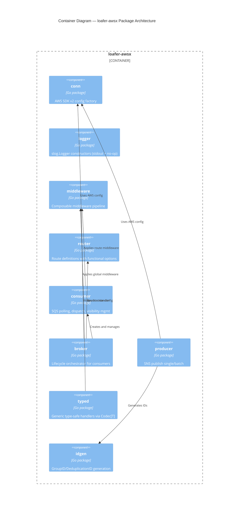
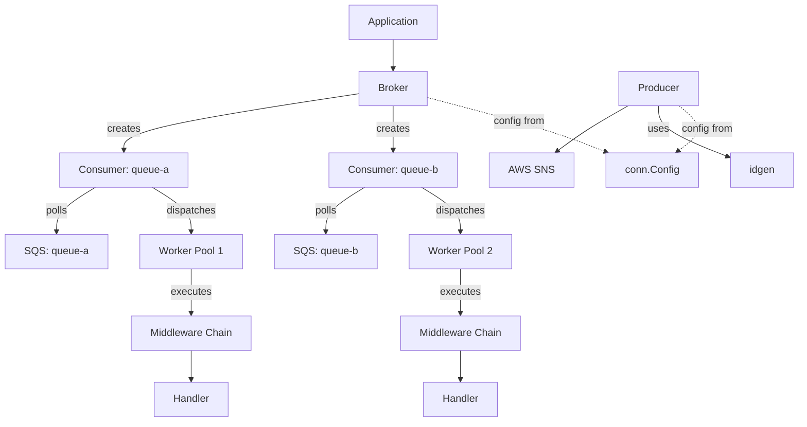
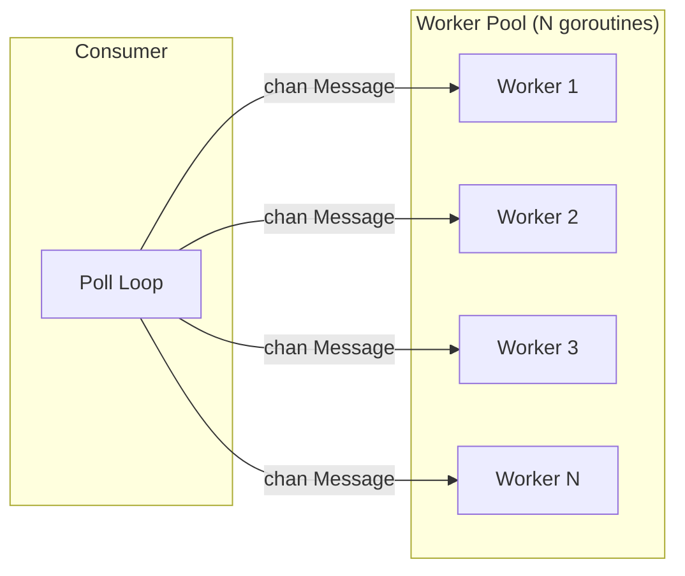
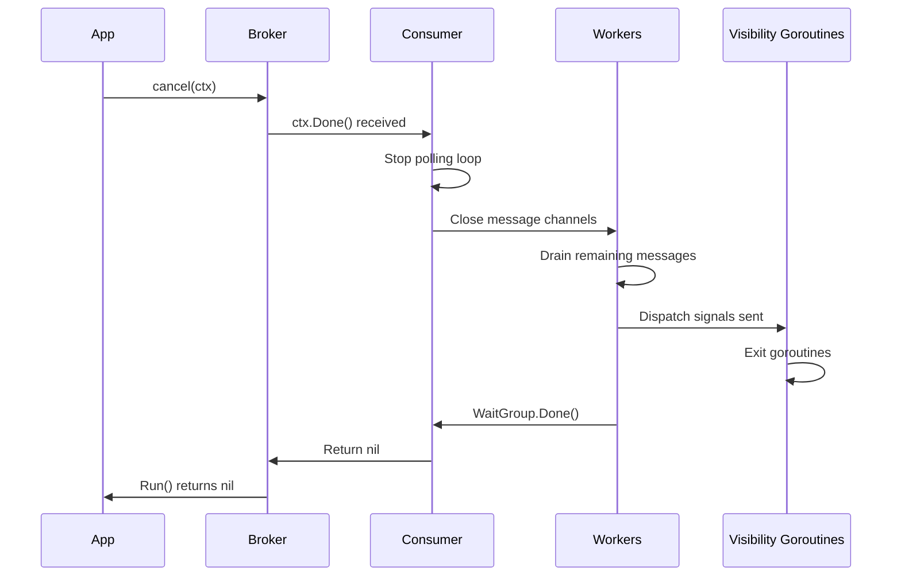
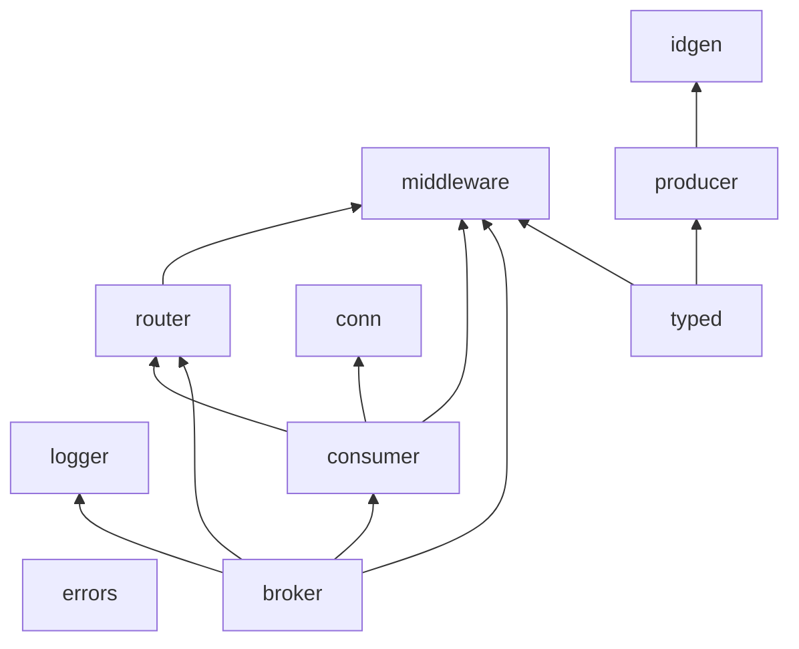

# loafer-awsx — Design Document

> Formerly the loafer-go v3 rewrite. Now delivered as its own module: `github.com/silviolleite/loafer-awsx`.

## Table of Contents

1. [Architecture Overview](#1-architecture-overview)
2. [Package Design](#2-package-design)
3. [Core Types and Interfaces](#3-core-types-and-interfaces)
4. [Middleware Pipeline Design](#4-middleware-pipeline-design)
5. [Concurrency Model](#5-concurrency-model)
6. [Error Handling Strategy](#6-error-handling-strategy)
7. [Configuration Design](#7-configuration-design)
8. [Testing Strategy](#8-testing-strategy)
9. [Project Directory Structure](#9-project-directory-structure)
10. [Migration Notes (loafer-go v2 → loafer-awsx)](#10-migration-notes-v2--v3)

---

## 1. Architecture Overview

### 1.1 C4 Context Diagram



### 1.2 C4 Container Diagram



### 1.3 Data Flow — Message Lifecycle

```mermaid
sequenceDiagram
    participant SQS as AWS SQS
    participant C as Consumer
    participant VTM as VisibilityTimeoutManager
    participant W as Worker (goroutine)
    participant MW as Middleware Pipeline
    participant H as Handler

    loop Polling Loop
        C->>SQS: ReceiveMessage(maxMessages, waitTimeSeconds)
        SQS-->>C: []Message

        par For each message
            C->>W: Dispatch message to worker channel
            W->>VTM: Start visibility extension goroutine
            W->>MW: Execute middleware chain
            MW->>H: Call handler(ctx, msg)

            alt Handler returns nil
                H-->>MW: nil
                MW-->>W: nil
                W->>SQS: DeleteMessage(receiptHandle)
                W->>VTM: Signal dispatch (stop extension)
            else Handler returns error
                H-->>MW: error
                MW-->>W: error
                W->>W: Log error, leave in queue
                W->>VTM: Signal dispatch (stop extension)
            else Message backed off
                H-->>MW: nil (after Backoff call)
                MW-->>W: nil
                W->>VTM: Signal backoff(duration)
                VTM->>SQS: ChangeMessageVisibility(duration)
            else Retries exhausted (SQS will redrive)
                H-->>MW: error
                MW-->>W: error
                W->>W: Emit Error log + loafer_messages_dlq_total + OnDLQ callback
                Note over W,SQS: Message left in queue; AWS SQS redrives natively per its redrive policy
                W->>VTM: Signal dispatch (stop extension)
            end
        end
    end
```

### 1.4 Component Interaction Overview



---

## 2. Package Design

### 2.1 Package: `conn`

**Import path:** `github.com/silviolleite/loafer-awsx/conn`

**Purpose:** Factory for AWS SDK v2 `aws.Config`. Encapsulates credential resolution,
endpoint configuration, retry policies, and profile loading.

**Public API:**

```go
package conn

import (
    "context"

    "github.com/aws/aws-sdk-go-v2/aws"
)

// Option configures the AWS connection.
type Option func(*options) error

// New creates an aws.Config from the provided options.
// Returns an error if required fields (region) are missing or invalid.
func New(ctx context.Context, opts ...Option) (aws.Config, error)

// WithRegion sets the AWS region (required).
func WithRegion(region string) Option

// WithAccessKey sets static credentials (access key + secret).
func WithAccessKey(key, secret string) Option

// WithSessionToken adds a session token to static credentials.
func WithSessionToken(token string) Option

// WithProfile sets the shared config profile name.
func WithProfile(profile string) Option

// WithEndpoint sets a custom endpoint URL (for LocalStack, etc.).
func WithEndpoint(url string) Option

// WithRetryCount sets the maximum retry attempts (default: 10).
func WithRetryCount(n int) Option
```

**Internal design notes:**
- Uses `aws-sdk-go-v2/config.LoadDefaultConfig` with applied overrides.
- Validates region is non-empty before calling LoadDefaultConfig.
- Static credentials take precedence over profile when both are provided.
- Default retry count is 10 using `retry.NewStandard(func(o *retry.StandardOptions) { o.MaxAttempts = n })`.

**Dependencies:** `aws-sdk-go-v2`, `aws-sdk-go-v2/config`, `aws-sdk-go-v2/credentials`

---

### 2.2 Package: `logger`

**Import path:** `github.com/silviolleite/loafer-awsx/logger`

**Purpose:** Provides constructors for the standard library `*slog.Logger` used throughout
all packages. The library does not define a custom logger interface; `*slog.Logger` is the
logging type everywhere. This package supplies a default stdout logger and a silent no-op logger.

**Public API:**

```go
package logger

import "log/slog"

// New returns a default *slog.Logger writing structured, leveled output to stdout
// using a slog.TextHandler on os.Stdout.
func New() *slog.Logger

// NewNoOp returns a *slog.Logger backed by a discard handler (silent).
func NewNoOp() *slog.Logger
```

**Internal design notes:**
- `New()` builds the logger with `slog.NewTextHandler(os.Stdout, ...)`, producing structured,
  leveled key=value output.
- `NewNoOp()` uses a discard handler (`slog.DiscardHandler` on Go 1.24, or a handler whose
  `Enabled` always returns false on earlier versions) so all records are dropped.
- Consumers using zap, zerolog, or logrus pass a `*slog.Logger` created from the respective
  slog bridge (for example, `zapslog` for zap). No adapter is provided or required by this library.

**Dependencies:** Standard library only (`log/slog`, `os`)

---

### 2.3 Package: `middleware`

**Import path:** `github.com/silviolleite/loafer-awsx/middleware`

**Purpose:** Defines the Middleware type, Chain combinator, and built-in middlewares
(Recovery, Logging, Metrics, OpenTelemetry).

**Public API:**

```go
package middleware

import (
    "context"
    "log/slog"

    "github.com/prometheus/client_golang/prometheus"
    "go.opentelemetry.io/otel/trace"
)

// Handler is the function signature for message processing.
type Handler func(ctx context.Context, msg Message) error

// Message is the minimal interface required by middleware.
// Re-exported from the consumer package to avoid circular imports.
type Message interface {
    Body() []byte
    Identifier() string
    Attribute(key string) string
    Attributes() map[string]string
    SystemAttributeByKey(key string) string
    SystemAttributes() map[string]string
    Metadata() map[string]string
    Message() string
}

// Middleware wraps a Handler with additional behavior.
type Middleware func(Handler) Handler

// Chain composes multiple middlewares into a single Middleware.
// Middlewares are applied in order: first in the slice is outermost.
//
//   Chain(A, B, C)(handler) == A(B(C(handler)))
func Chain(mws ...Middleware) Middleware

// Recovery catches panics in the handler, logs the stack trace, and returns an error.
func Recovery(log *slog.Logger) Middleware

// Logging logs message receipt, processing duration, and outcome.
func Logging(log *slog.Logger) Middleware

// MetricsOption configures the Metrics middleware.
type MetricsOption func(*metricsConfig)

// Metrics instruments handlers with Prometheus counters, histogram, and gauge.
func Metrics(routeName string, opts ...MetricsOption) Middleware

// WithMetricsRegisterer sets a custom Prometheus registerer (default: prometheus.DefaultRegisterer).
func WithMetricsRegisterer(r prometheus.Registerer) MetricsOption

// OTelOption configures the OpenTelemetry middleware.
type OTelOption func(*otelConfig)

// OTel creates spans for each message processing operation.
func OTel(routeName string, opts ...OTelOption) Middleware

// WithTracerProvider sets a custom TracerProvider (default: global).
func WithTracerProvider(tp trace.TracerProvider) OTelOption
```

**Internal design notes:**
- The `Message` interface is defined here as the minimal subset to avoid import cycles.
  The consumer package's full Message type satisfies this interface.
- Metrics middleware lazily registers collectors on first use (safe for multiple routes).
- Recovery middleware uses `runtime/debug.Stack()` for the panic trace.
- Recovery and Logging middleware log through the `*slog.Logger` directly, using its leveled
  methods (`Debug`/`Info`/`Warn`/`Error`, which map to the corresponding `slog.Level`).

**Dependencies:** `prometheus/client_golang`, `go.opentelemetry.io/otel`, `log/slog`

---

### 2.4 Package: `router`

**Import path:** `github.com/silviolleite/loafer-awsx/router`

**Purpose:** Defines a Route as a binding between a queue name, handler, middleware chain,
and route-level configuration options. Pure configuration — no runtime behavior.

**Public API:**

```go
package router

import (
    "time"

    "github.com/silviolleite/loafer-awsx/middleware"
)

// Mode defines how messages are dispatched to workers.
type Mode int

const (
    // Parallel dispatches messages to random workers.
    Parallel Mode = iota
    // PerGroupID dispatches messages to workers based on MessageGroupId hash.
    PerGroupID
)

// Route holds the configuration for a single SQS queue consumer.
type Route struct {
    queueName         string
    handler           middleware.Handler
    middlewares       []middleware.Middleware
    workerPoolSize    int
    maxMessages       int32
    waitTimeSeconds   int32
    visibilityTimeout int32
    extensionLimit    int
    runMode           Mode
    customGroupFields []string
    dlqConfig         *DLQConfig
}

// DLQConfig holds Dead Letter Queue observability configuration for a route.
// The library does not move, publish, or delete messages for DLQ purposes;
// redrive to the dead letter queue is delegated to the AWS SQS native redrive
// policy. This config only controls when the consumer treats a message as
// exhausted so it can emit observability signals.
type DLQConfig struct {
    // MaxReceiveCount mirrors the source queue's redrive policy maxReceiveCount.
    // It is used solely to detect when a message is exhausted (about to be
    // redriven by SQS); the library never performs the redrive itself.
    MaxReceiveCount int
    OnDLQ           func(ctx context.Context, msg middleware.Message)
}

// Option configures a Route.
type Option func(*Route) error

// New creates a Route with the given queue name, handler, and options.
// Returns an error if queue name is empty or handler is nil.
func New(queueName string, handler middleware.Handler, opts ...Option) (*Route, error)

// WithWorkerPoolSize sets the number of worker goroutines (default: 5).
func WithWorkerPoolSize(n int) Option

// WithMaxMessages sets the max messages per SQS receive call (default: 10).
func WithMaxMessages(n int32) Option

// WithWaitTimeSeconds sets long-polling wait time (default: 10).
func WithWaitTimeSeconds(n int32) Option

// WithVisibilityTimeout sets the visibility timeout in seconds (min: 11, default: 30).
func WithVisibilityTimeout(seconds int32) Option

// WithExtensionLimit sets how many times visibility can be extended (default: 2).
func WithExtensionLimit(n int) Option

// WithRunMode sets the message dispatch strategy (default: Parallel).
func WithRunMode(mode Mode) Option

// WithCustomGroupFields sets fields extracted from message body for PerGroupID routing.
func WithCustomGroupFields(fields ...string) Option

// WithMiddleware appends route-level middleware to the chain.
func WithMiddleware(mws ...middleware.Middleware) Option

// WithDLQ enables Dead Letter Queue observability for the route.
//
// This option does NOT configure a redrive destination — the destination is
// owned by the AWS SQS queue's redrive policy (RedrivePolicy). The library never
// moves, publishes, or deletes messages for DLQ purposes. maxReceiveCount MUST
// mirror the source queue's redrive policy maxReceiveCount; it is used only to
// know when a message is exhausted so the consumer can emit observability
// signals (Error log, loafer_messages_dlq_total metric, and optional OnDLQ
// callback) while leaving the message in the queue for SQS to redrive.
func WithDLQ(maxReceiveCount int, opts ...DLQOption) Option

// DLQOption configures DLQ observability behavior.
type DLQOption func(*DLQConfig)

// WithOnDLQ sets a callback invoked when a message is treated as exhausted
// (its receive count has reached maxReceiveCount and SQS is about to redrive it).
func WithOnDLQ(fn func(ctx context.Context, msg middleware.Message)) DLQOption

// QueueName returns the configured queue name.
func (r *Route) QueueName() string

// Handler returns the configured handler.
func (r *Route) Handler() middleware.Handler

// Middlewares returns the route-level middleware chain.
func (r *Route) Middlewares() []middleware.Middleware

// WorkerPoolSize returns the configured worker pool size.
func (r *Route) WorkerPoolSize() int

// MaxMessages returns the max messages per receive.
func (r *Route) MaxMessages() int32

// WaitTimeSeconds returns the long-polling wait time.
func (r *Route) WaitTimeSeconds() int32

// VisibilityTimeout returns the visibility timeout seconds.
func (r *Route) VisibilityTimeout() int32

// ExtensionLimit returns the max visibility extensions.
func (r *Route) ExtensionLimit() int

// RunMode returns the dispatch mode.
func (r *Route) RunMode() Mode

// CustomGroupFields returns the group routing fields.
func (r *Route) CustomGroupFields() []string

// DLQ returns the DLQ config (nil if not configured).
func (r *Route) DLQ() *DLQConfig
```

**Internal design notes:**
- Route is immutable after creation — all fields are unexported, accessed via getters.
- Validation happens in `New()`: empty queue name → error, nil handler → error,
  visibility timeout < 11 gets clamped to 11.
- Route is a pure value object; it doesn't hold runtime state.

**Dependencies:** `middleware` package (for Handler and Middleware types)

---

### 2.5 Package: `consumer`

**Import path:** `github.com/silviolleite/loafer-awsx/consumer`

**Purpose:** Implements the SQS polling loop, worker pool dispatch, visibility timeout
management, and message commit/backoff lifecycle.

**Public API:**

```go
package consumer

import (
    "context"
    "log/slog"
    "time"

    "github.com/aws/aws-sdk-go-v2/service/sqs"
    "github.com/silviolleite/loafer-awsx/middleware"
    "github.com/silviolleite/loafer-awsx/router"
)

// SQSClient defines the minimal SQS operations used by the consumer.
type SQSClient interface {
    ReceiveMessage(ctx context.Context, params *sqs.ReceiveMessageInput, optFns ...func(*sqs.Options)) (*sqs.ReceiveMessageOutput, error)
    DeleteMessage(ctx context.Context, params *sqs.DeleteMessageInput, optFns ...func(*sqs.Options)) (*sqs.DeleteMessageOutput, error)
    ChangeMessageVisibility(ctx context.Context, params *sqs.ChangeMessageVisibilityInput, optFns ...func(*sqs.Options)) (*sqs.ChangeMessageVisibilityOutput, error)
    GetQueueUrl(ctx context.Context, params *sqs.GetQueueUrlInput, optFns ...func(*sqs.Options)) (*sqs.GetQueueUrlOutput, error)
}

// Message represents a received SQS message with lifecycle controls.
type Message interface {
    middleware.Message
    Decode(out any) error
    DecodeMessage(out any) error
    Identifier() string
    TimeStamp() time.Time
    Dispatch()
    Backoff(delay time.Duration)
    BackedOff() bool
}

// Consumer polls a single SQS queue and dispatches messages to workers.
type Consumer struct { /* unexported fields */ }

// Option configures a Consumer.
type Option func(*Consumer)

// New creates a Consumer for the given route. It returns
// errors.ErrNoSQSClient when client is nil and errors.ErrNoRoute when route is
// nil, so a misconfigured consumer fails fast at construction.
func New(client SQSClient, route *router.Route, opts ...Option) (*Consumer, error)

// WithLogger sets the consumer logger.
func WithLogger(log *slog.Logger) Option

// WithRetryTimeout sets the delay between receive errors (default: 5s).
func WithRetryTimeout(d time.Duration) Option

// WithGlobalMiddleware prepends broker-level middleware to the chain.
func WithGlobalMiddleware(mws ...middleware.Middleware) Option

// Run starts the consumer polling loop. Blocks until ctx is canceled.
// Returns nil on clean shutdown, error on configuration failure.
func (c *Consumer) Run(ctx context.Context) error
```

**Internal design notes:**
- `New()` validates its inputs (fail-fast): a nil client returns `ErrNoSQSClient` and a nil route
  returns `ErrNoRoute`, so the consumer never dereferences a nil client or route during `Run()`.
- `Run()` resolves the queue URL first (fail-fast), then enters the polling loop.
- `Run()` sets `VisibilityTimeout` on the `ReceiveMessage` request to the route visibility timeout,
  so each message starts hidden for the configured duration and the visibility manager skips the
  initial `ChangeMessageVisibility` call, avoiding an extra API call (and cost) for messages that
  complete before the first extension tick.
- Each received message spawns a visibility timeout goroutine.
- Worker assignment: `Parallel` → `rand.Intn(poolSize)`, `PerGroupID` → `hash(groupKey) % poolSize`.
- Group key = `MessageGroupId` + joined custom fields from message attributes.
- On context cancellation: stop polling, close worker channels, wait for in-flight handlers.
- DLQ observability (observe-only): when a DLQ option is configured and the handler returns an
  error, if `ApproximateReceiveCount` >= `MaxReceiveCount`, the consumer treats the message as
  exhausted and emits an Error-level log (message identifier, queue name, receive count), the
  `loafer_messages_dlq_total` metric, and the optional `OnDLQ` callback. The message is left in
  the source queue — the consumer never publishes or deletes it for DLQ purposes; AWS SQS performs
  the redrive natively per the queue's redrive policy.

**Dependencies:** `aws-sdk-go-v2/service/sqs`, `router`, `middleware`, `log/slog`

---

### 2.6 Package: `broker`

**Import path:** `github.com/silviolleite/loafer-awsx/broker`

**Purpose:** Top-level orchestrator that creates and manages Consumer instances for
multiple routes. Provides coordinated startup, shutdown, and fail-fast behavior.

**Public API:**

```go
package broker

import (
    "context"
    "log/slog"
    "time"

    "github.com/silviolleite/loafer-awsx/consumer"
    "github.com/silviolleite/loafer-awsx/logger"
    "github.com/silviolleite/loafer-awsx/middleware"
    "github.com/silviolleite/loafer-awsx/router"
)

// Broker manages the lifecycle of multiple consumers.
type Broker struct { /* unexported fields */ }

// Option configures the Broker.
type Option func(*Broker)

// New creates a Broker with routes and options.
// Returns an error if no routes are provided.
func New(sqsClient consumer.SQSClient, routes []*router.Route, opts ...Option) (*Broker, error)

// WithLogger sets the broker logger (default: logger.New()).
func WithLogger(log *slog.Logger) Option

// WithRetryTimeout sets the delay for transient receive errors (default: 5s).
func WithRetryTimeout(d time.Duration) Option

// WithMiddleware sets global middleware applied to all routes (outermost).
func WithMiddleware(mws ...middleware.Middleware) Option

// WithShutdownTimeout sets the max time to wait for in-flight messages on shutdown
// (default: unbounded — waits until consumers finish; set a duration to bound it).
func WithShutdownTimeout(d time.Duration) Option

// Run starts all consumers concurrently and blocks until ctx is canceled
// or a fatal error occurs. Returns nil on clean shutdown.
func (b *Broker) Run(ctx context.Context) error
```

**Internal design notes:**
- `New()` validates at least one route exists (returns `ErrNoRoute` otherwise).
- `Run()` creates a child context with cancel; on first consumer config error, cancels all.
- Uses `sync.WaitGroup` to track all consumer goroutines.
- Shutdown sequence: cancel context → consumers stop polling → wait for WaitGroup → return.
- Global middleware is passed to each Consumer via `WithGlobalMiddleware`.

**Dependencies:** `consumer`, `router`, `middleware`, `logger`, `log/slog`

---

### 2.7 Package: `producer`

**Import path:** `github.com/silviolleite/loafer-awsx/producer`

**Purpose:** Publishes messages to AWS SNS topics. Supports standard and FIFO topics,
single and batch operations, and optional ID generation.

**Public API:**

```go
package producer

import (
    "context"

    "github.com/aws/aws-sdk-go-v2/service/sns"
    "github.com/silviolleite/loafer-awsx/idgen"
)

// SNSClient defines the minimal SNS operations used by the producer.
type SNSClient interface {
    Publish(ctx context.Context, params *sns.PublishInput, optFns ...func(*sns.Options)) (*sns.PublishOutput, error)
    PublishBatch(ctx context.Context, params *sns.PublishBatchInput, optFns ...func(*sns.Options)) (*sns.PublishBatchOutput, error)
}

// Producer publishes messages to SNS topics.
type Producer struct { /* unexported fields */ }

// Option configures the Producer.
type Option func(*Producer)

// New creates a Producer with the given SNS client and options.
// Returns ErrNoSNSClient if the client is nil.
func New(client SNSClient, opts ...Option) (*Producer, error)

// WithGroupIDGenerator sets the generator for automatic MessageGroupId.
func WithGroupIDGenerator(gen idgen.GroupIDGenerator) Option

// WithDeduplicationIDGenerator sets the generator for automatic MessageDeduplicationId.
func WithDeduplicationIDGenerator(gen idgen.DeduplicationIDGenerator) Option

// PublishInput holds the data for a single SNS publish.
type PublishInput struct {
    TopicARN        string
    Message         string
    GroupID         string            // optional: for FIFO topics
    DeduplicationID string            // optional: for deduplication
    Attributes      map[string]string // optional: message attributes
}

// Publish sends a single message to an SNS topic.
// Returns the message ID or an error.
func (p *Producer) Publish(ctx context.Context, input *PublishInput) (string, error)

// PublishBatchInput holds the data for a batch SNS publish.
type PublishBatchInput struct {
    TopicARN string
    Messages []*PublishBatchEntry
}

// PublishBatchEntry is a single entry in a batch publish.
type PublishBatchEntry struct {
    ID              string            // unique entry ID
    Message         string
    GroupID         string
    DeduplicationID string
    Attributes      map[string]string
}

// PublishBatchOutput holds the results of a batch publish.
type PublishBatchOutput struct {
    Successful []*PublishBatchSuccess
    Failed     []*PublishBatchFailure
}

// PublishBatchSuccess is a successfully published entry.
type PublishBatchSuccess struct {
    EntryID   string
    MessageID string
}

// PublishBatchFailure is a failed entry.
type PublishBatchFailure struct {
    EntryID string
    Err     error
}

// PublishBatch sends up to 10 messages to an SNS topic.
// Returns successful and failed entries.
func (p *Producer) PublishBatch(ctx context.Context, input *PublishBatchInput) (*PublishBatchOutput, error)

// BuildTopicARN constructs a full SNS topic ARN from components.
func BuildTopicARN(region, accountID, topicName string) string
```

**Internal design notes:**
- `New` validates the client is non-nil; returns `ErrNoSNSClient` otherwise so callers fail at construction time rather than panicking on the first publish.
- `Publish` validates input is non-nil and non-empty; returns `ErrEmptyInput`.
- `PublishBatch` validates batch size ≤ 10; returns `ErrMaxBatchSize`.
- If `GroupIDGenerator` is set and `input.GroupID` is empty, auto-generates from attributes.
- If `DeduplicationIDGenerator` is set and `input.DeduplicationID` is empty, auto-generates.
- Thread-safe: no mutable shared state after construction.

**Dependencies:** `aws-sdk-go-v2/service/sns`, `idgen`

---

### 2.8 Package: `typed`

**Import path:** `github.com/silviolleite/loafer-awsx/typed`

**Purpose:** Provides generic type-safe handlers and producers using a Codec interface.
Eliminates manual JSON unmarshaling boilerplate.

**Public API:**

```go
package typed

import (
    "context"
    "encoding/json"

    "github.com/silviolleite/loafer-awsx/middleware"
    "github.com/silviolleite/loafer-awsx/producer"
)

// Codec defines encoding and decoding for a specific type.
type Codec[T any] interface {
    Encode(v T) ([]byte, error)
    Decode(data []byte) (T, error)
}

// JSONCodec is a Codec implementation using JSON serialization.
type JSONCodec[T any] struct{}

// Encode serializes v to JSON bytes.
func (JSONCodec[T]) Encode(v T) ([]byte, error)

// Decode deserializes JSON bytes into T.
func (JSONCodec[T]) Decode(data []byte) (T, error)

// WrapHandler converts a typed handler function into a standard middleware.Handler.
// The codec is used to decode the message body before invoking the typed handler.
// If decoding fails, the error is returned to the consumer for standard error handling.
func WrapHandler[T any](codec Codec[T], fn func(ctx context.Context, msg T) error) middleware.Handler

// Producer wraps a standard producer with type-safe encoding.
type Producer[T any] struct { /* unexported fields */ }

// NewProducer creates a typed Producer that encodes messages before publishing.
func NewProducer[T any](p *producer.Producer, codec Codec[T]) *Producer[T]

// Publish encodes the value and publishes to the topic.
func (tp *Producer[T]) Publish(ctx context.Context, topicARN string, value T, opts ...PublishOption) (string, error)

// PublishOption configures a typed publish operation.
type PublishOption func(*publishConfig)

// WithGroupID sets the message group ID.
func WithGroupID(id string) PublishOption

// WithDeduplicationID sets the deduplication ID.
func WithDeduplicationID(id string) PublishOption

// WithAttributes sets message attributes.
func WithAttributes(attrs map[string]string) PublishOption
```

**Internal design notes:**
- `WrapHandler` reads `msg.Body()`, decodes via codec, calls typed handler.
- `JSONCodec` uses `json.Marshal`/`json.Unmarshal` under the hood.
- Round-trip property: `Decode(Encode(x)) == x` for all serializable types.
- The typed `Producer` delegates to the underlying `producer.Producer` after encoding.

**Dependencies:** `middleware`, `producer`, `encoding/json`

---

### 2.9 Package: `idgen`

**Import path:** `github.com/silviolleite/loafer-awsx/idgen`

**Purpose:** Generates `MessageGroupId` and `MessageDeduplicationId` values using
deterministic (key-based, composite) or random (UUID) strategies.

**Public API:**

```go
package idgen

import "context"

// GroupIDGenerator generates MessageGroupId values.
type GroupIDGenerator interface {
    Generate(ctx context.Context, fields map[string]string) (string, error)
}

// DeduplicationIDGenerator generates MessageDeduplicationId values.
type DeduplicationIDGenerator interface {
    Generate(ctx context.Context, fields map[string]string) (string, error)
}

// Option configures an ID generator.
type Option func(*generatorConfig)

// NewKeyBased creates a generator that hashes sorted field values deterministically.
// Returns an error if fields map is empty at generation time.
func NewKeyBased(opts ...Option) GroupIDGenerator

// NewRandom creates a generator that produces UUID v4 strings.
func NewRandom() GroupIDGenerator

// NewComposite creates a generator that joins field values with a separator.
func NewComposite(opts ...Option) GroupIDGenerator

// NewCompositeWithSuffix creates a generator that joins field values and
// appends a random numeric suffix within [min, max].
func NewCompositeWithSuffix(opts ...Option) GroupIDGenerator

// WithSeparator sets the field separator (default: ":").
func WithSeparator(sep string) Option

// WithHashAlgorithm sets the hash algorithm for KeyBased ("sha256", "fnv64").
// Default: "sha256".
func WithHashAlgorithm(algo string) Option

// WithFields sets a whitelist of field keys to use (order-preserving for Composite).
func WithFields(fields ...string) Option

// WithSuffixRange sets the [min, max] inclusive range for CompositeWithSuffix.
// Default: [1, 20].
func WithSuffixRange(min, max int) Option
```

**Internal design notes:**
- `KeyBased`: sorts field keys alphabetically, concatenates `key=value` pairs, hashes with configured algorithm, returns hex string.
- `Random`: uses `crypto/rand` for UUID v4 generation, no external dependency.
- `Composite`: joins values in field whitelist order using separator.
- `CompositeWithSuffix`: same as Composite + appends `<sep><rand(min,max)>`.
- All generators are safe for concurrent use (no mutable state).

**Dependencies:** `crypto/rand`, `crypto/sha256`, `hash/fnv`, `sort`, `encoding/hex`

---

## 3. Core Types and Interfaces

The following consolidates all public types and interfaces across the library:

```go
// ─── middleware/types.go ─────────────────────────────────────────────────────

package middleware

import "context"

// Handler processes a single message.
type Handler func(ctx context.Context, msg Message) error

// Middleware wraps a Handler.
type Middleware func(Handler) Handler

// Message is the interface required by handlers and middleware.
type Message interface {
    // Decode unmarshals the raw body into out using JSON.
    Decode(out any) error
    // DecodeMessage unmarshals the inner SNS Message field into out.
    DecodeMessage(out any) error
    // Attribute returns a custom attribute by key.
    Attribute(key string) string
    // Attributes returns all custom attributes.
    Attributes() map[string]string
    // SystemAttributeByKey returns a system attribute by key.
    SystemAttributeByKey(key string) string
    // SystemAttributes returns all system attributes.
    SystemAttributes() map[string]string
    // Metadata returns message metadata.
    Metadata() map[string]string
    // Identifier returns the receipt handle.
    Identifier() string
    // Body returns the raw message body.
    Body() []byte
    // Message returns the inner message content.
    Message() string
    // TimeStamp returns the message timestamp.
    TimeStamp() time.Time
    // Dispatch signals processing completion.
    Dispatch()
    // Backoff delays redelivery by the given duration.
    Backoff(delay time.Duration)
    // BackedOff returns whether the message was backed off.
    BackedOff() bool
}
```

```go
// ─── consumer/client.go ──────────────────────────────────────────────────────

package consumer

import (
    "context"

    "github.com/aws/aws-sdk-go-v2/service/sqs"
)

// SQSClient defines the minimal SQS API surface required.
type SQSClient interface {
    ReceiveMessage(ctx context.Context, params *sqs.ReceiveMessageInput, optFns ...func(*sqs.Options)) (*sqs.ReceiveMessageOutput, error)
    DeleteMessage(ctx context.Context, params *sqs.DeleteMessageInput, optFns ...func(*sqs.Options)) (*sqs.DeleteMessageOutput, error)
    ChangeMessageVisibility(ctx context.Context, params *sqs.ChangeMessageVisibilityInput, optFns ...func(*sqs.Options)) (*sqs.ChangeMessageVisibilityOutput, error)
    GetQueueUrl(ctx context.Context, params *sqs.GetQueueUrlInput, optFns ...func(*sqs.Options)) (*sqs.GetQueueUrlOutput, error)
}
```

```go
// ─── producer/client.go ──────────────────────────────────────────────────────

package producer

import (
    "context"

    "github.com/aws/aws-sdk-go-v2/service/sns"
)

// SNSClient defines the minimal SNS API surface required.
type SNSClient interface {
    Publish(ctx context.Context, params *sns.PublishInput, optFns ...func(*sns.Options)) (*sns.PublishOutput, error)
    PublishBatch(ctx context.Context, params *sns.PublishBatchInput, optFns ...func(*sns.Options)) (*sns.PublishBatchOutput, error)
}
```

```go
// ─── logger ──────────────────────────────────────────────────────────────────

// The library does not define a custom logger type. It uses the standard
// library *slog.Logger everywhere. The logger package only provides
// constructors:
//
//   func New() *slog.Logger      // default: slog.TextHandler on os.Stdout
//   func NewNoOp() *slog.Logger  // silent: discard handler
```

```go
// ─── idgen/generators.go ─────────────────────────────────────────────────────

package idgen

import "context"

// GroupIDGenerator produces MessageGroupId values.
type GroupIDGenerator interface {
    Generate(ctx context.Context, fields map[string]string) (string, error)
}

// DeduplicationIDGenerator produces MessageDeduplicationId values.
type DeduplicationIDGenerator interface {
    Generate(ctx context.Context, fields map[string]string) (string, error)
}
```

```go
// ─── typed/codec.go ──────────────────────────────────────────────────────────

package typed

// Codec defines encoding/decoding for type-safe message processing.
type Codec[T any] interface {
    Encode(v T) ([]byte, error)
    Decode(data []byte) (T, error)
}
```

---

## 4. Middleware Pipeline Design

### 4.1 How Middlewares Compose

Middleware follows the classic `func(Handler) Handler` decorator pattern.
The `Chain` function composes middlewares such that the **first middleware in the list
wraps the outermost layer**:

```go
// Chain(A, B, C)(handler) produces:
//   A → B → C → handler
//
// Execution order on request:  A.before → B.before → C.before → handler
// Execution order on return:   C.after  → B.after  → A.after

func Chain(mws ...Middleware) Middleware {
    return func(next Handler) Handler {
        for i := len(mws) - 1; i >= 0; i-- {
            next = mws[i](next)
        }
        return next
    }
}
```

### 4.2 Order of Execution

```
┌─────────────────────────────────────────────────────┐
│ Broker-level middleware (outermost)                  │
│  ┌───────────────────────────────────────────────┐  │
│  │ Route-level middleware                        │  │
│  │  ┌─────────────────────────────────────────┐  │  │
│  │  │ Handler (innermost)                     │  │  │
│  │  └─────────────────────────────────────────┘  │  │
│  └───────────────────────────────────────────────┘  │
└─────────────────────────────────────────────────────┘
```

The broker applies its global middleware before route-level middleware:

```go
// Inside Consumer.Run():
finalHandler := middleware.Chain(
    append(globalMiddlewares, routeMiddlewares...)...,
)(route.Handler())
```

### 4.3 Built-in Middlewares

#### Recovery

```go
func Recovery(log *slog.Logger) Middleware {
    return func(next Handler) Handler {
        return func(ctx context.Context, msg Message) (err error) {
            defer func() {
                if r := recover(); r != nil {
                    stack := debug.Stack()
                    log.Error("panic recovered",
                        "panic", r,
                        "stack", string(stack),
                        "message_id", msg.Identifier(),
                    )
                    err = fmt.Errorf("panic: %v", r)
                }
            }()
            return next(ctx, msg)
        }
    }
}
```

#### Logging

```go
func Logging(log *slog.Logger) Middleware {
    return func(next Handler) Handler {
        return func(ctx context.Context, msg Message) error {
            start := time.Now()
            log.Info("message received",
                "message_id", msg.Identifier(),
            )

            err := next(ctx, msg)

            duration := time.Since(start)
            if err != nil {
                log.Error("message processing failed",
                    "message_id", msg.Identifier(),
                    "duration", duration,
                    "error", err,
                )
            } else {
                log.Info("message processed",
                    "message_id", msg.Identifier(),
                    "duration", duration,
                )
            }
            return err
        }
    }
}
```

#### Metrics (Prometheus)

```go
func Metrics(routeName string, opts ...MetricsOption) Middleware {
    cfg := loadMetricsConfig(opts...)

    received := prometheus.NewCounterVec(prometheus.CounterOpts{
        Name: "loafer_messages_received_total",
        Help: "Total messages received",
    }, []string{"route"})

    processed := prometheus.NewCounterVec(prometheus.CounterOpts{
        Name: "loafer_messages_processed_total",
        Help: "Total messages processed",
    }, []string{"route", "status"})

    errors := prometheus.NewCounterVec(prometheus.CounterOpts{
        Name: "loafer_messages_errors_total",
        Help: "Total message processing errors",
    }, []string{"route"})

    duration := prometheus.NewHistogramVec(prometheus.HistogramOpts{
        Name:    "loafer_message_processing_duration_seconds",
        Help:    "Message processing duration",
        Buckets: prometheus.DefBuckets,
    }, []string{"route"})

    inflight := prometheus.NewGaugeVec(prometheus.GaugeOpts{
        Name: "loafer_messages_inflight",
        Help: "Messages currently being processed",
    }, []string{"route"})

    dlqTotal := prometheus.NewCounterVec(prometheus.CounterOpts{
        Name: "loafer_messages_dlq_total",
        Help: "Total messages observed as exhausted (receive count reached maxReceiveCount; redriven by AWS SQS)",
    }, []string{"route"})

    // Register all collectors
    cfg.registerer.MustRegister(received, processed, errors, duration, inflight, dlqTotal)

    return func(next Handler) Handler {
        return func(ctx context.Context, msg Message) error {
            received.WithLabelValues(routeName).Inc()
            inflight.WithLabelValues(routeName).Inc()
            defer inflight.WithLabelValues(routeName).Dec()

            start := time.Now()
            err := next(ctx, msg)
            elapsed := time.Since(start).Seconds()

            duration.WithLabelValues(routeName).Observe(elapsed)

            if err != nil {
                errors.WithLabelValues(routeName).Inc()
                processed.WithLabelValues(routeName, "error").Inc()
            } else {
                processed.WithLabelValues(routeName, "success").Inc()
            }

            return err
        }
    }
}
```

#### OpenTelemetry

```go
func OTel(routeName string, opts ...OTelOption) Middleware {
    cfg := loadOTelConfig(opts...)

    return func(next Handler) Handler {
        return func(ctx context.Context, msg Message) error {
            tracer := cfg.tracerProvider.Tracer("loafer-go")
            ctx, span := tracer.Start(ctx, "loafer.process/"+routeName,
                trace.WithAttributes(
                    attribute.String("messaging.system", "aws_sqs"),
                    attribute.String("messaging.destination.name", routeName),
                    attribute.String("messaging.message.id", msg.Identifier()),
                ),
                trace.WithSpanKind(trace.SpanKindConsumer),
            )
            defer span.End()

            err := next(ctx, msg)
            if err != nil {
                span.RecordError(err)
                span.SetStatus(codes.Error, err.Error())
            } else {
                span.SetStatus(codes.Ok, "")
            }

            return err
        }
    }
}
```

---

## 5. Concurrency Model

### 5.1 Worker Pool per Route

Each route gets an independent worker pool of N goroutines (default 5).
Workers are started when `Consumer.Run()` begins and stopped on context cancellation.



### 5.2 Message Dispatch Strategies

**Parallel Mode:**
```go
index := rand.Intn(workerPoolSize)
messageChs[index] <- msg
```

**PerGroupID Mode:**
```go
key := buildGroupKey(msg, route.CustomGroupFields())
index := hash(key) % workerPoolSize
messageChs[index] <- msg
```

The hash function uses a simple but effective integer hash:
```go
func hashGroupID(s string) int {
    h := 0
    for _, c := range s {
        h = int(c) + ((h << 5) - h)
    }
    if h < 0 {
        h = -h
    }
    return h
}
```

### 5.3 Visibility Timeout Goroutine Lifecycle

For each received message, a goroutine manages visibility extensions:

```go
func (c *Consumer) manageVisibility(ctx context.Context, msg *message) {
    sleepTime := time.Duration(c.visibilityTimeout - 10) * time.Second
    ticker := time.NewTicker(sleepTime)
    defer ticker.Stop()

    var count int
    extension := c.visibilityTimeout

    for {
        if count > c.extensionLimit {
            return // Stop extending
        }
        select {
        case delay := <-msg.backoffCh:
            c.changeVisibility(ctx, msg, int32(delay.Seconds()))
            return
        case <-msg.dispatchedCh:
            return // Handler completed
        case <-ticker.C:
            if count > 0 {
                extension += c.visibilityTimeout
            }
            c.changeVisibility(ctx, msg, extension)
            count++
        case <-ctx.Done():
            return // Shutdown
        }
    }
}
```

**Lifecycle guarantees:**
- Goroutine exits when handler completes (dispatch signal)
- Goroutine exits when backoff is requested
- Goroutine exits when extension limit is reached
- Goroutine exits when context is canceled (shutdown)
- No goroutine leaks possible due to exhaustive select cases

### 5.4 Shutdown Coordination



**Shutdown sequence:**
1. Application cancels the root context
2. Broker propagates cancellation to all consumers
3. Each consumer exits its polling loop (select on `ctx.Done()`)
4. Consumer closes all worker message channels
5. Workers process remaining buffered messages (drain)
6. Each completed message signals dispatch → visibility goroutines exit
7. Consumer's internal WaitGroup resolves
8. Broker's WaitGroup resolves, `Run()` returns

---

## 6. Error Handling Strategy

### 6.1 Sentinel Errors

```go
package errors

import "errors"

// Sentinel errors returned by loafer-awsx components.
var (
    // Broker errors
    ErrNoRoute = errors.New("loafer: no routes registered")

    // Consumer errors
    ErrNoSQSClient  = errors.New("loafer: SQS client is nil")
    ErrNoHandler    = errors.New("loafer: handler is nil")
    ErrGetMessage   = errors.New("loafer: failed to receive messages")
    ErrQueueResolve = errors.New("loafer: failed to resolve queue URL")

    // Producer errors
    ErrNoSNSClient   = errors.New("loafer: SNS client is nil")
    ErrEmptyInput    = errors.New("loafer: publish input is empty")
    ErrMaxBatchSize  = errors.New("loafer: batch size exceeds maximum of 10")

    // Config/validation errors
    ErrEmptyRegion     = errors.New("loafer: region is required")
    ErrEmptyQueueName  = errors.New("loafer: queue name is required")
    ErrInvalidOption   = errors.New("loafer: invalid option value")

    // IDGen errors
    ErrEmptyFields = errors.New("loafer: at least one field is required")
)

// Wrap wraps an error with context using fmt.Errorf and %w.
// Example: errors.Wrap(ErrGetMessage, err) → "loafer: failed to receive messages: <original>"
func Wrap(sentinel, err error) error {
    return fmt.Errorf("%w: %w", sentinel, err)
}
```

### 6.2 Error Handling Rules

| Scenario | Action |
|----------|--------|
| Handler returns `nil` | Delete message from queue |
| Handler returns `error` | Log error with context, leave message in queue for redelivery |
| Handler calls `msg.Backoff(d)` | Change visibility to `d`, do NOT delete |
| Config validation fails | Return error immediately from constructor (fail-fast) |
| SQS ReceiveMessage fails | Log error, wait `retryTimeout`, retry |
| SQS DeleteMessage fails | Log error (message will become visible again naturally) |
| ChangeMessageVisibility fails | Log error, continue operation |
| Handler error AND `ApproximateReceiveCount` >= `MaxReceiveCount` (DLQ configured) | Emit Error log + `loafer_messages_dlq_total` metric + optional `OnDLQ` callback; leave message in queue for AWS SQS to redrive natively (no publish, no delete) |
| Panic in handler | Caught by Recovery middleware, returned as error |

### 6.3 Error Wrapping Pattern

All errors returned from public API functions use `%w` for wrapping:
```go
// Good — allows errors.Is() and errors.As() by callers
return fmt.Errorf("consumer: resolve queue URL for %q: %w", queueName, err)

// Pattern for AWS SDK errors
if err != nil {
    return fmt.Errorf("%w: %w", ErrGetMessage, err)
}
```

---

## 7. Configuration Design

### 7.1 Full Functional Options API

All configuration uses the functional options pattern. No exported config structs
with public fields. Validation at creation time.

### 7.2 Default Values Table

| Package | Option | Default Value |
|---------|--------|---------------|
| conn | RetryCount | 10 |
| router | WorkerPoolSize | 5 |
| router | VisibilityTimeout | 30 seconds |
| router | MaxMessages | 10 |
| router | WaitTimeSeconds | 10 |
| router | ExtensionLimit | 2 |
| router | RunMode | Parallel |
| broker | RetryTimeout | 5 seconds |
| broker | ShutdownTimeout | unbounded (wait until consumers finish) |
| broker | Logger | logger.New() (stdout) |
| idgen | Separator | ":" |
| idgen | HashAlgorithm | "sha256" |
| idgen | SuffixRange | [1, 20] |

### 7.3 Validation Rules

| Package | Rule | Error |
|---------|------|-------|
| conn | Region must be non-empty | `ErrEmptyRegion` |
| router | QueueName must be non-empty | `ErrEmptyQueueName` |
| router | Handler must be non-nil | `ErrNoHandler` |
| router | VisibilityTimeout minimum 11s | Clamped silently |
| router | WorkerPoolSize minimum 1 | `ErrInvalidOption` |
| router | MaxMessages range [1, 10] | `ErrInvalidOption` |
| broker | At least one route required | `ErrNoRoute` |
| producer | SNSClient must be non-nil | `ErrNoSNSClient` |
| producer | PublishInput must be non-nil/non-empty | `ErrEmptyInput` |
| producer | Batch size ≤ 10 | `ErrMaxBatchSize` |
| idgen | KeyBased fields must be non-empty at Generate time | `ErrEmptyFields` |
| idgen | SuffixRange min ≤ max | `ErrInvalidOption` |

### 7.4 Configuration Examples

```go
// ─── conn ────────────────────────────────────────────────────────────────────
cfg, err := conn.New(ctx,
    conn.WithRegion("us-east-1"),
    conn.WithEndpoint("http://localhost:4566"),
    conn.WithRetryCount(5),
)

// ─── router ──────────────────────────────────────────────────────────────────
route, err := router.New("my-queue", myHandler,
    router.WithWorkerPoolSize(10),
    router.WithVisibilityTimeout(60),
    router.WithMaxMessages(5),
    router.WithWaitTimeSeconds(20),
    router.WithRunMode(router.PerGroupID),
    router.WithCustomGroupFields("tenant_id", "region"),
    router.WithMiddleware(
        middleware.Logging(log),
        middleware.Metrics("my-queue"),
    ),
    // maxReceiveCount mirrors the source queue's SQS redrive policy; the redrive
    // destination is owned by SQS, so no target ARN is passed. This only enables
    // DLQ observability (log + metric + optional callback).
    router.WithDLQ(5),
)

// ─── broker ──────────────────────────────────────────────────────────────────
b, err := broker.New(sqsClient, []*router.Route{route},
    broker.WithLogger(log),
    broker.WithRetryTimeout(10*time.Second),
    broker.WithShutdownTimeout(60*time.Second),
    broker.WithMiddleware(
        middleware.Recovery(log),
        middleware.OTel("my-service"),
    ),
)

// ─── producer ────────────────────────────────────────────────────────────────
p := producer.New(snsClient,
    producer.WithGroupIDGenerator(idgen.NewCompositeWithSuffix(
        idgen.WithSeparator("-"),
        idgen.WithFields("tenant_id"),
        idgen.WithSuffixRange(1, 10),
    )),
    producer.WithDeduplicationIDGenerator(idgen.NewRandom()),
)

// ─── typed ───────────────────────────────────────────────────────────────────
type OrderEvent struct {
    OrderID string `json:"order_id"`
    Amount  int    `json:"amount"`
}

handler := typed.WrapHandler(typed.JSONCodec[OrderEvent]{}, func(ctx context.Context, evt OrderEvent) error {
    fmt.Printf("Processing order: %s, amount: %d\n", evt.OrderID, evt.Amount)
    return nil
})

typedProducer := typed.NewProducer[OrderEvent](p, typed.JSONCodec[OrderEvent]{})
msgID, err := typedProducer.Publish(ctx, topicARN, OrderEvent{OrderID: "123", Amount: 100},
    typed.WithGroupID("orders"),
)
```

---

## 8. Testing Strategy

### 8.1 Property-Based Tests (pgregory.net/rapid)

| Package | Property |
|---------|----------|
| typed | `Decode(Encode(x)) == x` for JSONCodec with arbitrary structs |
| typed | `WrapHandler` decoding failure returns error for random bytes |
| idgen | KeyBased produces same output for same fields regardless of map iteration |
| idgen | CompositeWithSuffix suffix is within [min, max] for all generations |
| idgen | Random produces valid UUID v4 format |
| consumer | PerGroupID hash consistently routes same key to same worker index |
| consumer | PerGroupID hash distributes evenly across pool (statistical property) |
| middleware | Chain(A, B, C)(h) invokes in order A→B→C→h for any number of middlewares |

**Example property test:**
```go
func TestJSONCodecRoundTrip(t *testing.T) {
    rapid.Check(t, func(t *rapid.T) {
        type Payload struct {
            ID     string `json:"id"`
            Count  int    `json:"count"`
            Active bool   `json:"active"`
        }

        original := Payload{
            ID:     rapid.String().Draw(t, "id"),
            Count:  rapid.Int().Draw(t, "count"),
            Active: rapid.Bool().Draw(t, "active"),
        }

        codec := typed.JSONCodec[Payload]{}
        encoded, err := codec.Encode(original)
        require.NoError(t, err)

        decoded, err := codec.Decode(encoded)
        require.NoError(t, err)
        require.Equal(t, original, decoded)
    })
}
```

### 8.2 Goroutine Leak Detection (go.uber.org/goleak)

Every package's test suite uses `TestMain` with goleak verification:

```go
func TestMain(m *testing.M) {
    goleak.VerifyTestMain(m)
}
```

This ensures:
- No goroutines from visibility timeout managers leak after test completion
- No worker pool goroutines leak after consumer shutdown
- No background goroutines from broker lifecycle leak

### 8.3 Race Detector

All test targets run with `-race`:
```makefile
test:
	go test -race -count=1 -coverprofile=coverage.out ./...
```

### 8.4 Integration Tests (LocalStack)

Integration tests use build tags and Docker Compose:

```go
//go:build integration

package consumer_test

func TestConsumer_FullLifecycle(t *testing.T) {
    // Uses real SQS via LocalStack
    // Tests: receive → process → delete
    // Tests: receive → error → leave in queue
    // Tests: receive → backoff → change visibility
    // Tests: visibility timeout extension
    // Tests: graceful shutdown with in-flight messages
}
```

**LocalStack setup:**
```yaml
# docker-compose.integration.yml
services:
  localstack:
    image: localstack/localstack:latest
    ports:
      - "4566:4566"
    environment:
      - SERVICES=sqs,sns
      - DEFAULT_REGION=us-east-1
```

### 8.5 Mock/Fake Strategy

| Interface | Test Strategy |
|-----------|---------------|
| `consumer.SQSClient` | Mock (generated via mockery or hand-written) |
| `producer.SNSClient` | Mock (generated via mockery or hand-written) |
| `*slog.Logger` | Real logger built on a `slog.Handler` that captures records for assertions |
| `middleware.Message` | Fake (configurable struct implementing interface) |
| `idgen.GroupIDGenerator` | Fake (returns deterministic values) |
| `typed.Codec[T]` | Fake (controllable encode/decode behavior) |

**Fake Message example:**
```go
package fake

import "time"

// Message implements middleware.Message for testing.
type Message struct {
    BodyData       []byte
    ID             string
    Attrs          map[string]string
    SysAttrs       map[string]string
    Meta           map[string]string
    Msg            string
    TS             time.Time
    DispatchCalled bool
    BackoffDelay   time.Duration
    IsBackedOff    bool
}

func (m *Message) Body() []byte                      { return m.BodyData }
func (m *Message) Identifier() string                { return m.ID }
func (m *Message) Attribute(key string) string       { return m.Attrs[key] }
func (m *Message) Attributes() map[string]string     { return m.Attrs }
func (m *Message) SystemAttributeByKey(k string) string { return m.SysAttrs[k] }
func (m *Message) SystemAttributes() map[string]string  { return m.SysAttrs }
func (m *Message) Metadata() map[string]string       { return m.Meta }
func (m *Message) Message() string                   { return m.Msg }
func (m *Message) TimeStamp() time.Time              { return m.TS }
func (m *Message) Decode(out any) error              { return json.Unmarshal(m.BodyData, out) }
func (m *Message) DecodeMessage(out any) error       { return json.Unmarshal([]byte(m.Msg), out) }
func (m *Message) Dispatch()                         { m.DispatchCalled = true }
func (m *Message) Backoff(d time.Duration)           { m.BackoffDelay = d; m.IsBackedOff = true }
func (m *Message) BackedOff() bool                   { return m.IsBackedOff }
```

---

## 9. Project Directory Structure

```
loafer-go/
├── broker/
│   ├── broker.go              # Broker type, New(), Run()
│   ├── broker_test.go         # Unit tests
│   └── options.go             # Functional options
├── conn/
│   ├── conn.go                # New() factory function
│   ├── conn_test.go           # Unit tests
│   └── options.go             # Functional options
├── consumer/
│   ├── consumer.go            # Consumer type, New(), Run()
│   ├── consumer_test.go       # Unit tests
│   ├── message.go             # Internal message implementation
│   ├── message_test.go        # Message unit tests
│   ├── client.go              # SQSClient interface definition
│   ├── options.go             # Functional options
│   ├── visibility.go          # Visibility timeout manager
│   ├── visibility_test.go     # Visibility timeout tests
│   └── dispatch.go            # Worker dispatch logic (hash, assign)
├── idgen/
│   ├── idgen.go               # Interface definitions
│   ├── keybased.go            # KeyBased generator
│   ├── keybased_test.go       # KeyBased tests (property-based)
│   ├── random.go              # Random UUID generator
│   ├── random_test.go         # Random tests
│   ├── composite.go           # Composite generator
│   ├── composite_test.go      # Composite tests (property-based)
│   ├── composite_suffix.go    # CompositeWithSuffix generator
│   ├── composite_suffix_test.go
│   └── options.go             # Functional options
├── logger/
│   ├── logger.go              # New() *slog.Logger (stdout TextHandler)
│   ├── logger_test.go         # Unit tests
│   └── noop.go                # NewNoOp() *slog.Logger (discard handler)
├── middleware/
│   ├── middleware.go          # Middleware type, Chain(), Message interface
│   ├── middleware_test.go     # Chain composition tests
│   ├── recovery.go            # Recovery middleware
│   ├── recovery_test.go       # Recovery tests
│   ├── logging.go             # Logging middleware
│   ├── logging_test.go        # Logging tests
│   ├── metrics.go             # Prometheus metrics middleware
│   ├── metrics_test.go        # Metrics tests
│   ├── otel.go                # OpenTelemetry middleware
│   └── otel_test.go           # OTel tests
├── producer/
│   ├── producer.go            # Producer type, New(), Publish(), PublishBatch()
│   ├── producer_test.go       # Unit tests
│   ├── client.go              # SNSClient interface definition
│   ├── options.go             # Functional options
│   └── arn.go                 # BuildTopicARN helper
├── router/
│   ├── router.go              # Route type, New(), getters
│   ├── router_test.go         # Unit tests
│   ├── mode.go                # Mode type definition
│   ├── dlq.go                 # DLQConfig type
│   └── options.go             # Functional options
├── typed/
│   ├── typed.go               # WrapHandler, Codec interface
│   ├── typed_test.go          # Unit + property tests
│   ├── codec.go               # JSONCodec implementation
│   ├── codec_test.go          # Codec property tests
│   ├── producer.go            # Typed Producer[T]
│   └── producer_test.go       # Typed producer tests
├── errors/
│   └── errors.go              # Sentinel errors + Wrap helper
├── fake/
│   ├── message.go             # Fake Message implementation
│   ├── sqs_client.go          # Fake SQSClient
│   ├── sns_client.go          # Fake SNSClient
│   └── logger.go              # slog.Handler that captures records for assertions
├── examples/
│   ├── basic/
│   │   └── main.go            # Standard queue consumption
│   ├── fifo/
│   │   └── main.go            # PerGroupID with custom fields
│   ├── typed/
│   │   └── main.go            # Generic type-safe handler
│   ├── middleware/
│   │   └── main.go            # OTel + Prometheus setup
│   ├── producer/
│   │   └── main.go            # Single + batch publish
│   └── terraform/
│       ├── main.tf            # SQS queues, SNS topics, subscriptions
│       ├── variables.tf       # Configurable variables
│       ├── outputs.tf         # Queue URLs, topic ARNs
│       └── docker-compose.yml # LocalStack for local dev
├── docker-compose.integration.yml
├── go.mod
├── go.sum
├── Makefile
├── README.md
├── SECURITY.md
├── LICENSE
├── .golangci.yml
├── .mockery.yml
└── .github/
    └── workflows/
        └── ci.yml             # CI pipeline
```

### 9.1 go.mod

```go
module github.com/silviolleite/loafer-awsx

go 1.26

require (
    github.com/aws/aws-sdk-go-v2             v1.40.x
    github.com/aws/aws-sdk-go-v2/config      v1.32.x
    github.com/aws/aws-sdk-go-v2/credentials v1.19.x
    github.com/aws/aws-sdk-go-v2/service/sns v1.39.x
    github.com/aws/aws-sdk-go-v2/service/sqs v1.42.x
    github.com/prometheus/client_golang      v1.20.x
    go.opentelemetry.io/otel                 v1.32.x
    go.opentelemetry.io/otel/trace           v1.32.x
)

require (
    // Test dependencies
    github.com/stretchr/testify v1.11.x
    pgregory.net/rapid          v1.2.x
    go.uber.org/goleak           v1.3.x
)
```

### 9.2 Makefile Targets

```makefile
.PHONY: configure test lint test-integration cover test-bench

configure:
	go install golang.org/x/tools/cmd/goimports@latest
	go install github.com/golangci/golangci-lint/cmd/golangci-lint@latest
	go install golang.org/x/tools/go/analysis/passes/fieldalignment/cmd/fieldalignment@latest
	go install github.com/evilmartians/lefthook@latest
	go install github.com/vektra/mockery/v2@latest
	lefthook install

test:
	go test -race -count=1 -coverprofile=coverage.out ./...

lint:
	golangci-lint run ./...

test-integration:
	docker compose -f docker-compose.integration.yml up -d --wait
	go test -race -count=1 -tags=integration ./...
	docker compose -f docker-compose.integration.yml down

cover:
	go test -race -coverprofile=coverage.out ./...
	grep -v -E '(example|fake|/errors)' coverage.out > coverage.filtered.out
	go tool cover -func=coverage.filtered.out

test-bench:
	go test -bench=. -benchmem -run=^$$ ./...
```

---

## 10. Migration Notes (loafer-go v2 → loafer-awsx)

### 10.1 Module Path Change

```diff
- github.com/justcodes/loafer-go/v2
+ github.com/silviolleite/loafer-awsx
```

### 10.2 Package Path Changes

| v2 Package | v3 Package | Notes |
|------------|------------|-------|
| `loafergo` (root) | `broker` | Manager → Broker |
| `loafergo` (root) | `router` | Route config extracted |
| `loafergo` (root) | `middleware` | Handler type moved here |
| `loafergo` (root) | `logger` | Custom interface dropped; `*slog.Logger` used everywhere |
| `loafergo` (root) | `consumer` | Polling logic extracted |
| `aws/sqs` | `consumer` | Merged into consumer |
| `aws/sns` | `producer` | Renamed and simplified |
| `aws` | `conn` | Renamed, functional options |
| *(new)* | `typed` | Generic handlers |
| *(new)* | `idgen` | ID generation |
| *(new)* | `middleware` | Composable pipeline |
| `fake/` | `fake/` | Updated to new interfaces |

### 10.3 API Surface Changes

| v2 API | v3 API | Change Type |
|--------|--------|-------------|
| `loafergo.NewManager(config)` | `broker.New(sqsClient, routes, opts...)` | Breaking |
| `loafergo.Config{Logger, RetryTimeout}` | `broker.WithLogger()`, `broker.WithRetryTimeout()` | Struct → Options |
| `manager.RegisterRoute(route)` | Routes passed to `broker.New()` | Breaking |
| `manager.Run(ctx)` | `broker.Run(ctx)` | Renamed |
| `sqs.NewRoute(config, optFns...)` | `router.New(queueName, handler, opts...)` | Breaking |
| `sqs.Config{SQSClient, Handler, QueueName}` | Separate params in `router.New()` | Breaking |
| `sqs.RouteWithVisibilityTimeout(v)` | `router.WithVisibilityTimeout(v)` | Package moved |
| `sqs.RouteWithMaxMessages(v)` | `router.WithMaxMessages(v)` | Package moved |
| `sqs.RouteWithWorkerPoolSize(v)` | `router.WithWorkerPoolSize(v)` | Package moved |
| `sqs.RouteWithRunMode(v)` | `router.WithRunMode(v)` | Package moved |
| `loafergo.Handler` (type alias) | `middleware.Handler` | Package moved |
| `loafergo.Logger` (interface) | `*slog.Logger` (stdlib) | Custom interface removed; use `log/slog` |
| `loafergo.Router` (interface) | Removed | Route is a value, not interface |
| `loafergo.Message` (interface) | `middleware.Message` (interface) | Package moved |
| `loafergo.Mode` | `router.Mode` | Package moved |
| `sns.NewProducer(config)` | `producer.New(client, opts...)` | Breaking |
| `sns.Producer.Produce(ctx, input)` | `producer.Publish(ctx, input)` | Renamed |
| `sns.Producer.ProduceBatch(ctx, input)` | `producer.PublishBatch(ctx, input)` | Renamed |
| N/A | `typed.WrapHandler[T](codec, fn)` | New |
| N/A | `typed.NewProducer[T](p, codec)` | New |
| N/A | `middleware.Chain(mws...)` | New |
| N/A | `middleware.Recovery(log)` | New |
| N/A | `middleware.Metrics(route)` | New |
| N/A | `middleware.OTel(route)` | New |
| N/A | `idgen.NewKeyBased(opts...)` | New |
| N/A | `idgen.NewRandom()` | New |
| N/A | `idgen.NewCompositeWithSuffix(opts...)` | New |

### 10.4 Feature Mapping

| v2 Feature | v3 Equivalent | Notes |
|------------|---------------|-------|
| `loafergo.Parallel` | `router.Parallel` | Same behavior |
| `loafergo.PerGroupID` | `router.PerGroupID` | Same behavior |
| Visibility timeout extension | Built into consumer | Same algorithm |
| `msg.Backoff(duration)` | `msg.Backoff(duration)` | Same API |
| `msg.Dispatch()` | `msg.Dispatch()` | Same API |
| `loafergo.NoOpLogger{}` | `logger.NewNoOp()` | Function instead of struct |
| `sqs.AWSConfig` | `conn.New(ctx, opts...)` | Functional options |
| N/A | DLQ observability | New in v3 — observe-only (log + metric + `OnDLQ`); redrive delegated to AWS SQS native redrive policy |
| N/A | Middleware pipeline | New in v3 |
| N/A | Prometheus metrics | New in v3 |
| N/A | OpenTelemetry tracing | New in v3 |
| N/A | Typed handlers (generics) | New in v3 |
| N/A | ID generation | New in v3 |

### 10.5 Migration Example

**v2:**
```go
import (
    loafergo "github.com/justcodes/loafer-go/v2"
    "github.com/justcodes/loafer-go/v2/aws/sqs"
)

handler := func(ctx context.Context, msg loafergo.Message) error {
    var payload MyEvent
    if err := msg.Decode(&payload); err != nil {
        return err
    }
    // process...
    return nil
}

route := sqs.NewRoute(
    &sqs.Config{SQSClient: sqsClient, Handler: handler, QueueName: "my-queue"},
    sqs.RouteWithWorkerPoolSize(10),
    sqs.RouteWithVisibilityTimeout(60),
)

mgr := loafergo.NewManager(&loafergo.Config{Logger: myLogger})
mgr.RegisterRoute(route)
mgr.Run(ctx)
```

**v3:**
```go
import (
    "github.com/silviolleite/loafer-awsx/broker"
    "github.com/silviolleite/loafer-awsx/middleware"
    "github.com/silviolleite/loafer-awsx/router"
    "github.com/silviolleite/loafer-awsx/typed"
)

// Option A: standard handler
handler := func(ctx context.Context, msg middleware.Message) error {
    var payload MyEvent
    if err := msg.Decode(&payload); err != nil {
        return err
    }
    // process...
    return nil
}

// Option B: typed handler (new in v3)
typedHandler := typed.WrapHandler(typed.JSONCodec[MyEvent]{}, func(ctx context.Context, evt MyEvent) error {
    // process evt directly — no manual decoding
    return nil
})

route, err := router.New("my-queue", typedHandler,
    router.WithWorkerPoolSize(10),
    router.WithVisibilityTimeout(60),
    router.WithMiddleware(
        middleware.Logging(log),
        middleware.Metrics("my-queue"),
    ),
)

b, err := broker.New(sqsClient, []*router.Route{route},
    broker.WithLogger(log),
    broker.WithMiddleware(middleware.Recovery(log)),
)
b.Run(ctx)
```

---

## Appendix A: Dependency Graph



## Appendix B: Key Design Decisions Log

| Decision | Rationale |
|----------|-----------|
| Handler as function type, not interface | Simpler composition, easier testing, aligns with http.HandlerFunc pattern |
| Middleware as `func(Handler) Handler` | Standard Go pattern (net/http), enables functional composition |
| Route as value object (not interface) | No polymorphism needed, simplifies consumer implementation |
| Separate consumer and broker packages | Consumer is single-queue, broker orchestrates many — clear SRP |
| Message interface in middleware package | Avoids circular imports between consumer ↔ middleware |
| Functional options return error | Enables validation at creation time (fail-fast) |
| No backward compatibility with v2 | Clean break enables better API design without legacy constraints |
| Prometheus in middleware (not core) | Optional dependency — apps that don't need metrics don't pay for it |
| OpenTelemetry in middleware (not core) | Same rationale as Prometheus — opt-in observability |
| idgen as separate package | Reusable across producer and consumer; testable in isolation |
| Build tags for integration tests | Prevents CI from requiring LocalStack for unit tests |
| goleak in TestMain | Catches goroutine leaks across entire package, not just individual tests |
