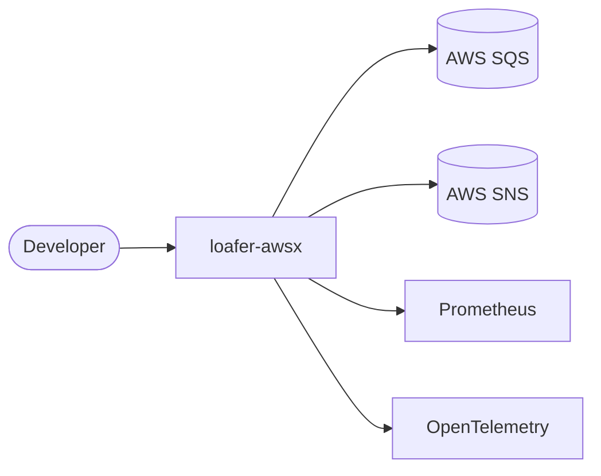
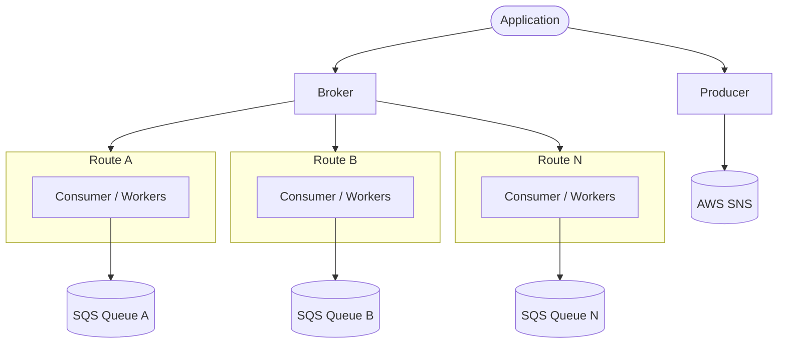

# loafer-awsx

[](https://pkg.go.dev/github.com/silviolleite/loafer-awsx)
[](https://github.com/silviolleite/loafer-awsx/actions/workflows/ci.yml)
[](go.mod)
[](LICENSE)

> A modern, idiomatic Go library for AWS SQS/SNS message processing, built on
> `aws-sdk-go-v2` with generic type-safe handlers, a composable middleware
> pipeline, first-class `log/slog` logging, and built-in Prometheus and
> OpenTelemetry observability.

`loafer-awsx` organizes message processing into small, single-responsibility
packages you can compose: build an AWS connection, declare routes, wrap them in
a broker, and publish events with a producer. Everything is configured through
functional options, and every component accepts the standard library
`*slog.Logger` directly, no custom logger interface.

- **Module:** `github.com/silviolleite/loafer-awsx`
- **Minimum Go version:** Go 1.26 or later
- **AWS SDK:** `aws-sdk-go-v2` (SQS + SNS)

---

## Table of Contents

1. [Architecture](#architecture)
   - [Context Diagram](#context-diagram)
   - [Container Diagram](#container-diagram)
2. [Installation](#installation)
3. [Quickstart](#quickstart)
4. [Examples](#examples)
5. [Configuration Reference](#configuration-reference)
6. [Benchmarks](#benchmarks)
7. [Acknowledgements](#acknowledgements)
8. [License](#license)

---

## Architecture

`loafer-awsx` is a library, not a service. Your application imports it, wires
routes and a broker, and processes messages from AWS SQS while optionally
publishing to AWS SNS. The library also exposes Prometheus metrics and
OpenTelemetry spans for observability.

### Context Diagram



### Container Diagram

The broker orchestrates one consumer per route: each `Route` binds a queue to a
handler, and its `Consumer` runs a worker pool that polls the matching SQS queue.
Publishing runs alongside through the `producer`.



Cross-cutting packages support this pipeline: `conn` builds the shared
`aws.Config`, `middleware` wraps each route handler (global middleware outermost,
route middleware innermost), `typed` adds generic type-safe handlers and
producers, `idgen` generates FIFO IDs, and `logger` supplies the `*slog.Logger`
used throughout.

**Package responsibilities at a glance:**

| Package | Responsibility |
| --- | --- |
| `conn` | Factory for an `aws.Config` (region, credentials, endpoint, profile, retry). |
| `logger` | Constructors for the standard library `*slog.Logger` (stdout + no-op). |
| `middleware` | `Handler`, `Middleware`, `Chain`, and built-in Recovery, Logging, Metrics, OTel. |
| `router` | Immutable `Route` value object binding a queue to a handler and options. |
| `consumer` | SQS polling loop, worker-pool dispatch, visibility management, DLQ observability. |
| `broker` | Lifecycle orchestrator that runs one consumer per route with graceful shutdown. |
| `producer` | SNS single and batch publish for standard and FIFO topics. |
| `typed` | Generic, type-safe handlers and producers via `Codec[T]`. |
| `idgen` | `MessageGroupId` / `MessageDeduplicationId` generation strategies. |
| `errors` | Sentinel errors matchable with `errors.Is`. |

---

## Installation

Requires Go 1.26 or later.

```bash
go get github.com/silviolleite/loafer-awsx
```

Then import the packages you need, for example:

```go
import (
    "github.com/silviolleite/loafer-awsx/broker"
    "github.com/silviolleite/loafer-awsx/conn"
    "github.com/silviolleite/loafer-awsx/logger"
    "github.com/silviolleite/loafer-awsx/router"
    "github.com/silviolleite/loafer-awsx/producer"
)
```

---

## Quickstart

A typical setup builds a shared AWS config with `conn.New`, binds queue names to
handlers with `router.New`, hands the routes to a `broker`, and calls
`broker.Run` (which blocks until the context is canceled, then drains in-flight
messages). Publishing works the same way: create a `producer` and call `Publish`
or `PublishBatch`.

For complete, runnable programs covering the consumer, producer, FIFO, typed,
and middleware setups, see the [`examples/`](./examples) directory and its
[README](./examples/README.md).

---

## Examples

Runnable, self-contained programs live in the [`examples/`](./examples)
directory, wired to run locally against [LocalStack](https://www.localstack.cloud/)
with infrastructure provisioned by Terraform. See
[`examples/README.md`](./examples/README.md) for setup and run instructions
(`make up`, `make provision`, `make run-basic`, and friends).

| Example | Directory | What it shows |
| --- | --- | --- |
| Basic | [`examples/basic/`](./examples/basic) | Standard SQS queue consumption with a simple handler. |
| FIFO | [`examples/fifo/`](./examples/fifo) | Ordered consumption in `PerGroupID` mode with custom group fields. |
| Typed | [`examples/typed/`](./examples/typed) | Generic type-safe handling via `typed.WrapHandler` + `typed.JSONCodec`. |
| Middleware | [`examples/middleware/`](./examples/middleware) | Recovery, logging, Prometheus metrics, and OpenTelemetry tracing. |
| Producer | [`examples/producer/`](./examples/producer) | Single and batch publishing to standard and FIFO SNS topics. |

---

## Configuration Reference

Every component is configured through functional options. Invalid values are
rejected at construction time (returning a descriptive error) rather than being
silently accepted.

### `conn` — AWS configuration

`conn.New(ctx context.Context, opts ...conn.Option) (aws.Config, error)`

| Option | Signature | Default | Description |
| --- | --- | --- | --- |
| `WithRegion` | `WithRegion(region string)` | — (required) | AWS region. `New` returns `ErrEmptyRegion` when empty. |
| `WithAccessKey` | `WithAccessKey(key, secret string)` | — | Static credentials; take precedence over a profile. |
| `WithSessionToken` | `WithSessionToken(token string)` | — | Session token; applied only with static credentials. |
| `WithProfile` | `WithProfile(profile string)` | — | Shared config profile name. |
| `WithEndpoint` | `WithEndpoint(url string)` | — | Custom endpoint URL (LocalStack, etc.). |
| `WithRetryCount` | `WithRetryCount(n uint)` | `10` | Maximum retry attempts. |

### `router` — route configuration

`router.New(queueName string, handler middleware.Handler, opts ...router.Option) (*router.Route, error)`

Returns `ErrEmptyQueueName` for an empty name and `ErrNoHandler` for a nil
handler. Option failures are wrapped with `ErrInvalidOption`.

| Option | Signature | Default | Description |
| --- | --- | --- | --- |
| `WithWorkerPoolSize` | `WithWorkerPoolSize(n int)` | `5` | Worker goroutines per route (must be > 0). |
| `WithMaxMessages` | `WithMaxMessages(n int32)` | `10` | Messages per SQS receive call (range `[1, 10]`). |
| `WithWaitTimeSeconds` | `WithWaitTimeSeconds(n int32)` | `10` | Long-poll wait in seconds (range `[0, 20]`). |
| `WithVisibilityTimeout` | `WithVisibilityTimeout(seconds int32)` | `30` | Visibility timeout; values `<= 11` are clamped up to `11`. |
| `WithExtensionLimit` | `WithExtensionLimit(n int)` | `2` | Max visibility extensions (must not be negative). |
| `WithRunMode` | `WithRunMode(mode router.Mode)` | `Parallel` | Dispatch strategy: `Parallel` or `PerGroupID`. |
| `WithCustomGroupFields` | `WithCustomGroupFields(fields ...string)` | — | Fields forming the group key for `PerGroupID`. |
| `WithMiddleware` | `WithMiddleware(mws ...middleware.Middleware)` | — | Route-level middleware appended in order. |
| `WithDLQ` | `WithDLQ(maxReceiveCount int, opts ...router.DLQOption)` | — | Enables DLQ observability (must be > 0). See below. |

**Run modes** (`router.Mode`): `Parallel` (random worker assignment) and
`PerGroupID` (hash of `MessageGroupId` + custom group fields, preserving
per-group ordering).

**DLQ observability** (`router.DLQOption`):

| Option | Signature | Description |
| --- | --- | --- |
| `WithOnDLQ` | `WithOnDLQ(fn func(ctx context.Context, msg middleware.Message))` | Callback invoked when a message is treated as exhausted. |

> DLQ is **observe-only**. `WithDLQ` does **not** take a target ARN and the
> library never moves, publishes, or deletes messages for DLQ purposes. AWS SQS
> performs the actual redrive natively via the source queue's redrive policy.
> `maxReceiveCount` must mirror that policy; it is used only to detect when a
> message is exhausted so the consumer can emit an Error log, the
> `loafer_messages_dlq_total` metric, and the optional `OnDLQ` callback while
> leaving the message in the queue.

### `consumer` — SQS polling

`consumer.New(client consumer.SQSClient, route *router.Route, opts ...consumer.Option) (*consumer.Consumer, error)`

Returns `ErrNoSQSClient` for a nil client and `ErrNoRoute` for a nil route. In
most applications the broker creates consumers for you; use these options
directly only when driving a consumer yourself.

| Option | Signature | Default | Description |
| --- | --- | --- | --- |
| `WithLogger` | `WithLogger(log *slog.Logger)` | no-op | Structured logger (nil is ignored). |
| `WithRetryTimeout` | `WithRetryTimeout(d time.Duration)` | `5s` | Wait after a failed `ReceiveMessage` (non-positive ignored). |
| `WithGlobalMiddleware` | `WithGlobalMiddleware(mws ...middleware.Middleware)` | — | Outermost middleware, ahead of route middleware. |
| `WithDLQMetric` | `WithDLQMetric(inc consumer.DLQMetric)` | — | Increments `loafer_messages_dlq_total`; wire only with Metrics enabled. |

### `broker` — lifecycle orchestration

`broker.New(sqsClient consumer.SQSClient, routes []*router.Route, opts ...broker.Option) (*broker.Broker, error)`

Returns `ErrNoRoute` when no routes are provided. `broker.Run(ctx)` starts one
consumer per route, blocks until the context is canceled, and drains in-flight
messages within the shutdown timeout with no goroutine leaks.

| Option | Signature | Default | Description |
| --- | --- | --- | --- |
| `WithLogger` | `WithLogger(log *slog.Logger)` | `logger.New()` | Structured logger, forwarded to every consumer. |
| `WithRetryTimeout` | `WithRetryTimeout(d time.Duration)` | `5s` | Per-consumer wait after a failed receive. |
| `WithShutdownTimeout` | `WithShutdownTimeout(d time.Duration)` | unbounded | Max wait for in-flight messages on shutdown. Unset waits until consumers finish; set a duration to bound it. |
| `WithMiddleware` | `WithMiddleware(mws ...middleware.Middleware)` | — | Global middleware applied outermost to all routes. |

> Middleware ordering: broker-level (global) middleware is applied outermost and
> route-level middleware innermost (closest to the handler).

### `producer` — SNS publishing

`producer.New(client producer.SNSClient, opts ...producer.Option) (*producer.Producer, error)`

Returns `ErrNoSNSClient` for a nil client. `Publish` returns `ErrEmptyInput` for
a nil/empty input; `PublishBatch` returns `ErrEmptyInput` for an empty batch and
`ErrMaxBatchSize` for more than 10 entries.

| Option | Signature | Description |
| --- | --- | --- |
| `WithGroupIDGenerator` | `WithGroupIDGenerator(gen idgen.GroupIDGenerator)` | Auto-generate `MessageGroupId` for FIFO topics when not set. |
| `WithDeduplicationIDGenerator` | `WithDeduplicationIDGenerator(gen idgen.DeduplicationIDGenerator)` | Auto-generate `MessageDeduplicationId` for FIFO topics when not set. |

Helpers: `producer.BuildTopicARN(region, accountID, topicName string) string`.

> Auto-generation only applies to FIFO topics (ARNs ending in `.fifo`) and only
> when the corresponding ID is empty. Standard topics never receive
> auto-generated IDs, because SNS rejects them on non-FIFO topics.

### `typed` — generic type-safe handlers

- `typed.Codec[T]` — interface with `Encode(T) ([]byte, error)` and `Decode([]byte) (T, error)`.
- `typed.JSONCodec[T]` — JSON implementation of `Codec[T]`.
- `typed.WrapHandler[T](codec Codec[T], fn func(ctx, msg T) error) middleware.Handler` — adapts a typed handler into a standard `Handler`; a decode error is returned to the consumer.
- `typed.NewProducer[T](p *producer.Producer, codec Codec[T]) *typed.Producer[T]` — a typed producer that encodes before publishing.
- `typed.Producer[T].Publish(ctx, topicARN, value T, opts ...typed.PublishOption) (string, error)`.

| Publish option | Signature | Description |
| --- | --- | --- |
| `WithGroupID` | `WithGroupID(id string)` | Sets `MessageGroupId`. |
| `WithDeduplicationID` | `WithDeduplicationID(id string)` | Sets `MessageDeduplicationId`. |
| `WithAttributes` | `WithAttributes(attrs map[string]string)` | Sets message attributes. |

### `middleware` package

- `middleware.Handler` — `func(ctx context.Context, msg middleware.Message) error`.
- `middleware.Middleware` — `func(Handler) Handler`.
- `middleware.Chain(mws ...Middleware) Middleware` — composes middleware; the first is outermost.
- `middleware.Recovery(log *slog.Logger) Middleware` — recovers panics, logs the stack, returns `ErrPanic`.
- `middleware.Logging(log *slog.Logger) Middleware` — logs receipt, duration, and outcome.
- `middleware.Metrics(routeName string, opts ...MetricsOption) Middleware` — Prometheus counters, histogram, and inflight gauge.
- `middleware.OTel(routeName string, opts ...OTelOption) Middleware` — an OpenTelemetry span per message.

| Option | Signature | Default | Description |
| --- | --- | --- | --- |
| `WithMetricsRegisterer` | `WithMetricsRegisterer(r prometheus.Registerer)` | `prometheus.DefaultRegisterer` | Custom Prometheus registerer. |
| `WithTracerProvider` | `WithTracerProvider(tp trace.TracerProvider)` | global provider | Custom OpenTelemetry tracer provider. |

**Metrics emitted:** `loafer_messages_received_total`,
`loafer_messages_processed_total` (labeled by status), `loafer_messages_errors_total`,
`loafer_message_processing_duration_seconds` (histogram),
`loafer_messages_inflight` (gauge), and `loafer_messages_dlq_total` — all
labeled by route.

### `logger` — standard library slog constructors

- `logger.New() *slog.Logger` — structured, leveled output to stdout via `slog.TextHandler`.
- `logger.NewNoOp() *slog.Logger` — a discard-backed logger (silent).

> The library uses `*slog.Logger` everywhere and defines **no** custom logger
> interface. A `*slog.Logger` produced by a third-party bridge (for example zap
> via `zapslog`, or zerolog via a slog handler) is accepted directly, no adapter
> required.

### `idgen` — ID generation

Interfaces `idgen.GroupIDGenerator` and `idgen.DeduplicationIDGenerator` both
expose `Generate(ctx context.Context, fields map[string]string) (string, error)`.
A single concrete generator satisfies both.

| Constructor | Description |
| --- | --- |
| `NewKeyBased(opts ...Option)` | Deterministic ID from sorted field values, hashed with the configured algorithm. Returns `ErrEmptyFields` when no field is selected. |
| `NewRandom()` | Random UUID v4 on every call; ignores fields. |
| `NewComposite(opts ...Option)` | Joins selected field values with a separator (no hashing). |
| `NewCompositeWithSuffix(opts ...Option)` | Like `NewComposite`, plus a random numeric suffix from the configured range to spread load across partitions. |

| Option | Signature | Default | Description |
| --- | --- | --- | --- |
| `WithHashAlgorithm` | `WithHashAlgorithm(algorithm idgen.HashAlgorithm)` | `SHA256` | Digest for key-based hashing: `SHA256` or `FNV64`. |
| `WithSeparator` | `WithSeparator(separator string)` | `":"` | Separator joining key/value pairs. |
| `WithFields` | `WithFields(fields ...string)` | all fields | Whitelist of fields to include. |
| `WithSuffixRange` | `WithSuffixRange(min, max int)` | `[1, 20]` | Inclusive suffix range for `NewCompositeWithSuffix`. |

### `errors` — sentinel errors

The `errors` package exports sentinels matchable with `errors.Is`, including
`ErrNoRoute`, `ErrNoSQSClient`, `ErrNoHandler`, `ErrGetMessage`,
`ErrQueueResolve`, `ErrNoSNSClient`, `ErrEmptyInput`, `ErrMaxBatchSize`,
`ErrEmptyRegion`, `ErrEmptyQueueName`, `ErrInvalidOption`, `ErrEmptyFields`, and
`ErrPanic`. `errors.New(text string) error` and `errors.Wrap(sentinel, err error) error`
help build and combine errors while preserving `errors.Is` matching against both
causes.

---

## Benchmarks

The numbers below compare the per-message processing overhead of `loafer-awsx`
with [JustCodes/loafer-go](https://github.com/JustCodes/loafer-go) for both
standard and FIFO (PerGroupID) routing.

Both libraries are driven by the same in-memory SQS client, a no-op handler, and
an identical 8-worker pool, so the results isolate library overhead (dispatch,
worker routing, visibility bookkeeping) and deliberately exclude AWS and network
latency. In production, end-to-end throughput is dominated by SQS round-trips, so
treat these figures as a measure of framework cost, not real-world throughput.

| Mode | Library | Time/op | Throughput | Allocs/op | Bytes/op |
| --- | --- | ---: | ---: | ---: | ---: |
| Standard | `loafer-awsx` | ~5.4 µs | ~184k msg/s | 19 | 1,175 B |
| Standard | `loafer-go` | ~9.3 µs | ~105k msg/s | 19 | 1,245 B |
| FIFO | `loafer-awsx` | ~6.1 µs | ~165k msg/s | 22 | 1,518 B |
| FIFO | `loafer-go` | ~9.9 µs | ~100k msg/s | 22 | 1,589 B |

Medians of `-benchtime=2s -count=6` on an Intel Core i5-8265U (Go 1.26,
`linux/amd64`). Absolute numbers are machine-specific; the relative gap is what
matters, and both the code and methodology are reproducible.

Relative to `loafer-go`, on this run:

- **Standard queue:** ~41% lower latency, ~70% higher throughput, ~6% less
  memory per message, and the same number of allocations.
- **FIFO queue:** ~38% lower latency, ~62% higher throughput, ~5% less memory
  per message, and the same number of allocations.

The benchmarks live in their own module under [`benchmarks/`](benchmarks) (kept
separate so the competitor dependency never touches the library's `go.mod`). To
reproduce:

```bash
cd benchmarks
go test -run '^$' -bench . -benchtime=2s -count=6
```

---

## Acknowledgements

This project was inspired by [JustCodes/loafer-go](https://github.com/JustCodes/loafer-go).

---

## License

See [LICENSE](./LICENSE).
