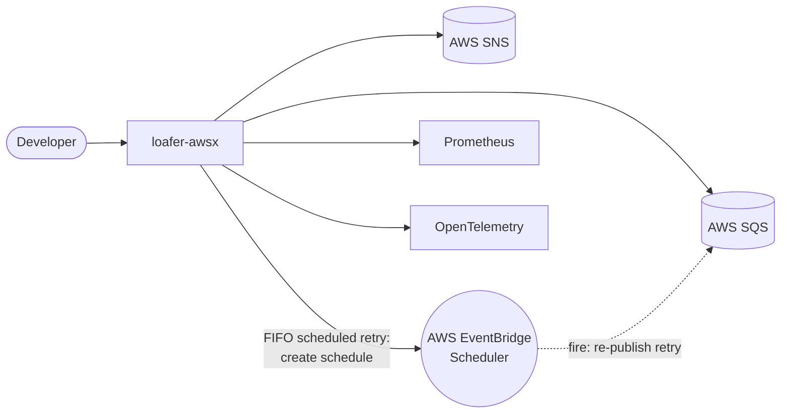
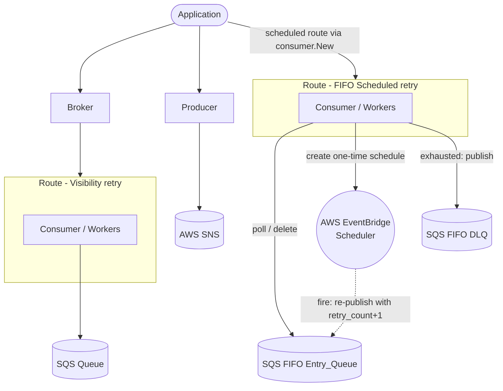
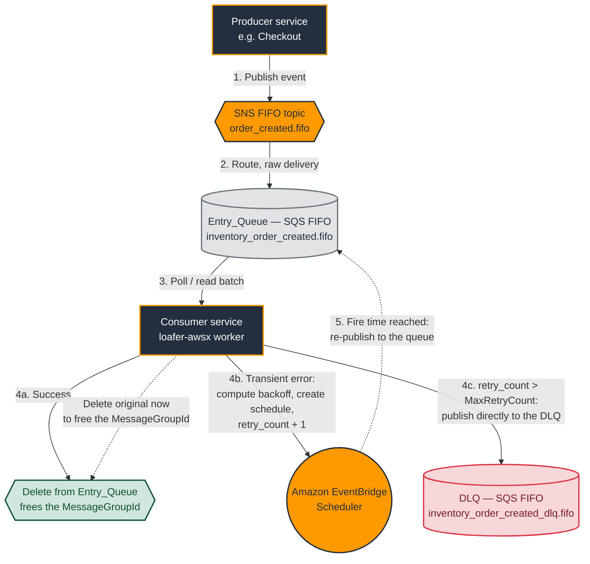

# loafer-awsx

[](https://pkg.go.dev/github.com/silviolleite/loafer-awsx)
[](https://github.com/silviolleite/loafer-awsx/actions/workflows/ci.yml)
[](go.mod)
[](LICENSE)

> A modern, idiomatic Go library for AWS SQS/SNS message processing, built on
> `aws-sdk-go-v2` with generic type-safe handlers, a composable middleware
> pipeline, first-class `log/slog` logging, and built-in Prometheus and
> OpenTelemetry observability.

`loafer-awsx` organizes message processing into small, single-responsibility
packages you can compose: build an AWS connection, declare routes, wrap them in
a broker, and publish events with a producer. Everything is configured through
functional options, and every component accepts the standard library
`*slog.Logger` directly, no custom logger interface.

- **Module:** `github.com/silviolleite/loafer-awsx`
- **Minimum Go version:** Go 1.26 or later
- **AWS SDK:** `aws-sdk-go-v2` (SQS + SNS + EventBridge Scheduler)

---

## Table of Contents

1. [Architecture](#architecture)
   - [Context Diagram](#context-diagram)
   - [Container Diagram](#container-diagram)
2. [Installation](#installation)
3. [Quickstart](#quickstart)
4. [Examples](#examples)
5. [Configuration Reference](#configuration-reference)
6. [Client constructors](#client-constructors)
7. [IAM permissions](#iam-permissions)
8. [Scheduled Retry (FIFO)](#scheduled-retry-fifo)
9. [Benchmarks](#benchmarks)
10. [Acknowledgements](#acknowledgements)
11. [License](#license)

---

## Architecture

`loafer-awsx` is a library, not a service. Your application imports it, wires
routes and a broker, and processes messages from AWS SQS while optionally
publishing to AWS SNS. The library also exposes Prometheus metrics and
OpenTelemetry spans for observability.

### Context Diagram



### Container Diagram

The broker orchestrates one consumer per route: each `Route` binds a queue to a
handler, and its `Consumer` runs a worker pool that polls the matching SQS queue.
Publishing runs alongside through the `producer`.



Cross-cutting packages support this pipeline: `conn` builds the shared
`aws.Config`, `middleware` wraps each route handler (global middleware outermost,
route middleware innermost), `typed` adds generic type-safe handlers and
producers, `idgen` generates FIFO IDs, and `logger` supplies the `*slog.Logger`
used throughout.

**Package responsibilities at a glance:**

| Package | Responsibility |
| --- | --- |
| `conn` | Factory for an `aws.Config` (region, credentials, endpoint, profile, retry). |
| `client` | Constructors that turn an `aws.Config` into SQS/SNS/Scheduler clients with construction-time connectivity validation. |
| `logger` | Constructors for the standard library `*slog.Logger` (stdout + no-op). |
| `middleware` | `Handler`, `Middleware`, `Chain`, and built-in Recovery, Logging, Metrics, OTel. |
| `router` | Immutable `Route` value object binding a queue to a handler and options. |
| `consumer` | SQS polling loop, worker-pool dispatch, visibility management, DLQ observability. |
| `broker` | Lifecycle orchestrator that runs one consumer per route with graceful shutdown. |
| `producer` | SNS single and batch publish for standard and FIFO topics. |
| `typed` | Generic, type-safe handlers and producers via `Codec[T]`. |
| `idgen` | `MessageGroupId` / `MessageDeduplicationId` generation strategies. |
| `errors` | Sentinel errors matchable with `errors.Is`. |

---

## Installation

Requires Go 1.26 or later.

```bash
go get github.com/silviolleite/loafer-awsx
```

Then import the packages you need, for example:

```go
import (
    "github.com/silviolleite/loafer-awsx/broker"
    "github.com/silviolleite/loafer-awsx/conn"
    "github.com/silviolleite/loafer-awsx/logger"
    "github.com/silviolleite/loafer-awsx/router"
    "github.com/silviolleite/loafer-awsx/producer"
)
```

---

## Quickstart

A typical setup builds a shared AWS config with `conn.New`, binds queue names to
handlers with `router.New`, hands the routes to a `broker`, and calls
`broker.Run` (which blocks until the context is canceled, then drains in-flight
messages). Publishing works the same way: create a `producer` and call `Publish`
or `PublishBatch`.

For complete, runnable programs covering the consumer, producer, FIFO, typed,
and middleware setups, see the [`examples/`](./examples) directory and its
[README](./examples/README.md).

---

## Examples

Runnable, self-contained programs live in the [`examples/`](./examples)
directory, wired to run locally against [LocalStack](https://www.localstack.cloud/)
with infrastructure provisioned by Terraform. See
[`examples/README.md`](./examples/README.md) for setup and run instructions
(`make up`, `make provision`, `make run-basic`, and friends).

| Example | Directory | What it shows |
| --- | --- | --- |
| Basic | [`examples/basic/`](./examples/basic) | Standard SQS queue consumption with a simple handler. |
| FIFO | [`examples/fifo/`](./examples/fifo) | Ordered consumption in `PerGroupID` mode with custom group fields. |
| Typed | [`examples/typed/`](./examples/typed) | Generic type-safe handling via `typed.WrapHandler` + `typed.JSONCodec`. |
| Middleware | [`examples/middleware/`](./examples/middleware) | Recovery, logging, Prometheus metrics, and OpenTelemetry tracing. |
| Producer | [`examples/producer/`](./examples/producer) | Single and batch publishing to standard and FIFO SNS topics. |

---

## Configuration Reference

Every component is configured through functional options following the same
pattern: pass `With*` options to each package's `New` constructor, which
validates them and rejects invalid values at construction time with a
descriptive error rather than accepting them silently. Option failures wrap
`errors.ErrInvalidOption`, and each package exposes its own sentinel errors
(matchable with `errors.Is`) for missing required inputs.

For the full, always-current list of options, signatures, defaults, and
sentinel errors for every package, see the Go Reference linked by the badge at
the top of this README. The notes below cover the conceptual behaviors that are
easy to miss from signatures alone.

- **`conn`** builds the shared `aws.Config` (region, credentials, endpoint,
  profile, retry). Region is required.
- **`router`** declares an immutable `Route` binding a queue to a handler, with
  options for worker-pool size, receive batching, long-poll wait, visibility
  timeout and extension limit, run mode, route middleware, and DLQ
  observability.
- **`consumer`** and **`broker`** run the polling loop and orchestrate one
  consumer per route; both accept a `*slog.Logger`, a retry timeout, and
  middleware, and the broker adds a shutdown timeout.
- **`producer`** publishes to SNS (single and batch), with optional
  auto-generation of FIFO IDs.
- **`typed`**, **`idgen`**, **`middleware`**, **`logger`**, and **`errors`**
  provide generic type-safe handlers/producers, FIFO ID generation strategies,
  the middleware primitives and built-ins, `*slog.Logger` constructors, and the
  sentinel error set respectively.

**Run modes** (`router.Mode`): `Parallel` assigns messages to workers randomly;
`PerGroupID` hashes the `MessageGroupId` plus any custom group fields so a
group's messages are handled in order.

**Middleware ordering:** broker-level (global) middleware is applied outermost
and route-level middleware innermost (closest to the handler).

**DLQ observability** (`router.WithDLQ`) is **observe-only**. It does **not**
take a target ARN, and the library never moves, publishes, or deletes messages
for DLQ purposes. AWS SQS performs the actual redrive natively via the source
queue's redrive policy. The `maxReceiveCount` you pass must mirror that policy;
it is used only to detect when a message is exhausted so the consumer can emit
an Error log, the `loafer_messages_dlq_total` metric, and the optional `OnDLQ`
callback, while leaving the message in the queue.

**Logging:** the library uses `*slog.Logger` everywhere and defines **no**
custom logger interface. A `*slog.Logger` produced by a third-party bridge (for
example zap via `zapslog`, or zerolog via a slog handler) is accepted directly,
no adapter required.

---

## Client constructors

The `client` package turns an `aws.Config` (produced by `conn.New`) into the
service clients the rest of the library consumes, so your application never has
to import the AWS SDK for Go v2 service packages (`sqs`, `sns`, `scheduler`)
directly:

- **`client.NewSQS(ctx, cfg, opts...)`** returns a client for the broker and
  consumer.
- **`client.NewSNS(ctx, cfg, opts...)`** returns a client for the producer.
- **`client.NewScheduler(ctx, cfg, opts...)`** returns a client for the
  Scheduled Retry path (wired through `consumer.WithSchedulerClient`).

Each constructor validates connectivity **during construction**: before
returning, it issues a lightweight, read-only request (the "Ping") to confirm
the client can reach its AWS service with valid credentials, failing fast if it
cannot. The validation uses a dedicated timeout and retry budget that are
independent of the request retry policy carried by the `aws.Config` (defaults:
`3s` timeout, `2` retries).

Three functional options tune this behavior:

- **`WithPingTimeout(d)`** overrides the total time budget for connectivity
  validation (including retries). The duration must be positive.
- **`WithPingRetryLimit(n)`** overrides the number of retries performed beyond
  the initial attempt.
- **`WithoutConnectivityCheck()`** disables the connectivity validation
  entirely. Use it when the credentials lack the read-only permission the Ping
  requires, or to construct a client offline.

The existing Go Reference badge at the top of this README covers the full
signatures, defaults, and sentinel errors.

---

## IAM permissions

Each constructor's connectivity validation (Ping) issues an additional
read-only request beyond the operations the client uses at runtime, so the
caller's credentials need the Ping permission too — unless the check is disabled
with `WithoutConnectivityCheck()`. The tables below list the complete set of
permissions each client requires.

### SQS client (`client.NewSQS`, used by broker and consumer)

| Action | Required by | Notes |
| --- | --- | --- |
| `sqs:ReceiveMessage` | Runtime (consumer poll) | On the Entry_Queue. |
| `sqs:DeleteMessage` | Runtime | On the Entry_Queue. |
| `sqs:ChangeMessageVisibility` | Runtime | Visibility extension during processing. |
| `sqs:GetQueueUrl` | Runtime | Resolve the queue URL from its name. |
| `sqs:SendMessage` | Runtime (Scheduled Retry only) | On the DLQ, to publish exhausted messages. |
| `sqs:ListQueues` | Construction (Ping) | Account-level; omit only if the check is disabled. |

### SNS client (`client.NewSNS`, used by producer)

| Action | Required by | Notes |
| --- | --- | --- |
| `sns:Publish` | Runtime | Covers both `Publish` and `PublishBatch`, on the target topic(s). |
| `sns:ListTopics` | Construction (Ping) | Account-level; omit only if the check is disabled. |

### EventBridge Scheduler client (`client.NewScheduler`, used by consumer Scheduled Retry)

| Action | Required by | Notes |
| --- | --- | --- |
| `scheduler:CreateSchedule` | Runtime | Create the one-time retry schedule. |
| `iam:PassRole` | Runtime | On the execution role passed via `WithSchedulerIdentity`. |
| `scheduler:ListSchedules` | Construction (Ping) | Omit only if the check is disabled. |

The **execution role** assumed by EventBridge Scheduler (the second argument to
`WithSchedulerIdentity`) is separate from the caller's credentials and needs
`sqs:SendMessage` on the Entry_Queue plus a trust policy allowing
`scheduler.amazonaws.com` to assume it.

> Because the Ping uses account-level `List*` permissions that scoped
> credentials may not grant, callers with least-privilege policies can either
> add the `List*` action or construct with `WithoutConnectivityCheck()`.

---

## Scheduled Retry (FIFO)

The FIFO consumption path supports two per-route retry models, selected with
`router.WithRetryModel` (or the `router.WithScheduledRetry` shortcut):

| Model | Constant | Behavior |
| --- | --- | --- |
| Visibility (default) | `router.VisibilityRetryModel` | A failed message stays in the queue and its visibility timeout is extended until it succeeds or AWS SQS redrives it natively. This blocks the `MessageGroupId` until the message resolves. |
| Scheduled | `router.ScheduledRetryModel` | The consumer owns the whole retry lifecycle: on failure it schedules a delayed re-publish through AWS EventBridge Scheduler and deletes the original message so the `MessageGroupId` is unblocked immediately. |

When no retry model is configured a route uses `VisibilityRetryModel`, so
existing routes are unchanged. Selecting the Scheduled model on one route never
affects routes that use the Visibility model, and no scheduler client is
constructed or required unless a route opts in.

Under the Scheduled model, when a handler fails (returns an error **or** requests
backoff) the consumer reads a `retry_count` message attribute (default `0`),
computes `next = current + 1`, and either:

- **Schedules a retry** when `next <= MaxRetryCount`: it creates a one-time
  EventBridge Scheduler schedule that re-publishes the message to the queue after
  the computed backoff, then deletes the original.
- **Publishes to the DLQ** when `next > MaxRetryCount`: it sends the message to
  the configured DLQ, then deletes the original.

On success the message is simply deleted. The library performs **no** success-side
publishing; whether success means publishing to a topic, calling an API, or doing
nothing is the handler's responsibility.

### Architecture



**Why this architecture.** A FIFO queue guarantees ordering within a
`MessageGroupId` by delivering the group's messages one at a time. That guarantee
turns a single poison or transiently failing message into a *head-of-line block*:
under the default Visibility model the failed message stays in the queue and its
visibility timeout is extended, so every later message sharing its group waits
behind it until it finally succeeds or SQS redrives it. For a busy group, one bad
message can stall a whole stream of otherwise healthy work.

The Scheduled Retry model breaks that coupling by moving the wait *out of the
queue*. On failure the consumer hands the retry to EventBridge Scheduler (step
4b) and immediately deletes the original message (step 5, the dashed
delete-to-free edge). The `MessageGroupId` is unblocked right away, so the next
message in the group is processed while the failed one waits — off-queue — for its
backoff to elapse. When the schedule fires, EventBridge Scheduler re-publishes the
message to the same Entry_Queue with an incremented `retry_count`, and the cycle
repeats until the message either succeeds or exceeds `MaxRetryCount` and is routed
straight to the DLQ (step 4c).

**Why it is efficient.**

- **Group liveness:** a failing message no longer blocks its group. Throughput of
  a group is bounded by its healthy messages, not by its slowest failure.
- **No worker is held during backoff:** the delay lives in EventBridge Scheduler,
  not in a sleeping goroutine or an extended visibility timeout, so worker slots
  and in-flight-message limits are not consumed while waiting to retry.
- **Backoff without polling churn:** exponential backoff is expressed as a
  one-time schedule fire time, so the queue is not repeatedly re-reading and
  re-hiding the same message across attempts.
- **Deterministic, consumer-owned dead-lettering:** the DLQ decision is driven by
  the `retry_count` carried on the message and the configured `MaxRetryCount`,
  rather than SQS `maxReceiveCount` redrive, giving you explicit control over when
  a message is dead-lettered and what metadata it carries.
- **Self-cleaning schedules:** each retry schedule is created with
  `ActionAfterCompletion = DELETE`, so it removes itself after its single
  invocation and no schedule resources accumulate.

**Accepted tradeoffs.** Because the original is deleted before the retry is
delivered, the model provides **at-least-once** delivery (a delete failure after a
successful schedule/DLQ publish leaves the original for redelivery), and **strict
ordering within a `MessageGroupId` is not preserved for messages that are
retried** — the retried message rejoins the queue later, after messages that were
behind it. Design handlers to be idempotent. These tradeoffs are the deliberate
price paid for group liveness.

### Router configuration

`router.WithRetryModel(m router.RetryModel)` sets the model explicitly and
rejects any value other than `VisibilityRetryModel` or `ScheduledRetryModel`.
`router.WithScheduledRetry(opts ...router.ScheduledRetryOption)` is the usual
entry point: it sets the model to Scheduled **and** attaches a validated
configuration assembled from its sub-options.

| Sub-option | Signature | Description |
| --- | --- | --- |
| `WithSchedulerIdentity` | `WithSchedulerIdentity(targetQueueARN, executionRoleARN string)` | Required. The EventBridge Scheduler target (Entry_Queue) ARN and the execution role ARN the scheduler assumes. A missing item is named individually in the error. |
| `WithScheduledDLQ` | `WithScheduledDLQ(dlqQueueURL string)` | Required. The DLQ destination queue URL for exhausted messages. |
| `WithMaxRetryCount` | `WithMaxRetryCount(n int)` | Inclusive threshold before DLQ routing. Must be within `[0, 2147483647]`. |
| `WithBackoff` | `WithBackoff(base, max time.Duration)` | Base and maximum backoff delay. Each must be within `[1ms, 24h]` and `max >= base`. Base defaults to `1000ms` when unset. |

All Scheduled-model configuration is validated at `router.New` time. An invalid
or incomplete configuration returns an error wrapping
`errors.ErrScheduledRetryConfig` that identifies the offending value, so a
misconfigured route is never built and consumption never starts for it.
Configuring both `WithScheduledRetry` and the observe-only `WithDLQ` on the same
route is a configuration error, regardless of option order.

### Consumer wiring

> The broker does **not** forward the scheduler client or the metric hooks to
> the consumers it creates. Wire a Scheduled-model route through `consumer.New`
> directly and run it yourself.

`consumer.WithSchedulerClient(consumer.SchedulerClient)` supplies the EventBridge
Scheduler client. A concrete `*scheduler.Client` from
`github.com/aws/aws-sdk-go-v2/service/scheduler` satisfies the interface
directly. A Scheduled-model route given to a consumer without a scheduler client
fails fast at `Run` with `errors.ErrNoSchedulerClient` and never begins
consuming.

Three optional metric hooks report each outcome, each labeled by route name and
no-op when nil:

| Option | Signature | Emitted when |
| --- | --- | --- |
| `WithSuccessMetric` | `WithSuccessMetric(func(routeName string))` | A handler succeeds and the original message is deleted. |
| `WithRetryMetric` | `WithRetryMetric(func(routeName string))` | A retry schedule is created successfully. |
| `WithDeadLetterMetric` | `WithDeadLetterMetric(func(routeName string))` | An exhausted message is published to the DLQ successfully. |

### Example

```go
package main

import (
    "context"
    "errors"
    "log/slog"
    "time"

    "github.com/aws/aws-sdk-go-v2/service/scheduler"
    "github.com/aws/aws-sdk-go-v2/service/sqs"

    "github.com/silviolleite/loafer-awsx/conn"
    "github.com/silviolleite/loafer-awsx/consumer"
    "github.com/silviolleite/loafer-awsx/logger"
    "github.com/silviolleite/loafer-awsx/middleware"
    "github.com/silviolleite/loafer-awsx/router"
)

func main() {
    ctx := context.Background()
    log := logger.New()

    cfg, err := conn.New(ctx, conn.WithRegion("us-east-1"))
    if err != nil {
        log.Error("failed to build AWS config", slog.Any("error", err))
        return
    }

    sqsClient := sqs.NewFromConfig(cfg)
    schedulerClient := scheduler.NewFromConfig(cfg)

    handler := func(ctx context.Context, msg middleware.Message) error {
        // Return an error (or call msg.Backoff) to exercise the scheduled-retry path.
        return errors.New("transient failure")
    }

    route, err := router.New("orders.fifo", handler,
        router.WithRunMode(router.PerGroupID),
        router.WithScheduledRetry(
            router.WithSchedulerIdentity(
                "arn:aws:sqs:us-east-1:000000000000:orders.fifo",       // target Entry_Queue ARN
                "arn:aws:iam::000000000000:role/loafer-scheduler-role", // execution role ARN
            ),
            router.WithScheduledDLQ("https://sqs.us-east-1.amazonaws.com/000000000000/orders-dlq.fifo"),
            router.WithMaxRetryCount(5),
            router.WithBackoff(1*time.Second, 15*time.Minute),
        ),
    )
    if err != nil {
        log.Error("failed to build route", slog.Any("error", err))
        return
    }

    // The Scheduled model is wired through consumer.New directly, not broker.New:
    // the scheduler client and metric hooks are consumer options.
    c, err := consumer.New(sqsClient, route,
        consumer.WithLogger(log),
        consumer.WithSchedulerClient(schedulerClient),
        consumer.WithSuccessMetric(func(routeName string) { log.Info("success", slog.String("route", routeName)) }),
        consumer.WithRetryMetric(func(routeName string) { log.Info("retry", slog.String("route", routeName)) }),
        consumer.WithDeadLetterMetric(func(routeName string) { log.Info("dead-letter", slog.String("route", routeName)) }),
    )
    if err != nil {
        log.Error("failed to build consumer", slog.Any("error", err))
        return
    }

    if err := c.Run(ctx); err != nil {
        log.Error("consumer stopped", slog.Any("error", err))
    }
}
```

### Required AWS resources and IAM permissions

The Scheduled model creates one-time schedules and publishes to a DLQ, so the
identities involved need these permissions:

- **The consumer's credentials** need `scheduler:CreateSchedule` to create retry
  schedules and `iam:PassRole` on the execution role passed via
  `WithSchedulerIdentity` (EventBridge Scheduler requires the caller to be
  allowed to pass the role it will assume). They also need `sqs:SendMessage` to
  the DLQ so exhausted messages can be published.
- **The execution role** (the second argument to `WithSchedulerIdentity`) is the
  role EventBridge Scheduler assumes when a schedule fires. It needs
  `sqs:SendMessage` to the Entry_Queue so the re-published retry can be
  delivered, and its trust policy must allow `scheduler.amazonaws.com` to assume
  it.

Each one-time schedule is created with `ActionAfterCompletion = DELETE` and a
disabled flexible time window, so EventBridge Scheduler **self-cleans** the
schedule after its single invocation. The library never tracks or reaps schedule
resources.

### Entry_Queue must use explicit deduplication

A scheduled retry re-publishes the message with an unchanged body but an explicit
`MessageDeduplicationId` distinct from the original. The FIFO Entry_Queue **must
not** rely on content-based deduplication: it must be configured for explicit
deduplication (`MessageDeduplicationId` provided per message). If the queue used
content-based deduplication, the re-published retry would be discarded as a
duplicate of the original because the body is identical.

### Accepted tradeoffs

The Scheduled model deliberately trades two FIFO guarantees for group liveness:

- **At-least-once delivery.** The retry (schedule or DLQ publish) is created
  before the original is deleted. If the delete step fails after a successful
  schedule or publish, both the original and the re-published copy can be in
  play. Handlers must be **idempotent**.
- **In-group ordering is not preserved for retried messages.** Because a failed
  message is deleted and re-published later while the next message in the same
  `MessageGroupId` is processed immediately, strict ordering within a group does
  not hold for messages that are retried.
- **Handler-owned success publishing.** On success the library only deletes the
  message and emits the success metric. Any success-side publishing (to a topic,
  an API, or elsewhere) is the handler's responsibility.

---

## Benchmarks

The numbers below compare the per-message processing overhead of `loafer-awsx`
with [JustCodes/loafer-go](https://github.com/JustCodes/loafer-go) for both
standard and FIFO (PerGroupID) routing.

Both libraries are driven by the same in-memory SQS client, a no-op handler, and
an identical 8-worker pool, so the results isolate library overhead (dispatch,
worker routing, visibility bookkeeping) and deliberately exclude AWS and network
latency. In production, end-to-end throughput is dominated by SQS round-trips, so
treat these figures as a measure of framework cost, not real-world throughput.

| Mode | Library | Time/op | Throughput | Allocs/op | Bytes/op |
| --- | --- | ---: | ---: | ---: | ---: |
| Standard | `loafer-awsx` | ~5.4 µs | ~184k msg/s | 19 | 1,175 B |
| Standard | `loafer-go` | ~9.3 µs | ~105k msg/s | 19 | 1,245 B |
| FIFO | `loafer-awsx` | ~6.1 µs | ~165k msg/s | 22 | 1,518 B |
| FIFO | `loafer-go` | ~9.9 µs | ~100k msg/s | 22 | 1,589 B |

Medians of `-benchtime=2s -count=6` on an Intel Core i5-8265U (Go 1.26,
`linux/amd64`). Absolute numbers are machine-specific; the relative gap is what
matters, and both the code and methodology are reproducible.

Relative to `loafer-go`, on this run:

- **Standard queue:** ~41% lower latency, ~70% higher throughput, ~6% less
  memory per message, and the same number of allocations.
- **FIFO queue:** ~38% lower latency, ~62% higher throughput, ~5% less memory
  per message, and the same number of allocations.

The benchmarks live in their own module under [`benchmarks/`](benchmarks) (kept
separate so the competitor dependency never touches the library's `go.mod`). To
reproduce:

```bash
cd benchmarks
go test -run '^$' -bench . -benchtime=2s -count=6
```

---

## Acknowledgements

This project was inspired by [JustCodes/loafer-go](https://github.com/JustCodes/loafer-go).

---

## License

See [LICENSE](./LICENSE).
